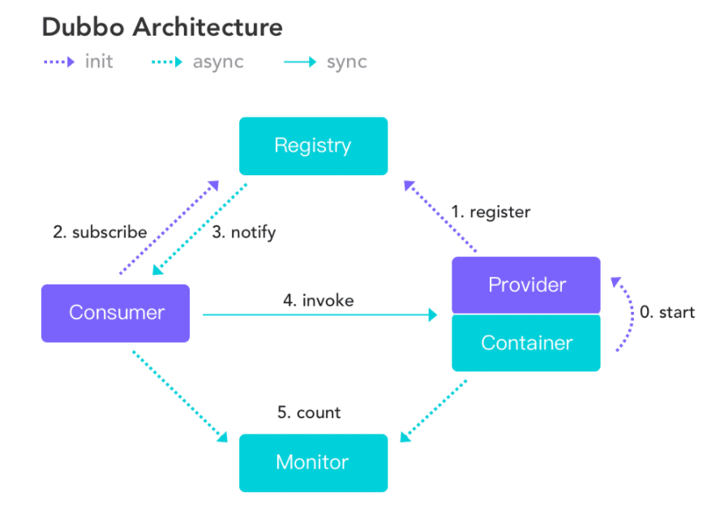
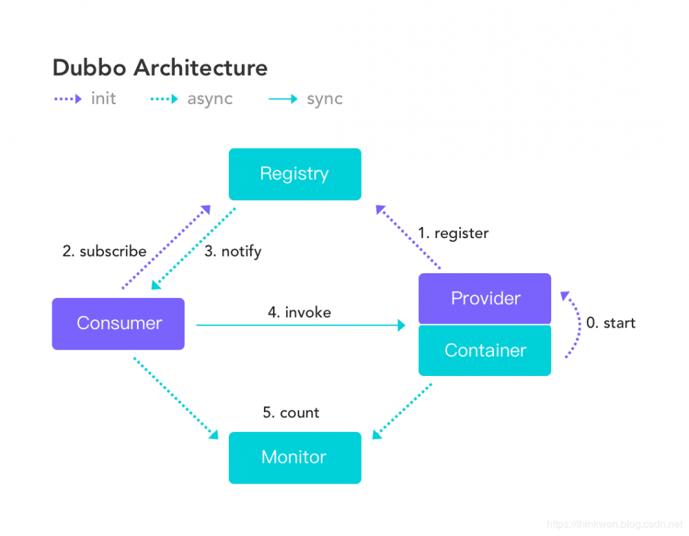

# Dubbo面试题

### 1.Dubbo 是什么？

简历：

XX项目

技术栈：Spring + Dubbo  +Mybatis

Dubbo是阿里巴巴开源的分布式，高性能的透明化的RPC服务框架，提供服务自动注册，自动发现等高效服务治理方案，可以和Spring框架可以无缝衔接。

### 2.Dubbo的由来

你们的项目为什么会使用Dubbo做为你们的分布式框架的技术选型。开场方式  背景。

标准回答：

早期我们的项目是单体架构，后续随着我们的用户量的增长，项目功能的增加，老的项目耦合严重，故障级联的问题，我们考虑使用分布式架构对于我们的项目进行重构，我们的Dubbo做为一款分布式，高性能的透明化的RPC服务框架，提供服务自动注册，自动发现等高效服务治理方案，可以和Spring框架可以无缝衔接。

而且我们当时对比了市面上的新浪的Motan，以及alibaba的Dubbo，还有谷歌的GRPC，当当的Dubbox,就开源度以及生态而言，我们最终选择了Dubbo做为我们的分布式解决方案。

### Dubbo的主要特性：

Dubbo的新版本当中有非常多的支持分布式特性的一些功能：

* 面向接口代理的高性能的RPC调用：提供了高性能的基于代理的远程调用能力，服务以接口为粒度，屏蔽了底层远程调用的细节.       @Reference   @DubboReference     <dubbo:Reference....
* 智能的负载均衡的能力：内置了多种负载均衡策略，智能的感知下游节点的健康状况，显著的减少调用延迟，提高系统吞吐。
* 服务的自动注册与发现：支持我们多种注册中心，实现服务实例的上下线感知



* 高度可拓展能力：遵循微内核+插件的设计原则，所有的核心能力，都会被设计为拓展点，平等的对待内置实现还是第三方的实现
* 运行期流量调度：内置条件，脚本等路由策略，通过配置不同的路由规则，实现灰度发布，同机房优先等功能。
* 可视化的服务治理以及运维：提供了丰富的服务治理工具，运维工具，随时可以查询服务的元数据，服务健康状态，调用统计，实时的下发路由策略，调整配置参数。

### Dubbo默认使用什么协议

Dubbo缺省协议是dubbo协议，采用的是单一长连接和NIO异步通信的方式，适用于小数据量以及大并发的服务调用，消费者远大于提供者，Dubbo的传输层协议TCP，异步的，使用Hessian序列化

### Dubbo 支持哪些协议，每种协议的应用场景，优缺点？

* dubbo：Dubbo缺省协议是dubbo协议，采用的是单一长连接和NIO异步通信的方式，适用于小数据量以及大并发的服务调用，消费者远大于提供者，Dubbo的传输层协议TCP，异步的，使用Hessian序列化
* rmi（remote  Method  invocation）：采用的是我们的JDK标准的rmi的实现，传输以及返回参数的时候都需要实现Serializable接口，使用java的标准的序列化机制，使用的是阻塞式的短连接，传输数据包可以大小混合，并且我们的消费者与提供者可以差不多数量，可以传文件。传输协议TCP，同步传输，适用于常规的远程服务调用以及rmi的相互操作。序列化安全漏洞。
* webservice：基于 WebService 的远程调用协议，集成 CXF 实现，提供和原生 WebService 的互操作。多个短连接，基于 HTTP 传输，同步传输，适用系统集成和跨语言调用；
* http：基于 Http 表单提交的远程调用协议，使用 Spring 的 HttpInvoke 实现。多个短连接，传输协议 HTTP，传入参数大小混合，提供者个数多于消费者，需要给应用程序和浏览器 JS 调用；
* hessian：集成 Hessian 服务，基于 HTTP 通讯，采用 Servlet 暴露服务，Dubbo 内嵌 Jetty 作为服务器时默认实现，提供与 Hession 服务互操作。多个短连接，同步 HTTP 传输，Hessian 序列化，传入参数较大，提供者大于消费者，提供者压力较大，可传文件；

### RPC与HTTP的区别


RPC（remote proedure call）：Dubbo，Grpc，Thrift

RPC与HTTP的级别，定位的区别

### 如何选择RPC与Rest风格的HTTP

RPC：远程方法调用，远程直接调用你的方法，可以选择Http做为我们的最终协议。Http2.0，

Rest风格的HTTP：Rest风格，可读性好，跨语言，得到防火墙的支持。异构设计，开发快。

缺陷：效率低，带来大量的无用信息。

如果你的项目不是那么大，并且希望快速开发，那么你使用Rest风格的HTTP，但是如果你的公司牛人很多，建议你使用RPC，你的项目比较大，对于网络传输的速率要求比较严格，那么你也可以使用RPC。

### Dubbo与Spring Cloud的区别

Spring Cloud  Netfilx      Spring Cloud Alibaba

开发效率快        网络传输速度慢     拓展性不强

Spring Cloud Alibaba

Dubbo是二进制传输  ，占用的带宽会更小

Spring Cloud        Rest风格的HTTP    消耗很多

dubbo的开发难度大

Spring  Cloud

Dubbo    ：  Reids    ZK  .......

Spring Cloud ：遵循Spring Cloud 规范的注册中心

### Dubbo一般使用什么注册中心？还有别的选择吗？

Dubbo默认的注册中心是哪个，还有没有什么更好的选择

Zookeeper        CP

consul          go语言写的，跟docker完美兼容

Eureka          AP     Peer  to   Peer

Redis  不推荐

ectd           不推荐

nacos        AP    CP     最好的

### 为什么需要服务治理？

1.过多的服务 ，Url配置困难

2.负载均衡分配节点 ，在压力过大的情况下，我们是需要部署集群的

3.服务依赖混乱，启动顺序不清晰

4.过多的服务导致性能指标分析难度大，需要监控。

### 服务治理手段

服务注册：服务提供者注册到注册中心服务端

服务续约：服务提供者需要给到注册中心服务端一个信号，告诉他，我自身的状态（心跳）。

服务获取：消费者去注册中心服务端获取服务提供者列表，并且缓存到本地

服务调用：我通过我们从注册中心服务端获取到的服务提供者信息，调用服务提供者

服务下线：服务提供者从注册中心服务端取消注册自己，从而使消费者拉取不到他

失效剔除：服务续约是发送心跳，但是心跳异常之后，我们需要根据规则对服务提供者进行剔除

自我保护：我网不好，那么这个时候我会制定规则，防止失效剔除的异常剔除情况出现，保护注册中心的服务提供者列表

服务同步：注册中心是集群，那么这个时候就有可能出现，服务提供者注册到A上，而消费者消费的是B，那么这个时候A跟B需要同步注册信息。

动态感知：一般情况下都是通过观察者模式，服务启动，会有很多的事件（EVENT）进行发布，那么这个时候我们的注册中心会去监听其中的一些启动事件，那么我们就能够感知我们的服务启动。同时进行自动注册流程。

### Dubbo的集群的容错方案

failover  Cluster（默认：）失败自动进行切换，当出现失败之后，重试其他服务器，通常用于读操作。但是重试会带来更长的延迟。

failfast  Cluster：快速失败，只发起一次调用，失败立即报错，通过用于非幂等性的写操作，比如新增加记录。

failsafe Cluster： 失败安全，  出现异常的时候，直接忽略。通常这种策略是用于写入审计日志等操作。

failBack Cluster：失败自动恢复：后台一旦记录请求失败，定时重发。通常用于消息通知。

forking Cluster ：并行调用多个服务器，只要有一个成功即返回。通常用于对于实时性要求较高的读操作，但是我们使用这种方式会极大的浪费服务器资源，可以设置最大的并行数。forks=‘3’。

broadcast Cluster：广播所有提供者，逐个调用。任何一台报错我就会直接报错。通常用于通知所有的提供者更新缓存或者日志等本地信息。

### Dubbo 有哪些负载均衡策略？

**Random LoadBalance**

随机，按照权重的设置随机几率

实际上我们的随机，按照我们的权重设计    A   3   B  5   C 2

**RoundRobin LoadBalance**

轮询  默认将流量均匀的打到各个机器上。但是各个机器的配置假设不一样，那么这个时候性能也不一样，容易导致性能差的机器负载过高。所以，轮询还是需要调整权重

**LeastActive LoadBalance**

最小活跃调用数，评估你的服务器性能，判定假设你某台机器性能很差，这个时候相应的我去进行分配的请求也就越少。

**ConsistentHash LoadBalance**

一致性Hash算法

相同的参数请求一定是分发到同一台机器的，解决原有的Hash算法可能会导致的节点抖动问题

### Dubbo 核心组件有哪些？



* provider ：暴露服务的服务提供方
* Consumer：调用远程服务的消费方
* Registry ：服务注册与发现中心
* Monitor：监控中心，访问统计
* Container：服务运行容器

### Dubbo 服务器注册与发现的流程？

1.服务容器负责启动，加载，以及运行服务提供者

2.服务提供者在启动的时候，向注册中心注册自己提供的服务

3.服务消费者启动时，需要向注册中心订阅自己所需要的服务提供者信息

4.注册中心向服务消费者返回服务提供者地址列表，并且一旦发生变更，那么注册中心会基于长连接推送变更数据

5.服务消费者会从本地缓存的服务提供者列表中，基于负载均衡算法，选择一台进行调用，一旦失败，他会基于容错机制FailOver Cluster，再次选择一台进行调用。

6.服务提供者与服务消费者，都会在内存中统计调用次数以及调用时间，定时每分钟发送一次统计数据给到监控中心。

### Dubbo 的整体架构设计有哪些分层?


十层分层，遵循了领域驱动设计原则，并且他是在分层架构设计的基础上进行衍生的。invoker调用器

严格分层架构设计

松散分层架构设计

Service   这一层次是与业务相关的，根据我们的服务提供者以及服务的消费者进行对应的业务接口设计与实现

Config  配置层：对外配置接口，以ServiceConfig以及ReferenceConfig做为中心。

Proxy  服务接口透明代理，生成客户端Stub以及服务端的骨架Skeketon，以ServiceProxy为中心点，扩展点是ProxyFactory

Registry：服务注册层：封装服务地址的注册与发现，

Cluster：封装了我们的提供者的路由以及负载策略，并且我们会通过这个层面去桥接注册中心，以invoker为中心，去进行相应的接口拓展

Monitor：监控层：PPC的调用次数和调用时间，Statistics为中心，去进行接口拓展

Protocol ：封装RPC调用，以invocation以及Result做为中心点，去进行拓展接口

Exchange  ：封装请求响应的模式，同步转异步，Request以及Response为中心

Transport ：抽象mina，或者netty3，Netty4。以Message做为中心

Sreialize ：可复用的工具。

### Dubbo配置文件是如何被加载到Spring当中的？

Spring容器启动的时候，schema机制解析XSD文件，读取到的默认的或者自定义的契约，我们会通过

DubboNamespaceHandler这个类通过一些DubboBeanDefinitionParser去解析我们的配置信息，并且转化成为我们需要加载的Bean对象。

说说核心的配置有哪些

| 标签               | 用途         | 解释                                                                                             |
| :----------------- | :----------- | :----------------------------------------------------------------------------------------------- |
| dubbo:service/     | 服务配置     | 用于暴露一个服务，定义服务的元信息，一个服务可以用多个协议暴露，一个服务也可以注册到多个注册中心 |
| dubbo:reference/   | 引用配置     | 用于创建一个远程服务代理，一个引用可以指向多个注册中心                                           |
| dubbo:protocol/    | 协议配置     | 用于配置提供服务的协议信息，协议由提供方指定，消费方被动接受                                     |
| dubbo:application/ | 应用配置     | 用于配置当前应用信息，不管该应用是提供者还是消费者                                               |
| dubbo:module/      | 模块配置     | 用于配置当前模块信息，可选                                                                       |
| dubbo:registry/    | 注册中心配置 | 用于配置连接注册中心相关信息                                                                     |
| dubbo:monitor/     | 监控中心配置 | 用于配置连接监控中心相关信息，可选                                                               |
| dubbo:provider/    | 提供方配置   | 当 ProtocolConfig 和 ServiceConfig 某属性没有配置时，采用此缺省值，可选                          |
| dubbo:consumer/    | 消费方配置   | 当 ReferenceConfig 某属性没有配置时，采用此缺省值，可选                                          |
| dubbo:method/      | 方法配置     | 用于 ServiceConfig 和 ReferenceConfig 指定方法级的配置信息                                       |
| dubbo:argument/    | 参数配置     | 用于指定方法参数配置                                                                             |

### Dubbo超时设置有哪些方式

超时设置可以在服务提供者端设置也可以在服务消费者端设置，但是我们一般会选择设置在服务提供者这边，因为消费者是没有办法感知服务提供者的特性的，所以尽可能优先设置在服务提供者端，如果消费者以及提供者都设置了超时时间，那么这个时候默认优先消费端设置，如果你在消费端设置，也有好处，好处是如果消费方超时，不会影响到提供者，提供者只会报警告不会报异常。

### 如果我们的Dubbo调用超时了会怎么办？

dubbo在调用服务不成功的时候，默认重试两次。

### Dubbo中的扩展点

**指定名称的扩展点**

```java
ExtensionLoader.getExtensionLoader(Protocol.class).getExtension("name");
```

1.找到Protocol的全路径名称，并且在META-INF/dubbo/internal下面找到Protocol的全路径名称为文件名字的文件

2.找到getExtension中的参数，并且根据参数找到对应的实现类

自适应拓展点

```java
ExtensionLoader.getExtensionLoader(ProxyFactory.class).getAdaptiveExtension();
```

1.如果@Adaptive注解是在类上，那么我的返回值会是当前类

2.如果@Adaptive注解是在方法上，那么我的返回值会是一个动态生成的代理类

激活拓展点

```java
ExtensionLoader.getExtensionLoader(Protocol.class).getActiveExtension
```

有激活条件   满足激活条件  我就去加载

### Dubbo中用到了哪些设计模式

工厂模式

```
ProxyFactory就是我们典型的工厂模式
```

简单工厂：提供一个方法，返回创建好的对象  他在Dubbo源码中的体现：LoggerFactory

工厂方法模式：对创建过程有修改，所以需要抽象一个工厂类，如果增加一个产品，就直接增加一个工厂类

> Dubbo在CacheFactory中，会对结果进行缓存，而缓存的策略有非常多种，我峨嵋你会发现，一个策略对应一个缓存工厂

抽象工厂：抽象工厂就是我们可以把不用的结果放到同一个工厂类之中          源码体现：ProxyFactory

策略模式

> SPI本身就是典型的策略模式，比如我们的负载均衡策略

装饰器模式:ClassLoadFilter的过滤器 ，在这里对于他的主功能做了增强，所以，是装饰器模式

观察者模式

服务自动注册的时候，或者说服务启动的时候，我们会有监听，我们的ApplicationContextListen

代理模式

我们的整个RPC实际上就是代理对象传递信息的过程

单例模式

```java
private void openServer(URL url) {
        // find server.
        String key = url.getAddress();
        //client can export a service which's only for server to invoke
        boolean isServer = url.getParameter(IS_SERVER_KEY, true);
        if (isServer) {
            ProtocolServer server = serverMap.get(key);
            if (server == null) {
                synchronized (this) {
                    server = serverMap.get(key);
                    if (server == null) {
                        serverMap.put(key, createServer(url));
                    }
                }
            } else {
                // server supports reset, use together with override
                server.reset(url);
            }
        }
    }
```

适配器模式

Dubbo可以支撑多个日志框架，但是我们每个日志框架都需要有对应的Adapter类

所以我们需要用适配器模式去对应Dubbo本身以及实现类的日志级别。

责任链模式

我们会有判断回升测试的判断，ProtocolFilterWrapper的buildInvokerChain用到了责任链模式

### Dubbo服务之间的调用是阻塞的吗？

默认是同步等待结果的阻塞的，但是我们可以去设置成异步

Dubbo是基于NIO非阻塞实现的并行调用，客户端不用读线程启动就可以完成并行调用远程服务，相对于原本的多线程，我们的线程开销较小。

### Dubbo的管理控制台能够做什么？

管理控制台：路由规则，动态配置，服务降级，访问控制，权重调整，负载均衡策略等相关的管理功能

Dubbo-ADMIN打成war包，发布运行即可

### 当一个服务接口有多种实现的时候，我们应该怎么做？

分组问题：当一个接口有多种实现的时候，我们可以用group属性进行分组，可以让服务的提供方，以及服务的消费者都指定同一个Group。

### 服务上线的时候怎么兼容旧版本

可以用版本号（version）进行过渡，多个不同的版本的服务注册到注册中心，版本号不想用，那么则不会互相引用。使用蓝绿部署的方式进行版本升级。

### 出现调用超时com.alibaba.dubbo.remoting.TimeoutException异常怎么办？

一般情况下都是你的业务处理太慢，那么这个时候你可以首先去jstack.log分析线程是卡在哪个方法的调用上。

如果不能将业务处理好的话，那么这个时候请调整超时时间timeout。

### 出现java.util.concurrent.RejectedExecutionException或者Thread pool exhausted怎么办？

代表你的线程池已经到达了最大值，并且没有空闲的连接。拒绝执行你的任务。

//建议你出现了这样的错误，将最大的线程池连接数以及最小的设置成一样

```
dubbo.service.min.thread.pool.size=200  
dubbo.service.max.thread.pool.size=200
```

这个参数是Dubbo.properties中的。

### Dubbo的安全性如何得到保障

在有注册中心的情况下，我们是可以通过Dubbo的路由规则，指定固定的IP的消费方来访问

在直连的情况下，那么这个时候我可以通过服务提供者的令牌（token），我们的消费方也需要在消费的时候输入这个token，才能够直连成功。Dubbo还可以提供服务白名单，防止接口被刷。

### 服务发布

服务的暴露起始于 Spring IOC 容器刷新完毕之后，会根据配置参数组装成 URL， 然后根据 URL 的参数来进行本地或者远程调用。

会通过 proxyFactory.getInvoker，利用 javassist 来进行动态代理，封装真的实现类，然后再通过 URL 参数选择对应的协议来进行 protocol.export，默认是 Dubbo 协议。

### 具体一点

exported

### 服务注册

饿汉式，懒汉式

根据配置的参数组成URL      构建一个注册中心文件夹  RegistryDirectory

协议层invoker    Cluster     failOverCluster   最终返回代理类

问你的点    留余地

### 服务获取

获取代理类     invoker   Map    ID

Dubbo异步

### SPI

激活拓展点

自适应拓展点     @Adaptive

指定名称的拓展点

### Dubbo中为什么不使用JDK的SPI

通过名称去对应的实现类中找到类的全限定名称，进行加载。节省资源

### Dubbo为什么默认使用javassist

JDK动态代理   CGlib   ASM   快      字节码生成非常的方便

### ASM比javassist更快，为什么不用

快到一定的程度
