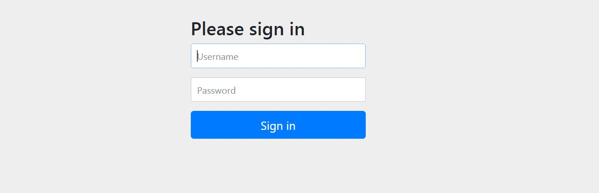
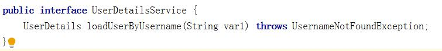
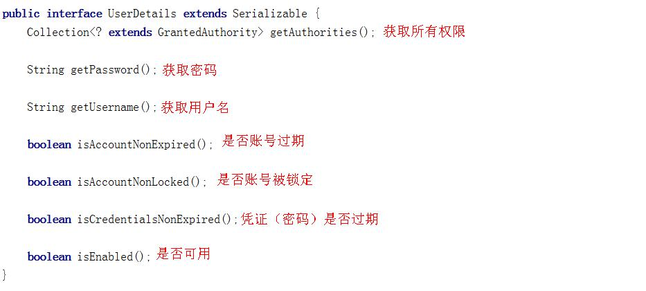
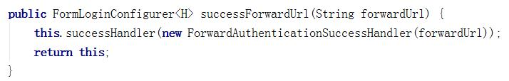
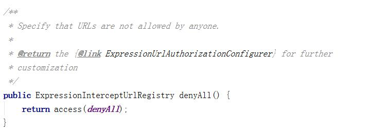
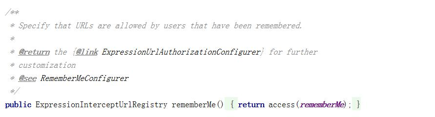
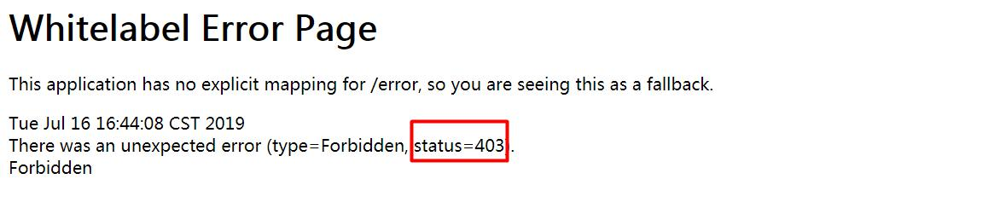
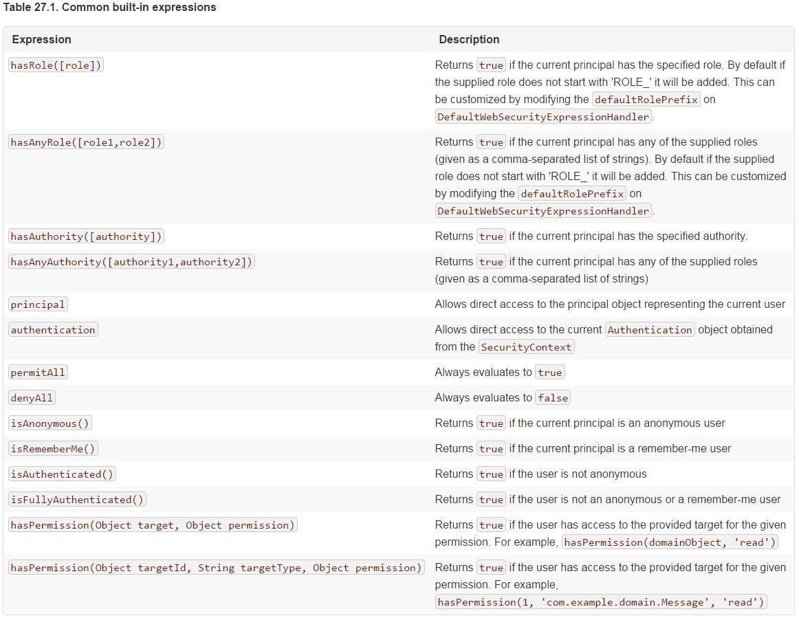

Spring Security

### 主要内容

1. Spring Security 简介

2. 第一个Spring Security项目

3. UserDetailsService详解

4. PasswordEncoder密码解析器详解

5. 自定义登录逻辑

6. 自定义登录页面

7. 认证过程其他常用配置

8. 访问控制url匹配

9. 内置访问控制方法介绍

  10.角色权限判断

  11.自定义403处理方案

  12.基于表达式的访问控制

  13.基于注解的访问控制

  14.RememberMe功能实现

  15.Thymeleaf中Spring Security使用

  16.退出登录

  17.Spring Security 中CSRF

### 学习目标

| 知识点                         | 要求   |
| --------------------------- | ---- |
| Spring Security 简介          | 掌握   |
| 第一个Spring Security项目        | 掌握   |
| UserDetailsService详解        | 掌握   |
| PasswordEncoder密码解析器详解      | 掌握   |
| 自定义登录逻辑                     | 掌握   |
| 自定义登录页面                     | 掌握   |
| 认证过程其他常用配置                  | 掌握   |
| 访问控制url匹配                   | 掌握   |
| 内置访问控制方法介绍                  | 掌握   |
| 角色权限判断                      | 掌握   |
| 自定义403处理方案                  | 掌握   |
| 基于表达式的访问控制                  | 掌握   |
| 基于注解的访问控制                   | 掌握   |
| Remember Me 功能实现            | 掌握   |
| Thymeleaf中Spring Security使用 | 掌握   |
| 退出登录                        | 掌握   |
| CSRF                        | 掌握   |

### 一、Spring Security简介

#### 1.概括

​	Spring Security是一个高度自定义的**安全框架**。利用Spring IoC/DI和AOP功能，为系统提供了声明式安全访问控制功能，减少了为系统安全而编写大量重复代码的工作。

​	使用Spring Secruity的原因有很多，但大部分都是发现了javaEE的Servlet规范或EJB规范中的安全功能缺乏典型企业应用场景。同时认识到他们在WAR或EAR级别无法移植。因此如果你更换服务器环境，还有大量工作去重新配置你的应用程序。使用Spring Security 解决了这些问题，也为你提供许多其他有用的、可定制的安全功能。

​	正如你可能知道的两个应用程序的两个主要区域是“**认证**”和“**授权**”（或者访问控制）。这两点也是Spring Security重要核心功能。“认证”，是建立一个他声明的主体的过程（一个“主体”一般是指用户，设备或一些可以在你的应用程序中执行动作的其他系统），通俗点说就是系统认为用户是否能登录。“授权”指确定一个主体是否允许在你的应用程序执行一个动作的过程。通俗点讲就是系统判断用户是否有权限去做某些事情。

#### 2.历史

​	Spring Security 以“The Acegi Secutity System for Spring” 的名字始于2003年年底。其前身为acegi项目。起因是Spring开发者邮件列表中一个问题，有人提问是否考虑提供一个基于Spring的安全实现。限制于时间问题，开发出了一个简单的安全实现，但是并没有深入研究。几周后，Spring社区中其他成员同样询问了安全问题，代码提供给了这些人。2004年1月份已经有20人左右使用这个项目。随着更多人的加入，在2004年3月左右在sourceforge中建立了一个项目。在最开始并没有认证模块，所有的认证功能都是依赖容器完成的，而acegi则注重授权。但是随着更多人的使用，基于容器的认证就显现出了不足。acegi中也加入了认证功能。大约1年后acegi成为Spring子项目。

​	在2006年5月发布了acegi 1.0.0版本。2007年底acegi更名为Spring Security。

### 二、第一个Spring Security项目

#### 1.导入依赖

​	Spring Security已经被Spring boot进行集成，使用时直接引入启动器即可。

```
<dependency>
    <groupId>org.springframework.boot</groupId>
    <artifactId>spring-boot-starter-security</artifactId>
</dependency>
```

#### 2.访问页面

​	导入spring-boot-starter-security启动器后，Spring Security已经生效，默认拦截全部请求，如果用户没有登录，跳转到内置登录页面。

​	在项目中新建login.html页面后

​	在浏览器输入：http://localhost:8080/login.html后会显示下面页面



​	默认的username为user，password打印在控制台中。当然了，同学们显示的肯定和我的不一样。

​		在浏览器中输入账号和密码后会显示login.html页面内容。

### 三、UserDetailsService详解

​	当什么也没有配置的时候，账号和密码是由Spring Security定义生成的。而在实际项目中账号和密码都是从数据库中查询出来的。 所以我们要通过自定义逻辑控制认证逻辑。

​	如果需要自定义逻辑时，只需要实现UserDetailsService接口即可。接口定义如下：



#### 1.返回值

​	返回值UserDetails是一个接口，定义如下



​	要想返回UserDetails的实例就只能返回接口的实现类。Spring Security中提供了如下的实例。对于我们只需要使用里面的User类即可。注意User的全限定路径是：

​	org.springframework.security.core.userdetails.User

​	此处经常和系统中自己开发的User类弄混。


​	在User类中提供了很多方法和属性。


​	其中构造方法有两个，调用其中任何一个都可以实例化UserDetails实现类User类的实例。而三个参数的构造方法实际上也是调用7个参数的构造方法。

​	username:用户名

​	password:密码

​	authorities：用户具有的权限。此处不允许为null


​	此处的用户名应该是客户端传递过来的用户名。而密码应该是从数据库中查询出来的密码。Spring Security会根据User中的password和客户端传递过来的password进行比较。如果相同则表示认证通过，如果不相同表示认证失败。

​	authorities里面的权限对于后面学习授权是很有必要的，包含的所有内容为此用户具有的权限，如有里面没有包含某个权限，而在做某个事情时必须包含某个权限则会出现403。通常都是通过AuthorityUtils.commaSeparatedStringToAuthorityList(“”)来创建authorities集合对象的。参数时一个字符串，多个权限使用逗号分隔。

#### 2.方法参数

​	方法参数表示用户名。此值是客户端表单传递过来的数据。默认情况下必须叫username，否则无法接收。

#### 3.异常

​	UsernameNotFoundException 用户名没有发现异常。在loadUserByUsername中是需要通过自己的逻辑从数据库中取值的。如果通过用户名没有查询到对应的数据，应该抛出UsernameNotFoundException，系统就知道用户名没有查询到。

### 四、PasswordEncoder密码解析器详解

​	Spring Security要求容器中必须有PasswordEncoder实例。所以当自定义登录逻辑时要求必须给容器注入PaswordEncoder的bean对象

#### 1.接口介绍

​	encode():把参数按照特定的解析规则进行解析。

matches()验证从存储中获取的编码密码与编码后提交的原始密码是否匹配。如果密码匹配，则返回true；如果不匹配，则返回false。第一个参数表示需要被解析的密码。第二个参数表示存储的密码。

​	upgradeEncoding()：如果解析的密码能够再次进行解析且达到更安全的结果则返回true，否则返回false。默认返回false。

#### 2.内置解析器介绍

​	在Spring Security中内置了很多解析器。


#### 3.BCryptPasswordEncoder简介

​	BCryptPasswordEncoder是Spring Security官方推荐的密码解析器，平时多使用这个解析器。

​	BCryptPasswordEncoder是对bcrypt强散列方法的具体实现。是基于Hash算法实现的单向加密。可以通过strength控制加密强度，默认10.

#### 4.代码演示

​	在项目src/test/java下新建com.msb.MyTest测试BCryptPasswordEncoder用法。

```
@SpringBootTest
@RunWith(SpringRunner.class)
public class MyTest {
    @Test
    public void test(){
        //创建解析器
        PasswordEncoder encoder = new BCryptPasswordEncoder();
        
        //对密码进行加密
        String password = encoder.encode("123");
        System.out.println("------------"+password);

        //判断原字符加密后和内容是否匹配
        boolean result = encoder.matches("123",password);
        System.out.println("============="+result);
    }
}
```

### 五、自定义登录逻辑

​	当进行自定义登录逻辑时需要用到之前讲解的UserDetailsService和PasswordEncoder。但是Spring Security要求：当进行自定义登录逻辑时容器内必须有PasswordEncoder实例。所以不能直接new对象。        

#### 1.编写配置类

​	新建类com.msb.config.SecurityConfig 编写下面内容

```
@Configuration
public class SecurityConfig {
    @Bean
    public PasswordEncoder getPwdEncoder(){
        return new BCryptPasswordEncoder();
    }
}
```

#### 2.自定义逻辑

​	在Spring Security中实现UserDetailService就表示为用户详情服务。在这个类中编写用户认证逻辑。

```
@Service
public class UserDetailsServiceImpl implements UserDetailsService {
    @Autowired
    private PasswordEncoder encoder;

    @Override
    public UserDetails loadUserByUsername(String username) throws UsernameNotFoundException {
        //1. 查询数据库判断用户名是否存在，如果不存在抛出UsernameNotFoundException

        if(!username.equals("admin")){
            throw new UsernameNotFoundException("用户名不存在");
        }
        //把查询出来的密码进行解析,或直接把password放到构造方法中。
        //理解:password就是数据库中查询出来的密码，查询出来的内容不是123
        String password = encoder.encode("123");

        return new User(username,password, AuthorityUtils.commaSeparatedStringToAuthorityList("admin"));
    }
}
```

#### 3.查看效果

​	重启项目后，在浏览器中输入账号：admin，密码：123。后可以正确进入到login.html页面。

### 六、自定义登录页面

​	虽然Spring Security给我们提供了登录页面，但是对于实际项目中，大多喜欢使用自己的登录页面。所以Spring Security中不仅仅提供了登录页面，还支持用户自定义登录页面。实现过程也比较简单，只需要修改配置类即可。

#### 1.编写登录页面

​	别写登录页面，登录页面中<form>的action不编写对应控制器也可以。

```
<!DOCTYPE html>
<html lang="en">
<head>
    <meta charset="UTF-8">
    <title>内容</title>
</head>
<body>
<form action="/login" method="post">
    <input type="text" name="username"/>
    <input type="password" name="password"/>
    <input type="submit" value="提交"/>
</form>

</body>
</html>
```

#### 2.修改配置类

​	修改配置类中主要是设置哪个页面是登录页面。配置类需要继承WebSecurityConfigurerAdapter,并重写configure方法。

​	successForwardUrl()登录成功后跳转地址

​	loginPage() 登录页面

​	loginProcessingUrl 登录页面表单提交地址，此地址可以不真实存在。

​	antMatchers():匹配内容

​	permitAll():允许

```
@Configuration
public class SecurityConfig extends WebSecurityConfigurerAdapter {

    @Override
    protected void configure(HttpSecurity http) throws Exception {
        // 表单认证
        	http.formLogin()
               	 .loginProcessingUrl("/login")   
                //当发现/login时认为是登录，需要执行
             UserDetailsServiceImpl
                	.successForwardUrl("/toMain")   //此处是post请求
                	.loginPage("/login.html");

        // url 拦截
        http.authorizeRequests()
                .antMatchers("/login.html").permitAll() //login.html不需要被认证
                .anyRequest().authenticated();//所有的请求都必须被认证。必须登录后才能访问。

        //关闭csrf防护
        http.csrf().disable();
    }
    @Bean
    public PasswordEncoder getPe(){
        return new BCryptPasswordEncoder();
    }
}
```

#### 3.编写控制器

​	编写控制器，当用户登录成功后跳转toMain控制器。编写完成控制器后编写main.html。页面中随意写上一句话表示main.html页面内容即可。而之前的/login控制器方法是不执行的，所以可以删除了。

```
@Controller
public class LoginController {
//    该方法不会被执行
//    @RequestMapping("/login")
//    public String login(){
//        System.out.println("执行了login方法");
//        return "redirect:main.html";
//    }

    @PostMapping("/toMain")
    public String toMain(){
        return "redirect:/main.html";
    }
}
```

### 七、 认证过程其他常用配置

#### 1.失败跳转

​	表单处理中成功会跳转到一个地址，失败也可以跳转到一个地址中。

##### 1.1编写页面

​	在src/main/resources/static下新建fail.html并编写如下内容

```
<!DOCTYPE html>
<html lang="en">
<head>
    <meta charset="UTF-8">
    <title>Title</title>
</head>
<body>
 操作失败，请重新登录. <a href="/login.html">跳转</a>
</body>
</html>
```

##### 1.2修改表单配置

​	在配置方法中表单认证部分添加failureForwardUrl()方法，表示登录失败跳转的url。此处依然是POST请求，所以跳转到可以接收POST请求的控制器/fail中。

```
// 表单认证
http.formLogin()
        .loginProcessingUrl("/login")   //当发现/login时认为是登录，需要执行UserDetailsServiceImpl
        .successForwardUrl("/toMain")   //此处是post请求
        .failureForwardUrl("/fail")     //登录失败跳转地址
        .loginPage("/login.html");
```

##### 1.3添加控制器方法

​	在控制器类中添加控制器方法，方法映射路径/fail。此处要注意：由于是POST请求访问/fail。所以如果返回值直接转发到fail.html中，及时有效果，控制台也会报警告，提示fail.html不支持POST访问方式。

```
@PostMapping("/fail")
public String fail(){
    return "redirect:/fail.html";
}
```

##### 1.4设置fail.html不需要认证

​	认证失败跳转到fail.html页面中，所以必须配置fail.html不需要被认证。需要修改配置类中内容

```
// url 拦截
http.authorizeRequests()
        .antMatchers("/login.html").permitAll() //login.html不需要被认证
        .antMatchers("/fail.html").permitAll()  //fail.html不需要被认证
        .anyRequest().authenticated();//所有的请求都必须被认证。必须登录后才能访问。
```

#### 2.设置请求账户和密码的参数名

##### 2.1源码简介

​	当进行登录时会执行UsernamePasswordAuthenticationFilter过滤器。

​	usernamePasrameter:账户参数名

​	passwordParameter:密码参数名

​	postOnly=true:默认情况下只允许POST请求。


##### 2.2修改配置

```
// 表单认证
http.formLogin()
        .loginProcessingUrl("/login")   //当发现/login时认为是登录，需要执行UserDetailsServiceImpl
        .successForwardUrl("/toMain")   //此处是post请求
        .failureForwardUrl("/fail")     //登录失败跳转地址
        .loginPage("/login.html")
        .usernameParameter("myusername")
        .passwordParameter("mypassword");
```

##### 2.3修改页面

​	修改login.html

```
<form action = "/login" method="post">
    用户名：<input type="text" name="myusername"/><br/>
    密码:<input type="password" name="mypassword"/><br/>
    <input type="submit" value="登录"/>
</form>
```

#### 3.自定义登录成功处理器

##### 3.1源码分析

​	使用successForwardUrl()时表示成功后转发请求到地址。内部是通过successHandler（）方法进行控制成功后交给哪个类进行处理



​	ForwardAuthenticationSuccessHandler内部就是最简单的请求转发。由于是请求转发，当遇到需要跳转到站外或在前后端分离的项目中就无法使用了。


​	当需要控制登录成功后去做一些事情时，可以进行自定义认证成功控制器。

##### 3.2代码实现

###### 3.2.1自定义类

​	新建类com.msb.handler.MyAuthenticationSuccessHandler编写如下：

```
public class MyAuthenticationSuccessHandler implements AuthenticationSuccessHandler {
    @Override
    public void onAuthenticationSuccess(HttpServletRequest httpServletRequest, HttpServletResponse httpServletResponse, Authentication authentication) throws IOException, ServletException {
        //Principal 主体，存放了登录用户的信息
        User user = (User)authentication.getPrincipal();
        System.out.println(user.getUsername());
        System.out.println(user.getPassword());//密码输出为null
        System.out.println(user.getAuthorities());
        //重定向到百度。这只是一个示例，具体需要看项目业务需求
        httpServletResponse.sendRedirect("http://www.baidu.com");
    }
}
```

###### 3.2.2修改配置项

使用successHandler()方法设置成功后交给哪个对象进行处理

```
// 表单认证
http.formLogin()
        .loginProcessingUrl("/login")   //当发现/login时认为是登录，需要执行UserDetailsServiceImpl
        .successHandler(new MyAuthenticationSuccessHandler())
        //.successForwardUrl("/toMain")   //此处是post请求
        .failureForwardUrl("/fail")     //登录失败跳转地址
        .loginPage("/login.html");
```

#### 4.自定义登录失败处理器

##### 4.1源码分析

​	failureForwardUrl()内部调用的是failureHandler()方法

​	ForwardAuthenticationFailureHandler中也是一个请求转发，并在request作用域中设置			 SPRING_SECURITY_LAST_EXCEPTION的key，内容为异常对象。


##### 4.2代码实现

###### 4.2.1新建控制器

​	新建com.msb.handler.MyForwardAuthenticationFailureHandler实现AuthenticationFailureHandler。在方法中添加重定向语句

```
public class MyForwardAuthenticationFailureHandler implements AuthenticationFailureHandler {
    @Override
    public void onAuthenticationFailure(HttpServletRequest httpServletRequest, HttpServletResponse httpServletResponse, AuthenticationException e) throws IOException, ServletException {
        httpServletResponse.sendRedirect("/fail.html");
    }
}
```

###### 4.2.2修改配置类

​	修改配置类中表单登录部分。设置失败时交给失败处理器进行操作。failureForwardUrl和failureHandler不可共存。

```
        // 表单认证
        http.formLogin()
                .loginProcessingUrl("/login")   //当发现/login时认为是登录，需要执行UserDetailsServiceImpl
                .successHandler(new MyAuthenticationSuccessHandler())
                //.successForwardUrl("/toMain")   //此处是post请求
                .failureHandler(new MyForwardAuthenticationFailureHandler())
//                .failureForwardUrl("/fail")     //登录失败跳转地址
                .loginPage("/login.html");
```

### 八、访问控制url匹配

​	在前面讲解了认证中所有常用配置，主要是对http.formLogin()进行操作。而在配置类中		http.authorizeRequests()主要是对url进行控制，也就是我们所说的授权（访问控制）。http.authorizeRequests()也支持连缀写法，总体公式为：

​	url匹配规则.权限控制方法

通过上面的公式可以有很多url匹配规则和很多权限控制方法。这些内容进行各种组合就形成了Spring Security中的授权。

​	在所有匹配规则中取所有规则的交集。配置顺序影响了之后授权效果，越是具体的应该放在前面，越是笼统的应该放到后面。	

#### 1.anyRequest()

​	在之前认证过程中我们就已经使用过anyRequest()，表示匹配所有的请求。一般情况下此方法都会使用，设置全部内容都需要进行认证。

​	代码示例:

```
anyRequest().authenticated();
```

#### 2.antMatcher()

​	方法定义如下：

```
public C antMatchers(String... antPatterns)
```

​	参数是不定向参数，每个参数是一个ant表达式，用于匹配URL规则。

​	规则如下：

​	? 匹配一个字符

​	* 匹配0个或多个字符

​	** 匹配0个或多个目录

​	在实际项目中经常需要放行所有静态资源，下面演示放行js文件夹下所有脚本文件。

```
.antMatchers("/js/**").permitAll()
```

还有一种配置方式是只要是.js文件都放行

```
antMatchers("/**/*.js").permitAll()
```

#### 3.regexMatchers()

##### 3.1介绍

使用正则表达式进行匹配。和antMatchers()主要的区别就是参数，antMatchers()参数是ant表达式，regexMatchers()参数是正则表达式。

演示所有以.js结尾的文件都被放行。

```
.regexMatchers(".+[.]js").permitAll()
```

##### 3.2两个参数时使用方式

无论是antMatchers()还是regexMatchers()都具有两个参数的方法，其中第一个参数都是HttpMethod，表示请求方式，当设置了HttpMethod后表示只有设定的特定的请求方式才执行对应的权限设置。

枚举类型HttpMethod内置属性如下：


### 九、内置访问控制方法介绍

​	Spring Security匹配了URL后调用了permitAll()表示不需要认证，随意访问。在Spring Security中提供了多种内置控制。

#### 1.permitAll()

​	permitAll()表示所匹配的URL任何人都允许访问。

#### 2.authenticated()

​	authenticated()表示所匹配的URL都需要被认证才能访问。

#### 3.anonymous()

​	anonymous()表示可以匿名访问匹配的URL。和permitAll()效果类似，只是设置为anonymous()的url会执行filter 链中

​	官方源码定义如下：


#### 4.denyAll()

​	denyAll()表示所匹配的URL都不允许被访问。



#### 5.rememberMe()

​	被“remember me”的用户允许访问



#### 6.fullyAuthenticated()

​	如果用户不是被remember me的，才可以访问。


## 十、角色权限判断

​	除了之前讲解的内置权限控制。Spring Security中还支持很多其他权限控制。这些方法一般都用于用户已经被认证后，判断用户是否具有特定的要求。

#### 1.hasAuthority(String)

​	判断用户是否具有特定的权限，用户的权限是在自定义登录逻辑中创建User对象时指定的。

下图中admin就是用户的权限。admin严格区分大小写。

​	在配置类中通过hasAuthority(“admin”)设置具有admin权限时才能访问。

```
.antMatchers(**"/main1.html"**).hasAuthority(**"admin"**)
```

####  2.hasAnyAuthority(String ...)

​	如果用户具备给定权限中某一个，就允许访问。

​	下面代码中由于大小写和用户的权限不相同，所以用户无权访问/main1.html

```
.antMatchers("/main1.html").hasAnyAuthority("adMin","admiN")
```

#### 3.hasRole(String)

​	如果用户具备给定角色就允许访问。否则出现403。

​	参数取值来源于自定义登录逻辑UserDetailsService实现类中创建User对象时给User赋予的授权。

​	在给用户赋予角色时角色需要以：ROLE_ 开头，后面添加角色名称。例如：ROLE_abc 其中abc是角色名，ROLE_是固定的字符开头。使用hasRole()时参数也只写abc即可。否则启动报错。

​	给用户赋予角色：

​	在配置类中直接写abc即可。

#### 4.hasAnyRole(String ...)

​	如果用户具备给定角色的任意一个，就允许被访问

#### 5.hasIpAddress(String)

​	如果请求是指定的IP就运行访问。

​	可以通过request.getRemoteAddr()获取ip地址。

​	需要注意的是在本机进行测试时localhost和127.0.0.1输出的ip地址是不一样的。

​	当浏览器中通过localhost进行访问时控制台打印的内容：


​	当浏览器中通过127.0.0.1访问时控制台打印的内容：


​	当浏览器中通过具体ip进行访问时控制台打印内容：


​	使用Spring Security时经常会看见403（无权限），默认情况下显示的效果如下：



​	而在实际项目中可能都是一个异步请求，显示上述效果对于用户就不是特别友好了。Spring Security支持自定义权限受限。

#### 1.新建类

​	新建类实现AccessDeniedHandler

```
@Component
public class MyAccessDeniedHandler implements AccessDeniedHandler {
    @Override
    public void handle(HttpServletRequest httpServletRequest, HttpServletResponse httpServletResponse, AccessDeniedException e) throws IOException, ServletException {
        httpServletResponse.setStatus(HttpServletResponse.SC_FORBIDDEN);
        httpServletResponse.setHeader("Content-Type","application/json;charset=utf-8");
        PrintWriter out = httpServletResponse.getWriter();
        out.write("{\"status\":\"error\",\"msg\":\"权限不足，请联系管理员!\"}");
        out.flush();
        out.close();
    }
}
```

#### 2.修改配置类

​	配置类中重点添加异常处理器。设置访问受限后交给哪个对象进行处理。

​	myAccessDeniedHandler是在配置类中进行自动注入的。

```
//异常处理
http.exceptionHandling()
        .accessDeniedHandler(myAccessDeniedHandler);
```

### 十二、基于表达式的访问控制

#### 1.access()方法使用

​	之前学习的登录用户权限判断实际上底层实现都是调用access(表达式)



​	可以通过access()实现和之前学习的权限控制完成相同的功能。

##### 1.1以hasRole和permitAll举例

​	下面代码和直接使用permitAll()和hasRole()是等效的。


#### 2.使用自定义方法

​	虽然这里面已经包含了很多的表达式(方法)但是在实际项目中很有可能出现需要自己自定义逻辑的情况。

​	判断登录用户是否具有访问当前URL权限。

##### 2.1新建接口及实现类

​	新建接口com.msb.service.MyService后新建实现类。

```
public interface MyService {
    boolean hasPermission(HttpServletRequest request, Authentication authentication);
}
```

```
@Component
public class MyServiceImpl implements MyService {
    @Override
    public boolean hasPermission(HttpServletRequest request, Authentication authentication) {
        Object obj = authentication.getPrincipal();
        if(obj instanceof UserDetails){
            UserDetails user = (UserDetails) obj;
            Collection<? extends GrantedAuthority> authorities = user.getAuthorities();
            return authorities.contains(new SimpleGrantedAuthority(request.getRequestURI()));
        }
        return false;
    }
}
```

##### 2.2修改配置类

​	在access中通过@bean的id名.方法(参数)的形式进行调用

​	配置类中修改如下：

```
 // url 拦截 (授权)
http.authorizeRequests()
        .antMatchers("/login.html").access("permitAll")
        .antMatchers("/fail.html").permitAll()
        .anyRequest().access("@myServiceImpl.hasPermission(request,authentication)");
```

### 十三、基于注解的访问控制

​	在Spring Security中提供了一些访问控制的注解。这些注解都是默认是都不可用的，需要通过@EnableGlobalMethodSecurity进行开启后使用。

​	如果设置的条件允许，程序正常执行。如果不允许会报500

​	这些注解可以写到Service接口或方法上上也可以写到Controller或Controller的方法上。通常情况下都是写在控制器方法上的，控制接口URL是否允许被访问。

#### 1.@Secured

​	@Secured是专门用于判断是否具有角色的。能写在方法或类上。参数要以ROLE_开头。


##### 1.1实现步骤

###### 1.1.1 开启注解

​	在启动类(也可以在配置类等能够扫描的类上)上添加@EnableGlobalMethodSecurity(securedEnabled = true)

```
@SpringBootApplication
@EnableGlobalMethodSecurity(securedEnabled = true)
public class MyApp {
    public static void main(String [] args){
        SpringApplication.run(MyApp.class,args);
    }
}
```

###### 1.1.2在控制器方法上添加@Secured注解

​	在LoginController中方法上添加注解

```
@Secured("abc")
@RequestMapping("/toMain")
public String toMain(){
    return "redirect:/main.html";
}
```

###### 1.1.3配置类

​	配置类中方法配置保留最基本的配置即可。

```
protected void configure(HttpSecurity http) throws Exception {
    // 表单认证
    http.formLogin()
            .loginProcessingUrl("/login")   //当发现/login时认为是登录，需要执行UserDetailsServiceImpl
            .successForwardUrl("/toMain")   //此处是post请求
            .loginPage("/login.html");

    // url 拦截
    http.authorizeRequests()
            .antMatchers("/login.html").permitAll() //login.html不需要被认证
            .anyRequest().authenticated();//所有的请求都必须被认证。必须登录后才能访问。

    //关闭csrf防护
    http.csrf().disable();

}
```

#### 2.@PreAuthorize/@PostAuthorize

​	@PreAuthorize和@PostAuthorize都是方法或类级别注解。

​	@PreAuthorize表示访问方法或类在执行之前先判断权限，大多情况下都是使用这个注解，注解的参数和access()方法参数取值相同，都是权限表达式。

​	@PostAuthorize表示方法或类执行结束后判断权限，此注解很少被使用到。

##### 2.1实现步骤

###### 2.1.1开启注解

​	在启动类中开启@PreAuthorize注解。

```
@SpringBootApplication
@EnableGlobalMethodSecurity(prePostEnabled = true)
public class MyApp {
    public static void main(String [] args){
        SpringApplication.run(MyApp.class,args);
    }
}
```

###### 2.1.2添加@PreAuthorize

​	在控制器方法上添加@PreAuthorize，参数可以是任何access()支持的表达式

```
@PreAuthorize("hasRole('abc')")
@RequestMapping("/toMain")
public String toMain(){
    return "redirect:/main.html";
}
```

### 十四、Remember Me功能实现

​	Spring Security 中Remember Me为“记住我”功能，用户只需要在登录时添加remember-me复选框，取值为true。Spring Security会自动把用户信息存储到数据源中，以后就可以不登录进行访问。

#### 1.添加依赖

​	Spring Security实现Remember Me 功能时底层实现依赖Spring-JDBC，所以需要导入Spring-JDBC。以后多使用MyBatis框架而很少直接导入spring-jdbc，所以此处导入mybatis启动器

同时还需要添加MySQL驱动

```
<dependency>
    <groupId>org.mybatis.spring.boot</groupId>
    <artifactId>mybatis-spring-boot-starter</artifactId>
    <version>2.1.1</version>
</dependency>
<dependency>
    <groupId>mysql</groupId>
    <artifactId>mysql-connector-java</artifactId>
    <version>5.1.6</version>
</dependency>
```

#### 2.配置数据源

​	在application.properties中配置数据源。请确保数据库中已经存在security数据库

```
spring.datasource.driver-class-name=com.mysql.jdbc.Driver
spring.datasource.url=jdbc:mysql://127.0.0.1:3306/mashibing
spring.datasource.username=root
spring.datasource.password=root
```

#### 3.编写配置

​	新建com.msb.config.RememberMeConfig类，并创建Bean对象

```
@Configuration
public class RememberMeConfig {
    @Autowired
    private DataSource dataSource;
    @Bean
    public PersistentTokenRepository getPersistentTokenRepository() {
        JdbcTokenRepositoryImpl jdbcTokenRepositoryImpl=new JdbcTokenRepositoryImpl();
        jdbcTokenRepositoryImpl.setDataSource(dataSource);
        //自动建表，第一次启动时需要，第二次启动时注释掉
//        jdbcTokenRepositoryImpl.setCreateTableOnStartup(true);
        return jdbcTokenRepositoryImpl;
    }
}
```

#### 4.修改SecurityConfig

​	在SecurityConfig中添加RememberMeConfig和UserDetailsService实现类对象，并自动注入。

​	在configure中添加下面配置内容。

```
http.rememberMe()
        .userDetailsService(userDetailsService) //登录逻辑交给哪个对象
        .tokenRepository(repository);   //持久层对象
```

#### 5.在客户端页面中添加复选框

​	在客户端登录页面中添加remember-me的复选框，只要用户勾选了复选框下次就不需要进行登录了。

```
<form action = "/login" method="post">
    用户名：<input type="text" name="username"/><br/>
    密码:<input type="text" name="password"/><br/>
    <input type="checkbox" name="remember-me" value="true"/> <br/>
    <input type="submit" value="登录"/>
</form>
```

#### 6.有效时间

​	默认情况下重启项目后登录状态失效了。但是可以通过设置状态有效时间，即使项目重新启动下次也可以正常登录。

```
//remember Me
http.rememberMe()
        .tokenValiditySeconds(120)//单位：秒
        .tokenRepository(repository)
        .userDetailsService(userDetailsServiceImpl);
```

### 十五、Thymeleaf中Spring Security的使用

​	Spring Security可以在一些视图技术中进行控制显示效果。例如：JSP或Thymeleaf。在非前后端分离且使用Spring Boot的项目中多使用Thymeleaf作为视图展示技术。

​	Thymeleaf对Spring Security的支持都放在thymeleaf-extras-springsecurityX中，目前最新版本为5。所以需要在项目中添加此jar包的依赖和thymeleaf的依赖。

```
<dependency>
    <groupId>org.thymeleaf.extras</groupId>
    <artifactId>thymeleaf-extras-springsecurity5</artifactId>
</dependency>
<dependency>
    <groupId>org.springframework.boot</groupId>
    <artifactId>spring-boot-starter-thymeleaf</artifactId>
</dependency>
```

​	在html页面中引入thymeleaf命名空间和security命名空间

```
<html xmlns="http://www.w3.org/1999/xhtml"
      xmlns:th="http://www.thymeleaf.org"
xmlns:sec="http://www.thymeleaf.org/thymeleaf-extras-springsecurity5">
```

#### 1.获取属性

​	可以在html页面中通过 sec:authentication=""获取UsernamePasswordAuthenticationToken中所有getXXX的内容，包含父类中的getXXX的内容。

​	根据源码得出下面属性：

​	l name：登录账号名称

​	l principal：登录主体，在自定义登录逻辑中是UserDetails

​	l credentials：凭证

​	l authorities：权限和角色

​	l details：实际上是WebAuthenticationDetails的实例。可以获取remoteAddress(客户端ip)和sessionId(当	前sessionId)

##### 1.1实现步骤：

###### 1.1.1新建demo.html

​	在项目resources中新建templates文件夹，在templates中新建demo.html页面


###### 1.1.2编写demo.html

​	在demo.html中编写下面内容，测试获取到的值

```
<!DOCTYPE html>
<html xmlns="http://www.w3.org/1999/xhtml"
      xmlns:th="http://www.thymeleaf.org"
      xmlns:sec="http://www.thymeleaf.org/thymeleaf-extras-springsecurity5">
<head>
    <meta charset="UTF-8">
    <title>Title</title>
</head>
<body>
    登录账号:<span sec:authentication="name">123</span><br/>
    登录账号:<span sec:authentication="principal.username">456</span><br/>
    凭证：<span sec:authentication="credentials">456</span><br/>
    权限和角色：<span sec:authentication="authorities">456</span><br/>
    客户端地址：<span sec:authentication="details.remoteAddress">456</span><br/>
    sessionId：<span sec:authentication="details.sessionId">456</span><br/>
</body>
</html>  
```

###### 1.1.3编写控制器

​	thymeleaf页面需要控制转发，在控制器类中编写下面方法

```
@RequestMapping("/demo")
public String demo(){
    return "demo";
}
```

#### 2.权限判断

​	在html页面中可以使用sec:authorize=”表达式”进行权限控制，判断是否显示某些内容。表达式的内容和access(表达式)的用法相同。如果用户具有指定的权限，则显示对应的内容；如果表达式不成立，则不显示对应的元素。

##### 2.1不同权限的用户显示不同的按钮

###### 2.1.1设置用户角色和权限

​	设定用户具有admin，/insert，/delete权限ROLE_abc角色。

```
return new User(username,password, AuthorityUtils.commaSeparatedStringToAuthorityList("admin,ROLE_abc,/insert,/delete"));
```

###### 2.1.2控制页面显示效果

在页面中根据用户权限和角色判断页面中显示的内容

```
通过权限判断：
<button sec:authorize="hasAuthority('/insert')">新增</button>
<button sec:authorize="hasAuthority('/delete')">删除</button>
<button sec:authorize="hasAuthority('/update')">修改</button>
<button sec:authorize="hasAuthority('/select')">查看</button>
<br/>
通过角色判断：
<button sec:authorize="hasRole('abc')">新增</button>
<button sec:authorize="hasRole('abc')">删除</button>
<button sec:authorize="hasRole('abc')">修改</button>
<button sec:authorize="hasRole('abc')">查看</button>
```

### 十六、退出登录

​	用户只需要向Spring Security项目中发送/logout退出请求即可。

#### 1.退出实现

实现退出非常简单，只要在页面中添加/logout的超链接即可。

```
<a href="/logout">退出登录
```

​	为了实现更好的效果，通常添加退出的配置。默认的退出url为/logout，退出成功后跳转到/login?logout

​	如果不希望使用默认值，可以通过下面的方法进行修改。

```
http.logout()     .logoutUrl(**"/logout"**)     .logoutSuccessUrl(**"/login.html"**);
```

#### 2.logout其他常用配置源码解读

##### 2.1.addLogoutHandler(LogoutHandler)

​	默认是contextLogoutHandler

​	默认实例内容


##### 2.2clearAuthentication(boolean)

​	是否清除认证状态，默认为true

##### 2.3invalidateHttpSession(boolean)

​	是否销毁HttpSession对象，默认为true

##### 2.4logoutSuccessHandler(LogoutSuccessHandler)

​	退出成功处理器。

​	也可以自己进行定义退出成功处理器。只要实现了LogoutSuccessHandler接口。与之前讲解的登录成功处理器和登录失败处理器极其类似。

### 十七、Spring Security中CSRF

从刚开始学习Spring Security时，在配置类中一直存在这样一行代码：http.csrf().disable();如果没有这行代码导致用户无法被认证。这行代码的含义是：关闭csrf防护。

#### 1.什么是CSRF

​	CSRF（Cross-site request forgery）跨站请求伪造，也被称为“One Click Attack” 或者Session Riding。通过伪造用户请求访问受信任站点的非法请求访问。

​	跨域：只要网络协议，ip地址，端口中任何一个不相同就是跨域请求。

​	客户端与服务进行交互时，由于http协议本身是无状态协议，所以引入了cookie进行记录客户端身份。在cookie中会存放session id用来识别客户端身份的。在跨域的情况下，session id可能被第三方恶意劫持，通过这个session id向服务端发起请求时，服务端会认为这个请求是合法的，可能发生很多意想不到的事情。

#### 2.Spring Security中CSRF

​	从Spring Security4开始CSRF防护默认开启。默认会拦截请求。进行CSRF处理。CSRF为了保证不是其他第三方网站访问，要求访问时携带参数名为_csrf值为token(token在服务端产生)的内容，如果token和服务端的token匹配成功，则正常访问。 

##### 2.1实现步骤

###### 2.1.1 编写控制器方法

​	编写控制器方法，跳转到templates中login.html页面。

```
@GetMapping("/showLogin")
public String showLogin() {
    return "login";
}
```

###### 2.1.2新建login.html

在项目resources下新建templates文件夹，并在文件夹中新建login.html页面。红色部分是必须存在的否则无法正常登录。

```
<!DOCTYPE html>
<html xmlns="http://www.w3.org/1999/xhtml"
      xmlns:th="http://www.thymeleaf.org">
<head>
    <meta charset="UTF-8">
    <title>Title</title>
</head>
<body>
<form action = "/login" method="post">
    <input type="hidden" th:value="${_csrf.token}" name="_csrf" th:if="${_csrf}"/>
    用户名：<input type="text" name="username"/><br/>
    密码:<input type="password" name="password"/><br/>
    <input type="submit" value="登录"/>
</form>
</body>
</html>     
```

###### 2.1.3修改配置类

在配置类中注释掉CSRF防护失效

```
//关闭csrf防护
//http.csrf().disable();
```

 

 