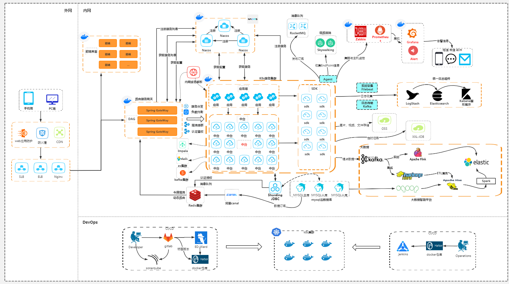

# 网关介绍

在微服务架构中，一个系统会被拆分为很多个微服务。那么作为客户端要如何去调用这么多的微服务呢？如果没有网关的存在，我们只能在客户端记录每个微服务的地址，然后分别去调用。这样的话会产生很多问题，例如：

- 客户端多次请求不同的微服务，增加客户端代码或配置编写的复杂性
- 认证复杂，每个微服务都有独立认证
- 存在跨域请求，在一定场景下处理相对复杂

为解决上面的问题所以引入了网关的概念：所谓的API网关，就是指系统的统一入口，提供内部服务的路由中转，为客户端提供统一服务，一些与业务本身功能无关的公共逻辑可以在这里实现，诸如认证、鉴权、监控、路由转发等。

## 网关对比

- Zuul 1.x

  Netflix开源的网关，基于Servlet框架构建，功能丰富，使用JAVA开发，易于二次开发 问题：即一个线程处理一次连接请求，这种方式在内部延迟严重、设备故障较多情况下会引起存活的连接增多和线程增加的情况发生。

- Zuul 2.x

  Zuul2 采用了Netty实现异步非阻塞编程模型，每个 CPU 核一个线程，处理所有的请求和响应，请求和响应的生命周期是通过事件和回调来处理的，这种方式减少了线程数量，因此开销较小。

- GateWay

  Spring公司为了替换Zuul而开发的网关服务，底层为Netty，将在下面具体介绍。

- Nginx+lua

  使用nginx的反向代理和负载均衡可实现对api服务器的负载均衡及高可用，lua是一种脚本语言,可以来编写一些简单的逻辑, nginx支持lua脚本，问题在于：无法融入到微服务架构中

- Kong

  基于Nginx+Lua开发，性能高，稳定，有多个可用的插件(限流、鉴权等等)可以开箱即用。 问题：只支持Http协议；二次开发，自由扩展困难；提供管理API，缺乏更易用的管控、配置方式。

## GateWay

Spring Cloud Gateway 基于Spring Boot 2.x、Spring WebFlux和Project Reactor，它旨在为微服务架构提供一种简单有效的统一的 API 路由管理方式。它的目标是替代Netflix Zuul，其不仅提供统一的路由方式，并且基于 Filter 链的方式提供了网关基本的功能，例如：安全，监控和限流。

特点：

1. 性能强劲：是Zuul的1.6倍
2. 功能强大：内置了很多实用的功能，例如转发、监控、限流等
3. 设计优雅，容易扩展

### 基本概念：

路由(Route) 是 gateway 中最基本的组件之一，表示一个具体的路由信息载体。主要定义了下面的几个信息:

-  id：路由标识、区别于其他route
- uri：路由指向的目的地uri，即客户端请求最终被转发到的微服务
- order：用于多个route之间的排序，数值越小排序越靠前，匹配优先级越高
- predicate：断言的作用是进行条件判断，只有断言都返回真，才会真正的执行路由 
- filter：过滤器用于修改请求和响应信息

### 执行流程：

1. Gateway Client向Gateway Server发送请求
2. 请求首先会被HttpWebHandlerAdapter进行提取组装成网关上下文
3. 然后网关的上下文会传递到DispatcherHandler，它负责将请求分发给RoutePredicateHandlerMapping
4. RoutePredicateHandlerMapping负责路由查找，并根据路由断言判断路由是否可用
5. 如果过断言成功，由FilteringWebHandler创建过滤器链并调用
6. 请求会一次经过PreFilter--微服务--PostFilter的方法，最终返回响应

## 总结：

SpringCloud GateWay使用的是Webflux中的reactor-netty响应式编程组件，底层使用了Netty通讯框架。

