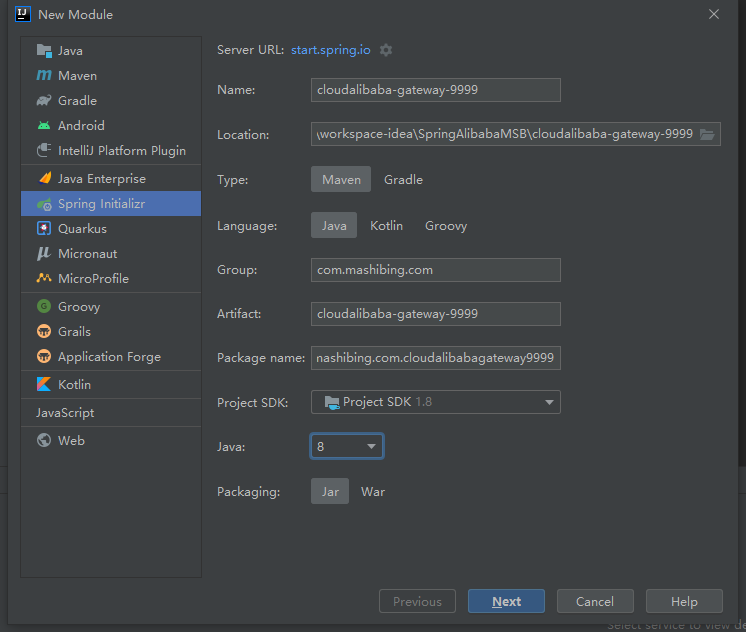
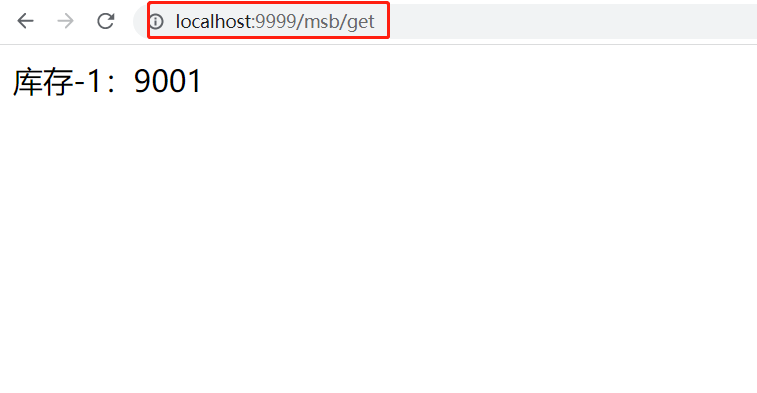
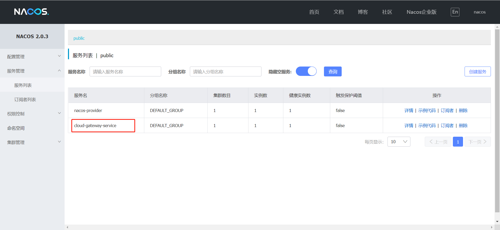

# GateWay工作流程+GateWay搭建

核心流程图如下：


**核心概念：**

客户端向 Spring Cloud Gateway 发出请求。如果Gateway Handler Mapping确定请求与路由匹配，则将其发送到Gateway Web Handler 处理程序。此处理程序通过特定于请求的Fliter链运行请求。Fliter被虚线分隔的原因是Fliter可以在发送代理请求之前（pre）和之后（post）运行逻辑。执行所有pre过滤器逻辑。然后进行代理请求。发出代理请求后，将运行“post”过滤器逻辑。

**过滤器作用：**

- Filter在pre类型的过滤器可以做参数效验、权限效验、流量监控、日志输出、协议转换等。
- Filter在post类型的过滤器可以做响应内容、响应头的修改、日志输出、流量监控等
- 这两种类型的过滤器有着非常重要的作用

在GateWay的内部有三个核心点，我们先来看一下：

## 核心点

- Route（路由）

  路由是构建网关的基础模块，它由ID，目标URI，包括一些列的断言和过滤器组成，如果断言为true则匹配该路由

- Predicate（断言）

  参考的是Java8的java.util.function.Predicate，开发人员可以匹配HTTP请求中的所有内容（例如请求头或请求参数），请求与断言匹配则进行路由

- Filter（过滤）

  指的是Spring框架中GateWayFilter的实例，使用过滤器，可以在请求被路由前或者之后对请求进行修改。

- 三个核心点连起来：

  当用户发出请求到达GateWay，GateWay会通过一些匹配条件，定位到真正的服务节点，并在这个转发过程前后，进行一些及细化控制。其中Predicate就是我们匹配的条件，而Filter可以理解为一个拦截器，有了这两个点，再加上目标URI，就可以实现一个具体的路由了。

  

## 总结

GateWay核心的流程就是：路由转发+执行过滤器链

## GateWay搭建

那么我们现在已经了解了整体的基础概念以后，我们现在来搭建一个GateWay项目：cloudalibaba-gateway-9999



因为GateWay输入SpringCloud的，所以我们要导入对应依赖，一定要注意版本关系：

版本对应地址：https://spring.io/projects/spring-cloud

老师这里使用的是SpringBoot2.2.6的版本所以配合的是SpringCloud的Hoxton.SR5版本

**注意：引入GateWay一定要删除spring-boot-starter-web依赖，否则会有冲突无法启动**

父级项目引入

```java
<!--spring cloud Hoxton.SR5-->
<dependency>
    <groupId>org.springframework.cloud</groupId>
    <artifactId>spring-cloud-dependencies</artifactId>
    <version>${spring-cloud-gateway-varsion}</version>
    <type>pom</type>
    <scope>import</scope>
</dependency>
```

子级项目，因为GateWay也需要注册进Nacos，所以也需要Nacos的依赖

```java
<dependency>
    <groupId>com.alibaba.cloud</groupId>
    <artifactId>spring-cloud-starter-alibaba-nacos-discovery</artifactId>
</dependency>
<dependency>
    <groupId>org.springframework.cloud</groupId>
    <artifactId>spring-cloud-starter-gateway</artifactId>
</dependency>
```

接着配置YML文件

```java
server:
  port: 9999
spring:
  application:
    name: cloud-gateway-service
  cloud:
    nacos:
      discovery:
        server-addr: localhost:8848
    gateway:
      discovery:
        locator:
          enabled: true #开启注册中心路由功能
      routes:  # 路由
        - id: nacos-provider #路由ID，没有固定要求，但是要保证唯一，建议配合服务名
          uri: http://localhost:9001/nacos-provider # 匹配提供服务的路由地址
          predicates: # 断言
            - Path=/msb/** # 断言，路径相匹配进行路由
```

更改9001的DemoController，加上一个入口

```java
@RestController
@RequestMapping("/msb")//路由路径
public class DemoController {

    @Value("${server.port}")
    private String serverPort;

    @GetMapping(value = "/get")
    public String getServerPort(){
        return "库存-1："+serverPort;
    }

}
```

最后测试，启动Nacos、9001和9999网关，通过网关访问9001的/msb/get接口同时查看Nacos控制台



Nacos控制台成功注册GateWay网关



