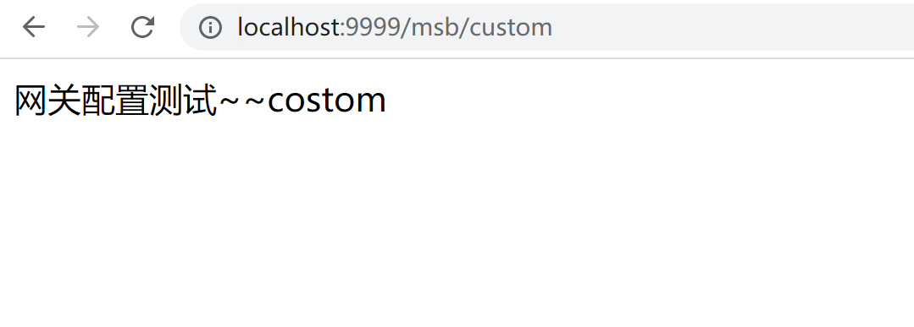

# GateWay配置路由的两种方式

经过上节课的讲解，我们现在知道了GateWay的基本配置路由的方式，通过YML来完成，但是实际上GateWay还提供了另外一种配置方式

## GatewayConfig

 其实这种配置方式就是通过代码的方式进行配置，也就是通过@Bean注入一个RouteLocator

那我们直接来操作一下

### 具体操作

首先我们在新建一个GateWayConfig，其实这里的配置对应的就是我们之前在YML中配置的对应内容

```java
package com.mashibing.com.cloudalibabagateway9999.config;

import org.springframework.cloud.gateway.route.RouteLocator;
import org.springframework.cloud.gateway.route.builder.RouteLocatorBuilder;
import org.springframework.context.annotation.Bean;
import org.springframework.context.annotation.Configuration;

@Configuration
public class GateWayConfig {
    /*
    配置了一个id为path_msb1的路由规则
    当访问地址http://localhost:9999/msb/**
    就会转发到http://localhost:9001/nacos-provider/msb/任何地址
     */

    @Bean
    public RouteLocator customRouteLocator(RouteLocatorBuilder routeLocatorBuilder){
        // 构建多个路由routes
        RouteLocatorBuilder.Builder routes = routeLocatorBuilder.routes();
        // 具体路由地址
        routes.route("path_msb",r -> r.path("/msb/**").uri("http://localhost:9001/nacos-provider")).build();
        // 返回所有路由规则
        return routes.build();
    }
}
```

我们在9001的DemoController中添加一个控制器

```java
@GetMapping(value = "/custom")
public String customTest(){
    return "网关配置测试~~costom";
}
```

这个时候我们就可以测试了，启动9999网关服务和9001微服务，然后访问地址：http://localhost:9999/msb/custom 就可以转发到9001中具体的接口中了

