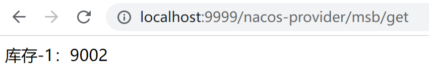

# GateWay实现负载均衡

在之前的学习中，我们已经掌握了GateWay的一些基本配置，包括两种配置方法，但是其中有很多的配置细节，我们没有细讲，包括我们现在的配置是写死的具体端口号，那么这节课，我们要实现通过GateWay实现负载均衡的两种方式

## 自动负载均衡

首先我们看一下我们之前的网关服务9999的yml配置，这里的配置信息，其实有一些，咱们目前是不清楚的，比如：

1. gateway.discovery.locator.enabled: true #开启自动路由功能
2. routes中的uri其实最后是不需要服务名称的，这个位置其实只需要指定的localhost:9001即可

```java
server:
  port: 9999
spring:
  application:
    name: cloud-gateway-service
  cloud:
    nacos:
      discovery:
        server-addr: localhost:8848
    gateway:
      discovery:
        locator:
          enabled: true #开启自动路由功能，根据服务名称自动创建routes
      routes:  # 路由
        - id: nacos-provider #路由ID，没有固定要求，但是要保证唯一，建议配合服务名
          uri: http://localhost:9001/nacos-provider # 匹配提供服务的路由地址
          predicates: # 断言
            - Path=/msb/** # 断言，路径相匹配进行路由
```

所以这个位置我们可以把当前的配置优化为以下情况，它是一样可以启动的，我们可以进行测试启动9001和网关9999，通过网关来访问"localhost:9999/msb/**"

```java
server:
  port: 9999
spring:
  application:
    name: cloud-gateway-service
  cloud:
    nacos:
      discovery:
        server-addr: localhost:8848
    gateway:
      routes:  # 路由
        - id: nacos-provider #路由ID，没有固定要求，但是要保证唯一，建议配合服务名
          uri: http://localhost:9001 # 匹配提供服务的路由地址
          predicates: # 断言
            - Path=/msb/** # 断言，路径相匹配进行路由
```

GateWay还提供了和Zuul类似的自动路由规则，具体配置如下：

1. discovery.locator.enabled: true #这个配置默认为false，但是如果为true，就是开启了通过serviceId转发到具体的服务实例。“localhost:9999/ServiceID/msb/**”
2. 在配置好这些以后，我们可以直接通过服务名称来进行访问Nacos中注册的服务和对应的接口
3. 这个位置我们为了测试可以启动2个微服务9001、9002
4. GateWay在开启了自动路由以后，还自带负载均衡

```java
server:
  port: 9999
spring:
  application:
    name: cloud-gateway-service
  cloud:
    nacos:
      discovery:
        server-addr: localhost:8848
    gateway:
      discovery:
        locator:
          enabled: true #是否与服务发现组件进行结合，通过serviceId转发到具体的服务实例。默认为false，设为true便开启通过服务中心的自动根据 serviceId 创建路由的功能。
```

9002和9001保持一致，Controller保持一致，负载均衡测试

```java
package com.mashibing.cloudalibabanacos9002.controller;

import org.springframework.beans.factory.annotation.Value;
import org.springframework.web.bind.annotation.GetMapping;
import org.springframework.web.bind.annotation.PathVariable;
import org.springframework.web.bind.annotation.RequestMapping;
import org.springframework.web.bind.annotation.RestController;

@RestController
@RequestMapping("/msb")
public class DemoController {

    @Value("${server.port}")
    private String serverPort;

    @GetMapping(value = "/get")
    public String getServerPort(){
        return "库存-1："+serverPort;
    }

    @GetMapping(value = "custom")
    public String customTest(){
        return "测试网关配置类~~custom";
    }
}
```

测试结果：

- 访问地址：
  - http://localhost:9999/nacos-provider/msb/get





## 手动负载均衡

在以上的配置中，其实是有问题的，问题在于当前的服务名称暴露，并且太过于灵活，那么如果想解决的话，其实我们可以进行手动配置。

具体配置如下：

```java
server:
  port: 9999
spring:
  application:
    name: cloud-gateway-service
  cloud:
    nacos:
      discovery:
        server-addr: localhost:8848
    gateway:
      discovery:
        locator:
          enabled: true #开启自动路由功能(此时可以关闭)
      routes: # 路由
        - id: nacos-provider #路由ID，没有固定要求，但是要保证唯一，建议配合服务名
          uri: lb://nacos-provider # 匹配提供服务的路由地址
          predicates: # 断言
            - Path=/msb/** 
```

## 测试

我们现在开启9001/9002两个服务和9999网关服务，然后此时我们可以通过网关去访问：http://localhost:9999/msb/get


