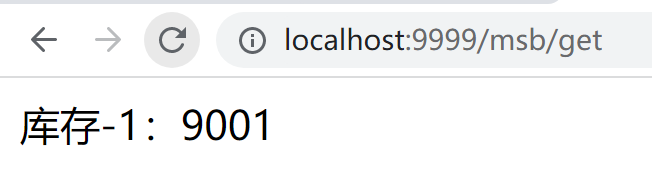
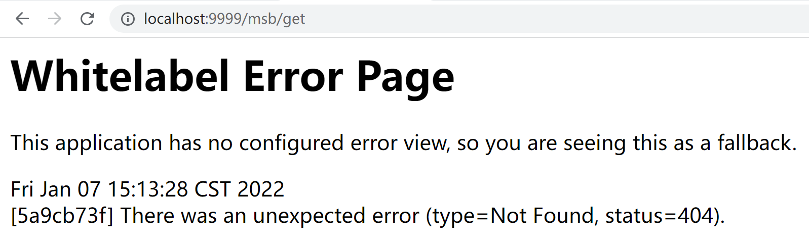
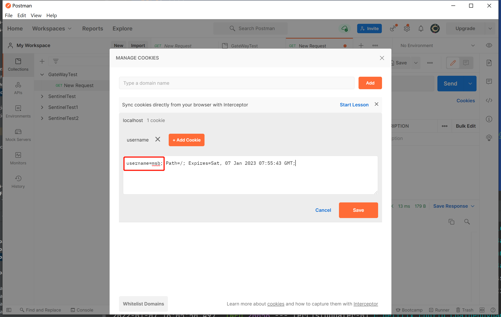
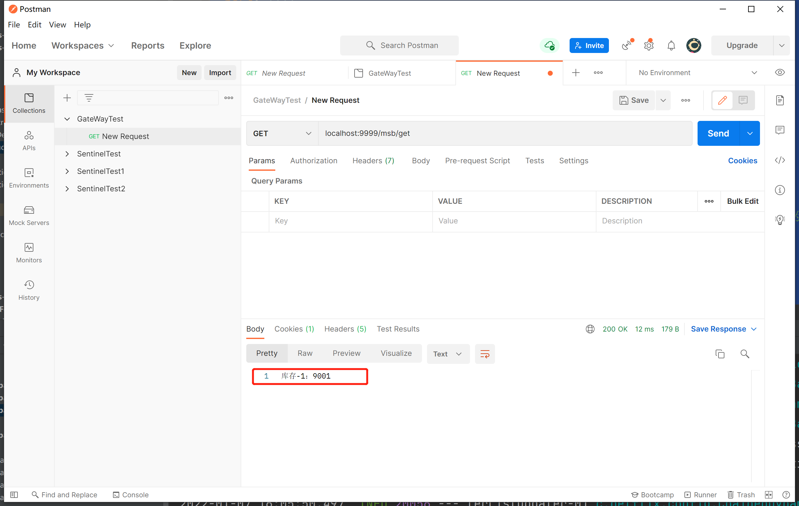
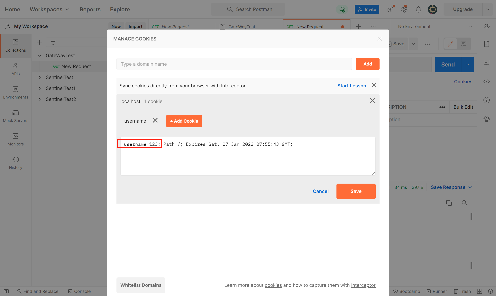
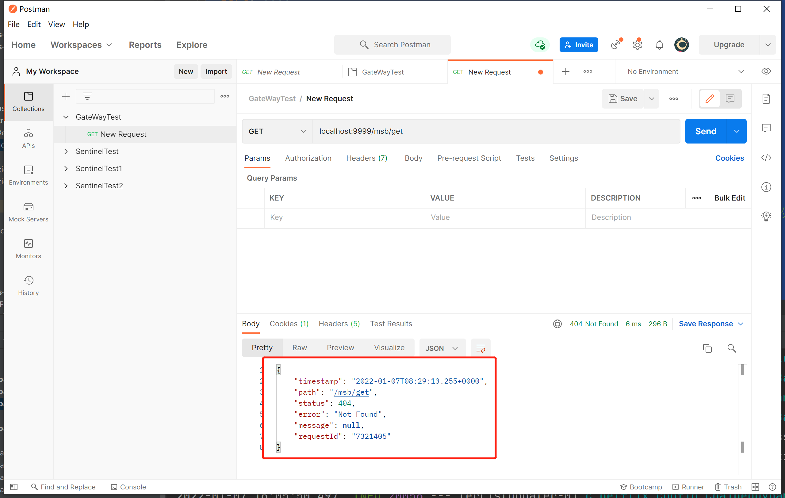
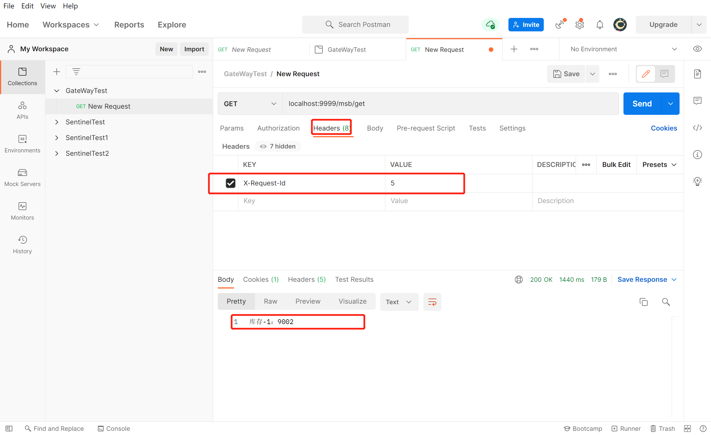
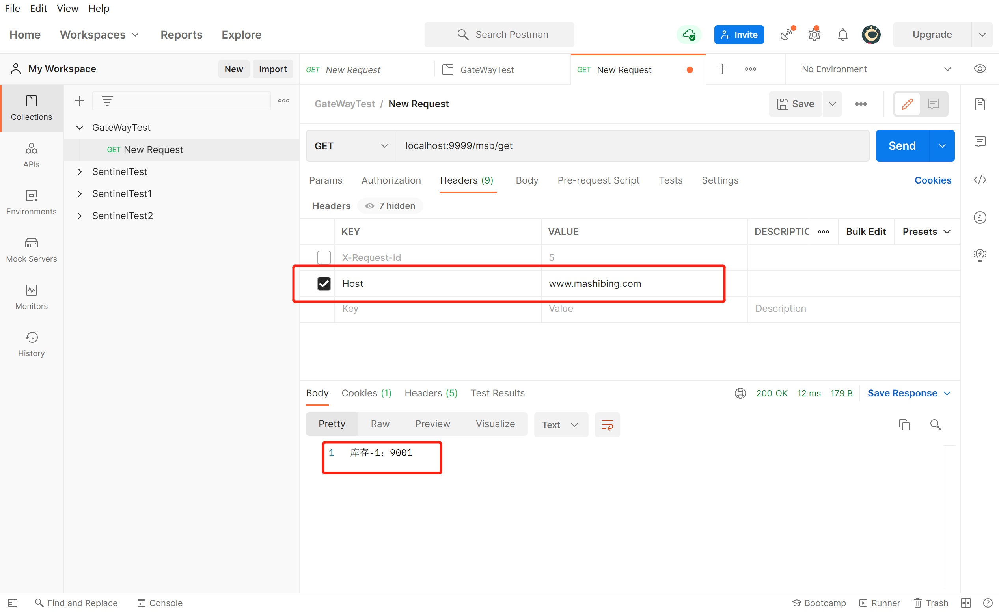
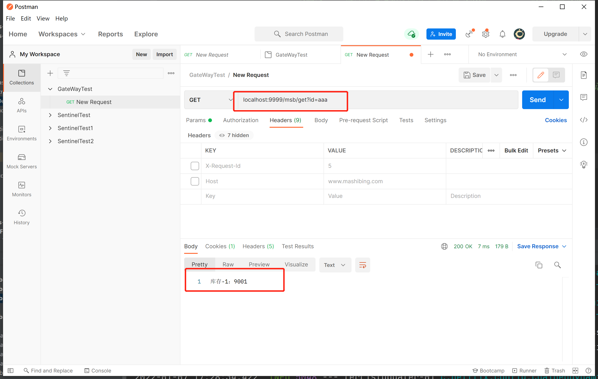

# GateWay断言Predicate

这节课我们来研究一下GateWay的Predicate（断言）

每一个Predicate的使用，可以理解为：当满足条件后才会进行转发，如果十多个，那就是满足所有条件才会转发

## 断言种类

1. After：匹配在指定日期时间之后发生的请求。
2. Before：匹配在指定日期之前发生的请求。
3. Between：需要指定两个日期参数，设定一个时间区间，匹配此时间区间内的请求。
4. Cookie：需要指定两个参数，分别为name和regexp（正则表达式），也可以理解Key和Value，匹配具有给定名称且其值与正则表达式匹配的Cookie。
5. Header：需要两个参数header和regexp（正则表达式），也可以理解为Key和Value，匹配请求携带信息。
6. Host：匹配当前请求是否来自于设置的主机。
7. Method：可以设置一个或多个参数，匹配HTTP请求，比如GET、POST
8. Path：匹配指定路径下的请求，可以是多个用逗号分隔
9. Query：需要指定一个或者多个参数，一个必须参数和一个可选的正则表达式，匹配请求中是否包含第一个参数，如果有两个参数，则匹配请求中第一个参数的值是否符合正则表达式。
10. RemoteAddr：匹配指定IP或IP段，符合条件转发。
11. Weight：需要两个参数group和weight（int），实现了路由权重功能，按照路由权重选择同一个分组中的路由

## 常用断言演示

以上这么多的断言，我们不可能一一的去演示，我们挑出一些比较常用的来给大家做演示，这些具体的演示在官网上都有提供，具体地址为：https://docs.spring.io/spring-cloud-gateway/docs/current/reference/html/#gateway-request-predicates-factories

### After

匹配在指定时间之后发生的请求，可以对应提前上线业务

yml配置

```java
server:
  port: 9999
spring:
  application:
    name: cloud-gateway-service
  cloud:
    nacos:
      discovery:
        server-addr: localhost:8848
    gateway:
      discovery:
        locator:
          enabled: false # 是否与服务发现进行组合，通过ServiceID转发到具体的服务实例，默认为false，
                        # 设置为true便开启通过服务注册中心来自动根据SeviceID创建路由功能。
      routes:
        - id: nacos-provider # 路由ID，唯一不可重复，最好配合服务名
          uri: lb://nacos-provider # 匹配提供服务的路由地址 lb://代表开启负载均衡
          predicates: # 断言
            - Path=/msb/** # 匹配对应地址
            - After=2022-01-07T14:39:10.529+08:00[Asia/Shanghai] # 在这个时间之后的请求都能通过，当前没有为题以后，故意改为1个小时以后
```

写一个测试类，来获取当前时间

```java
public class TestDateTime {
    public static void main(String[] args) {
        ZonedDateTime zbj = ZonedDateTime.now();//默认时区
        System.out.println(zbj);
    }
}
```

测试：

当前时间之后请求没有问题



设置为1个小时会后访问404



当这个After理解了以后，剩下的关于日期时间的设置Before、Between道理都是一样的，只不过是限定不同的日期时间区间

### Cookie

需要指定两个参数，分别为name和regexp（正则表达式），也可以理解Key和Value，匹配具有给定名称且其值与正则表达式匹配的Cookie。

简单理解就是路由规则会通过获取Cookie name值和正则表达式去匹配，如果匹配上就会执行路由，如果匹配不上则不执行。

我们可以分为两种情况演示，Cookie匹配，Cookie不匹配

yml

```java
server:
  port: 9999
spring:
  application:
    name: cloud-gateway-service
  cloud:
    nacos:
      discovery:
        server-addr: localhost:8848
    gateway:
      discovery:
        locator:
          enabled: false # 是否与服务发现进行组合，通过ServiceID转发到具体的服务实例，默认为false，
                        # 设置为true便开启通过服务注册中心来自动根据SeviceID创建路由功能。
      routes:
        - id: nacos-provider # 路由ID，唯一不可重复，最好配合服务名
          uri: lb://nacos-provider # 匹配提供服务的路由地址 lb://代表开启负载均衡
          predicates: # 断言
            - Path=/msb/** # 匹配对应地址
            # - After=2022-01-07T14:39:10.529+08:00[Asia/Shanghai] # 在这个时间之后的请求都能通过
            - Cookie=username,[a-z]+ # 匹配Cookie的key和value（正则表达式）
```

那么我们通过postman来进行测试

当Cookie匹配时：





当Cookie不匹配时：





 ### Header

需要两个参数header和regexp（正则表达式），也可以理解为Key和Value，匹配请求携带信息。

实际上就是请求头携带的信息，官网给出的案例是X-Request-Id，那我们就用这个做实验

yml

```java
server:
  port: 9999
spring:
  application:
    name: cloud-gateway-service
  cloud:
    nacos:
      discovery:
        server-addr: localhost:8848
    gateway:
      discovery:
        locator:
          enabled: false # 是否与服务发现进行组合，通过ServiceID转发到具体的服务实例，默认为false，
                        # 设置为true便开启通过服务注册中心来自动根据SeviceID创建路由功能。
      routes:
        - id: nacos-provider # 路由ID，唯一不可重复，最好配合服务名
          uri: lb://nacos-provider # 匹配提供服务的路由地址 lb://代表开启负载均衡
          predicates: # 断言
            - Path=/msb/** # 匹配对应地址
            #- After=2022-01-07T14:39:10.529+08:00[Asia/Shanghai] # 在这个时间之后的请求都能通过
            #- Cookie=username,[a-z]+
            - Header=X-Request-Id,\d+ #表示数字
```

测试



### Host

匹配当前请求是否来自于设置的主机。

这个比较比较简单，我们直接来试验

yml

```java
server:
  port: 9999
spring:
  application:
    name: cloud-gateway-service
  cloud:
    nacos:
      discovery:
        server-addr: localhost:8848
    gateway:
      discovery:
        locator:
          enabled: false # 是否与服务发现进行组合，通过ServiceID转发到具体的服务实例，默认为false，
                        # 设置为true便开启通过服务注册中心来自动根据SeviceID创建路由功能。
      routes:
        - id: nacos-provider # 路由ID，唯一不可重复，最好配合服务名
          uri: lb://nacos-provider # 匹配提供服务的路由地址 lb://代表开启负载均衡
          predicates: # 断言
            - Path=/msb/** # 匹配对应地址
            #- After=2022-01-07T14:39:10.529+08:00[Asia/Shanghai] # 在这个时间之后的请求都能通过
            #- Cookie=username,[a-z]+
            #- Header=X-Request-Id,\d+ #表示数字
            - Host=**.mashibing.com #匹配当前的主机地址发出的请求
```

postman



### Method

可以设置一个或多个参数，匹配HTTP请求，比如GET、POST

yml

```java
server:
  port: 9999
spring:
  application:
    name: cloud-gateway-service
  cloud:
    nacos:
      discovery:
        server-addr: localhost:8848
    gateway:
      discovery:
        locator:
          enabled: false # 是否与服务发现进行组合，通过ServiceID转发到具体的服务实例，默认为false，
                        # 设置为true便开启通过服务注册中心来自动根据SeviceID创建路由功能。
      routes:
        - id: nacos-provider # 路由ID，唯一不可重复，最好配合服务名
          uri: lb://nacos-provider # 匹配提供服务的路由地址 lb://代表开启负载均衡
          predicates: # 断言
            - Path=/msb/** # 匹配对应地址
            #- After=2022-01-07T14:39:10.529+08:00[Asia/Shanghai] # 在这个时间之后的请求都能通过
            #- Cookie=username,[a-z]+
            #- Header=X-Request-Id,\d+ #表示数字
            #- Host=**.mashibing.com #匹配当前的主机地址发出的请求
            - Method=GET,POST # 匹配GET请求或者POST请求
```

### Query

需要指定一个或者多个参数，一个必须参数和一个可选的正则表达式，匹配请求中是否包含第一个参数，如果有两个参数，则匹配请求中第一个参数的值是否符合正则表达式。

yml

```java
server:
  port: 9999
spring:
  application:
    name: cloud-gateway-service
  cloud:
    nacos:
      discovery:
        server-addr: localhost:8848
    gateway:
      discovery:
        locator:
          enabled: false # 是否与服务发现进行组合，通过ServiceID转发到具体的服务实例，默认为false，
                        # 设置为true便开启通过服务注册中心来自动根据SeviceID创建路由功能。
      routes:
        - id: nacos-provider # 路由ID，唯一不可重复，最好配合服务名
          uri: lb://nacos-provider # 匹配提供服务的路由地址 lb://代表开启负载均衡
          predicates: # 断言
            - Path=/msb/** # 匹配对应地址
            #- After=2022-01-07T14:39:10.529+08:00[Asia/Shanghai] # 在这个时间之后的请求都能通过
            #- Cookie=username,[a-z]+
            #- Header=X-Request-Id,\d+ #表示数字
            #- Host=**.mashibing.com #匹配当前的主机地址发出的请求
            #- Method=GET,POST
            - Query=id,.+ # 匹配请求参数，这里如果需要匹配多个参数，可以写多个Query
```

测试：



### Weight

需要两个参数group和weight（int），实现了路由权重功能，按照路由权重选择同一个分组中的路由

官网提供的演示yml

```java
spring:
  cloud:
    gateway:
      routes:
      - id: weight_high
        uri: https://weighthigh.org
        predicates:
        - Weight=group1, 8
      - id: weight_low
        uri: https://weightlow.org
        predicates:
        - Weight=group1, 2
```

该路由会将约 80% 的流量转发到[weighthigh.org](https://weighthigh.org/)，将约 20% 的流量[转发](https://weighlow.org/)到[weightlow.org](https://weighlow.org/)

## 总结：

Predicate就是为了实现一组匹配规则，让请求过来找到对应的Route进行处理。