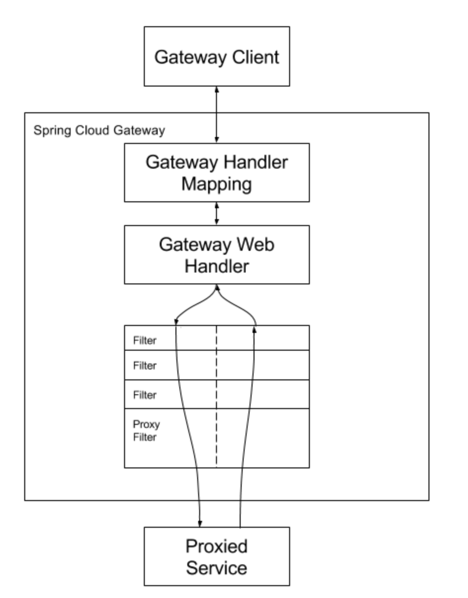
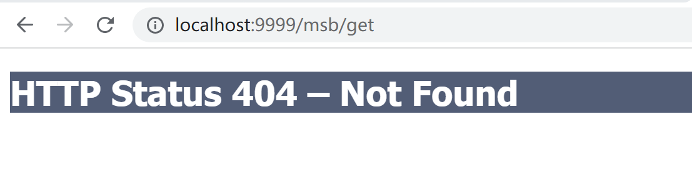
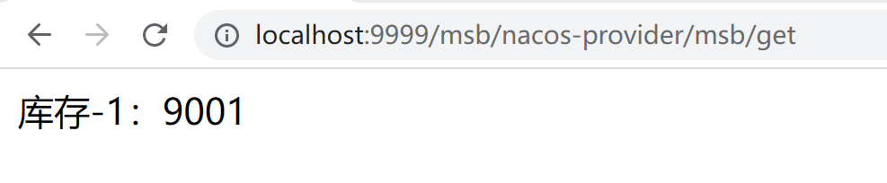
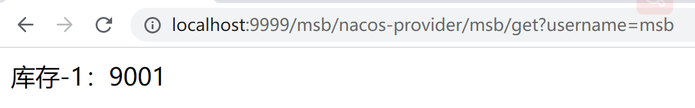
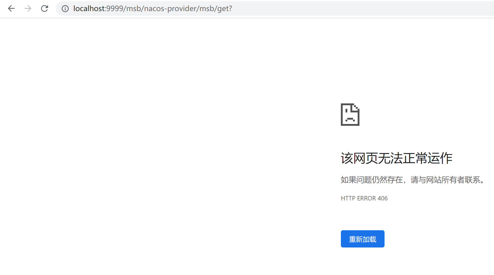

# GateWay的Filter

路由过滤器允许以某种方式修改传入的 HTTP 请求或传出的 HTTP 响应。路由过滤器的范围是特定的路由。Spring Cloud Gateway 包含许多内置的 GatewayFilter 工厂。



## 内置Filter

1. GateWay内置的Filter生命周期为两种：pre（业务逻辑之前）、post（业务逻辑之后）

2. GateWay本身自带的Filter分为两种： GateWayFilter（单一）、GlobalFilter（全局）
3. 单一的有32种，全局的有9种
4. 官方网址：https://docs.spring.io/spring-cloud-gateway/docs/current/reference/html/#global-filters

这个数量实在是太惊人了，而且用法都比较简单，所以这里大家可以自行根据官网给出的演示进行练习，在这里给大家举一个例子

### StripPrefix（死拽t 破瑞fai s）

该StripPrefix有一个参数，parts。该parts参数指示在将请求发送到下游之前要从请求中剥离的路径中的部分数。

案例：比如我们现在在9001微服务上加一个context-path配置

```yml
server:
  port: 9001
  servlet:
    context-path: /nacos-provider
.....
```

现在9001的访问路径变为http://localhost:9001/nacos-provider/msb/get

目前的网关9999配置信息为

```java
server:
  port: 9999
spring:
  application:
    name: cloud-gateway-service
  cloud:
    nacos:
      discovery:
        server-addr: localhost:8848
    gateway:
      discovery:
        locator:
          enabled: false # 是否与服务发现进行组合，通过ServiceID转发到具体的服务实例，默认为false，
                        # 设置为true便开启通过服务注册中心来自动根据SeviceID创建路由功能。
      routes:
        - id: nacos-provider # 路由ID，唯一不可重复，最好配合服务名
          uri: lb://nacos-provider # 匹配提供服务的路由地址 lb://代表开启负载均衡
          predicates: # 断言
            - Path=/msb/** # 匹配对应地址
```

为了保证断言能够匹配，此时通过网关的访问地址应该改为：http://localhost:9999/msb/nacos-provider/msb/get，但是出现了404因为多了一层路径http://localhost:9001/msb/nacos-provider/msb/get



那么如果想要解决，我们应该在转发的时候去地址中最前面的/msb，所以我们就需要使用FIlter：StripPrefix

yml

```java
server:
  port: 9999
spring:
  application:
    name: cloud-gateway-service
  cloud:
    nacos:
      discovery:
        server-addr: localhost:8848
    gateway:
      discovery:
        locator:
          enabled: false # 是否与服务发现进行组合，通过ServiceID转发到具体的服务实例，默认为false，
                        # 设置为true便开启通过服务注册中心来自动根据SeviceID创建路由功能。
      routes:
        - id: nacos-provider # 路由ID，唯一不可重复，最好配合服务名
          uri: lb://nacos-provider # 匹配提供服务的路由地址 lb://代表开启负载均衡
          predicates: # 断言
            - Path=/msb/** # 匹配对应地址
          filters:
            - StripPrefix=1 # 去掉地址中的第一部分
          # http://localhost:9999/msb/nacos-provider/msb/get
          # http://localhost:9999/nacos-provider/msb/get
```

最后我们来看效果，成功转发



## 自定义Filter

要实现GateWay自定义过滤器，那么我们需要实现两个接口

- GlobalFilter
- Ordered

### 演示

首先我们新建一个类MyFilter

```java
@Component
@Slf4j
public class MyFilter implements Ordered, GlobalFilter {
    /**
     * @param exchange 可以拿到对应的request和response
     * @param chain 过滤器链
     * @return 是否放行
     */
    @Override
    public Mono<Void> filter(ServerWebExchange exchange, GatewayFilterChain chain) {
        String username = exchange.getRequest().getQueryParams().getFirst("username");
        log.info("*************MyFilter:"+new Date());
        if(username == null){
            log.info("**********用户名为null，非法用户，请求被拒绝！");
            //如果username为空，返回状态码为406，不可接受的请求
            exchange.getResponse().setStatusCode(HttpStatus.NOT_ACCEPTABLE);
            return exchange.getResponse().setComplete();
        }
        return chain.filter(exchange);
    }

    /**
     * 加载过滤器的顺序
     * @return 整数数字越小优先级越高
     */
    @Override
    public int getOrder() {
        return 0;
    }
}

```

测试，此时我们的逻辑是在访问同时要传入username参数同时不能为空，否则不会放行本次请求。

传入正确参数：



未传入正确参数：

