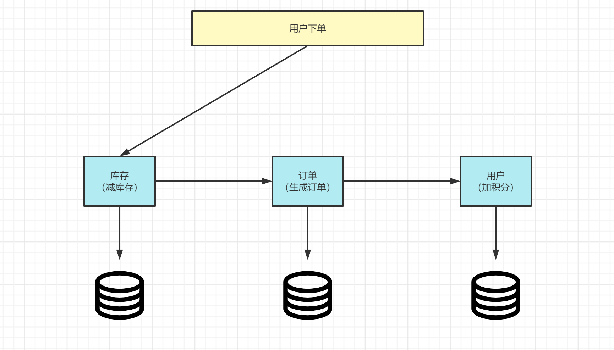
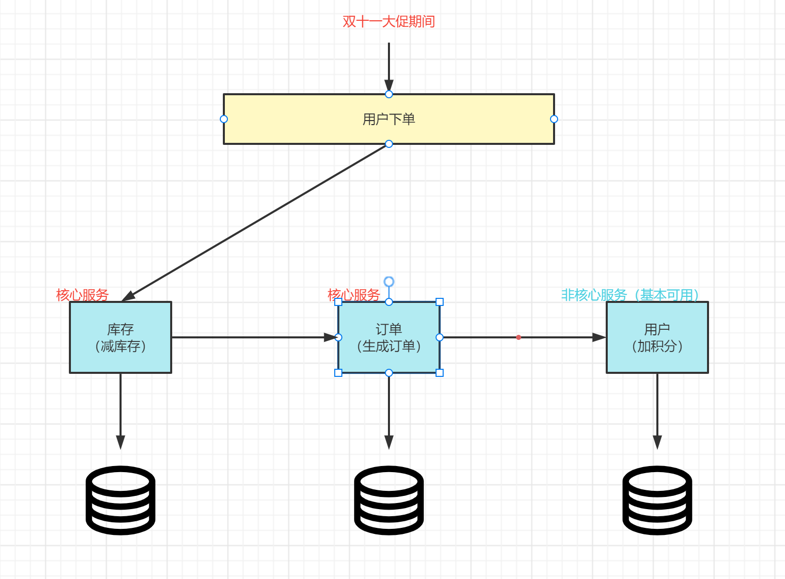
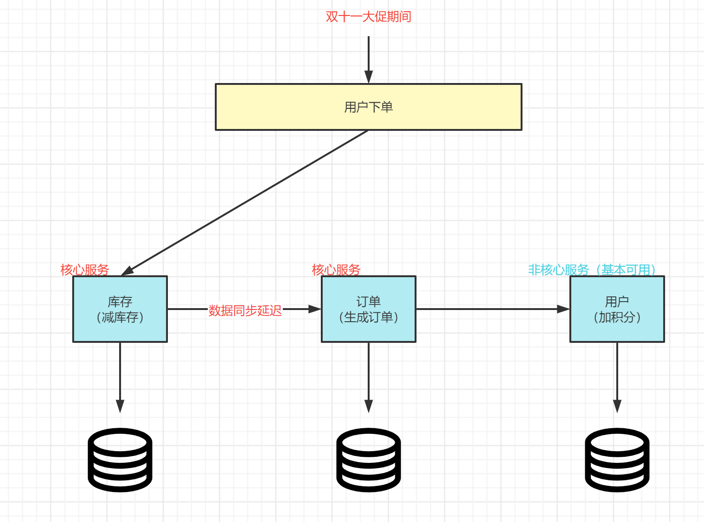
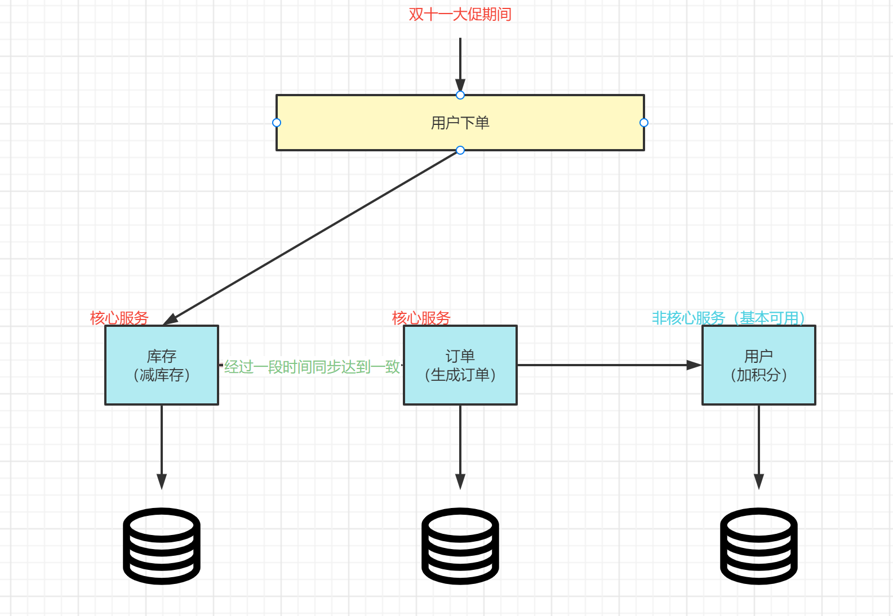

# 分布式事务简介

## 概念

基础概念：事务ACID

* A（Atomic）：原子性，构成事务的所有操作，要么都执行完成，要么全部不执行，不可能出现部分成功部分失 败的情况。
* C（Consistency）：一致性，在事务执行前后，数据库的一致性约束没有被破坏。比如：张三向李四转100元， 转账前和转账后的数据是正确状态这叫一致性，如果出现张三转出100元，李四账户没有增加100元这就出现了数 据错误，就没有达到一致性。
* I（Isolation）：隔离性，数据库中的事务一般都是并发的，隔离性是指并发的两个事务的执行互不干扰，一个事 务不能看到其他事务运行过程的中间状态。通过配置事务隔离级别可以避脏读、重复读等问题。
* D（Durability）：持久性，事务完成之后，该事务对数据的更改会被持久化到数据库，且不会被回滚。

### 事务

* 本地事务：同一数据库和服务器，称为本地事务
  在计算机系统中，更多的是通过关系型数据库来控制事务，这是利用数据库本身的事务特性来实现的，因此叫数据库事务，由于应用主要靠关系数据库来控制事务，而数据库通常和应用在同一个服务器，所以基于关系型数据库的事务又被称为本地事务。
* 分布式事务：
  分布式事务指事务的参与者、支持事务的服务器、资源服务器以及事务管理器分别位于**不同的分布式系统**的不同节点之上，且属于不同的应用，分布式事务需要保证这些操作要么全部成功，要么全部失败。本质上来说，分布式事务就是为了保证不同数据库的数据一致性。
* 举例：
  分布式系统会把一个应用系统拆分为可独立部署的多个服务，因此需要服务与服务之间远程协作才能完成事务操 作，这种分布式系统环境下由不同的服务之间通过网络远程协作完成事务称之为分布式事务，例如用户注册送积分事务、创建订单减库存事务，银行转账事务等都是分布式事务。

通过以上的图中我们可以看出，其实只要涉及到操作多个数据源，就可能会产生事务问题，当然在实际开发中我们要尽量避免这种问题的出现，当然如果避免不了，我们就需要进行解决，在我们的微服务系统架构中，目前比较好，比较常用的解决方案就是Seata。

## 分布式事务理论

随着互联化的蔓延，各种项目都逐渐向分布式服务做转换。如今微服务已经普遍存在，本地事务已经无法满足分布式的要求，由此分布式事务问题诞生。 分布式事务被称为世界性的难题，目前分布式事务存在两大理论依据：CAP定律 BASE理论。

### CAP定律

这个定理的内容是指的是在一个分布式系统中、Consistency（一致性）、 Availability（可用性）、Partition tolerance（分区容错性），三者不可得兼。

- 一致性（C）

  在分布式系统中的所有数据备份，在同一时刻是否同样的值。（等同于所有节点访问同一份最新的数据副本）

- 可用性（A）

  在集群中一部分节点故障后，集群整体是否还能响应客户端的读写请求。（对数据更新具备高可用性）

- 分区容错性（P）

  以实际效果而言，分区相当于对通信的时限要求。系统如果不能在时限内达成数据一致性，就意味着发生了分区的情况，必须就当前操作在C和A之间做出选择

CAP是无法同时存在的，一下通过这个例子来说明

1. 当库存服务减库存以后，那么需要将数据同步到其他的服务上，这是为了保证数据一致性C，但是网络是不可靠的，所以我们系统就需要保证分区容错性P，也就是我们必须容忍网络所带来的的一些问题，此时如果我们想保证C那么就需要舍弃A，也就是说我们在保证C的情况下，就必须舍弃A，也就是CP无法保证高可用。
2. 如果为了保证A，高可用的情况下，也就是必须在限定时间内给出响应，同样由于网络不可靠P，订单服务就有可能无法拿到新的数据，但是也要给用户作出响应，那么也就无法保证C一致性。所以AP是无法保证强一致性的。
3. 如果我们想保证CA，也就是高可用和一致性，也就是必须保证网络良好才能实现，那么也就是说我们需要将库存、订单、用户放到一起，但是这种情况也就丧失了P这个保证，这个时候系统也就不是分布式系统了。
4. 总结：在分布式系统中，p是必然的存在的，所以我们只能在C和A之间进行取舍，在这种条件下就诞生了BASE理论

### BASE理论

BASE是Basically Available（基本可用）、Soft state（软状态）和 Eventually consistent（最终一致性）三个短语的缩写。BASE理论是对CAP中一致性和可用性权衡的结果，其来源于对大规模互联网系统分布式实践的总结， 是基于CAP定理逐步演化而来的。BASE理论的核心思想是：即使无法做到强一致性，但每个应用都可以根据自身业务特点，采用适当的方式来使系统达到最终一致性。

- 基本可用

  基本可用是指分布式系统在出现不可预知故障的时候，允许损失部分可用性—-注意，这绝不等价于系统不可用。比如：

  （1）响应时间上的损失。正常情况下，一个在线搜索引擎需要在0.5秒之内返回给用户相应的查询结果，但由于出现故障，查询结果的响应时间增加了1~2秒

  （2）系统功能上的损失：正常情况下，在一个电子商务网站上进行购物的时候，消费者几乎能够顺利完成每一笔订单，但是在一些节日大促购物高峰的时候，由于消费者的购物行为激增，为了保护购物系统的稳定性，部分消费者可能会被引导到一个降级页面

- 软状态

  软状态指允许系统中的数据存在中间状态，并认为该中间状态的存在不会影响系统的整体可用性，即允许系统在不同节点的数据副本之间进行数据同步的过程存在延时

- 最终一致性

  最终一致性强调的是所有的数据副本，在经过一段时间的同步之后，最终都能够达到一个一致的状态。因此，最终一致性的本质是需要系统保证最终数据能够达到一致，而不需要实时保证系统数据的强一致性。

那这个位置我们依旧可以用我们刚才的例子来进行说明

**基本可用：**保证核心服务是可以使用的，至于其他的服务可以适当的降低响应时间，甚至是服务降级

**软状态：**存在中间状态，不影响整体系统使用，数据同步存在延时

**最终一致性：**再过了流量高峰期以后，经过一段时间的同步，保持各服务数据的一致

