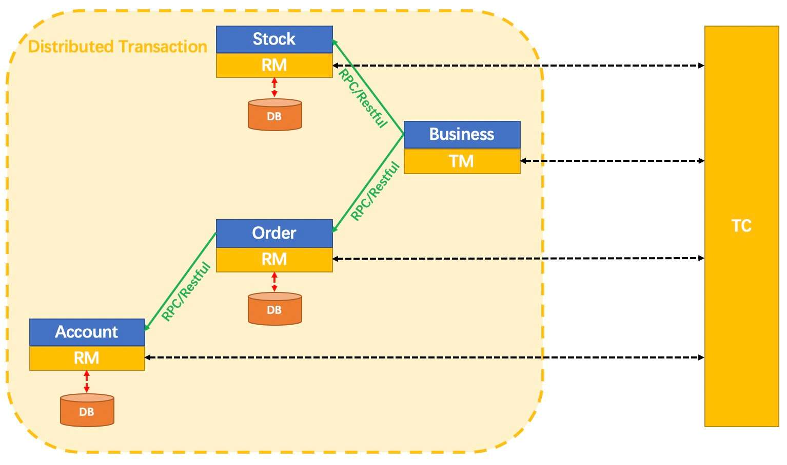

# Seata-Server安装

## 分布式事务解决方案

2PC即两阶段提交协议，是将整个事务流程分为两个阶段，P是指准备阶段，C是指提交阶段。

1. 准备阶段（Prepare phase）
2. 提交阶段（commit phase）

举例：比如说相亲对象两个人去吃饭，店老板要求，先付钱在吃饭，这是男女双方提出了AA，也就是说只有男女双方都付钱，才能落座吃饭，但是只要两个人中有一个不统一付款就不能落座吃饭。

- 准备阶段：老板要求男方付款，男方付款。老板要求女方付款，女方付款
- 提交阶段：老板出餐，两人纷纷落座

其实此例子就形成了一个事务，如果男女双方有一个人拒绝付款，那么老板就不会出餐，并且会把已收取的钱原路退回。

真个事务过程是由事务管理器和参与者组成的，店老板就是事务管管理器，男女双发就是参与者，事务管理器决策整个分布式事务在计算机中关系数据库支持的两阶段提交协议：

- 准备阶段（Prepare phase）：事务管理器给每个参与者发送Prepare消息，每个数据库参与者在本地执行事务，并写本地的Undo/Redo日志，此时事务没有提交。
- （Undo日志是记录修改前的数据，用于数据库回滚，Redo日志是记录修改后的数据，用于提交事务后写入数据文件）
- 提交阶段（commit phase）：如果事务管理器收到了参与者的执行失败或者超时消息时，直接给每个参与者发送回滚(Rollback)消息；否则，发送提交(Commit)消息；参与者根据事务管理器的指令执行提交或者回滚操作，并释放事务处理过程中使用的资源。

具体步骤图例：

成功：

失败：

## Seata简介

官网：https://seata.io/zh-cn/docs/overview/what-is-seata.html

概念：Seata 是一款开源的分布式事务解决方案，致力于提供高性能和简单易用的分布式事务服务。Seata 将为用户提供了 AT、TCC、SAGA 和 XA 事务模式，为用户打造一站式的分布式解决方案。

在我们的微服务系统中，对应业务被对应的拆分成独立模块，在官方提供的架构图中，我们可以看出当前是三个服务：

- 仓储服务：对给定的商品进行增删操作记录数量
- 订单服务：根据采购者的需求创建订单
- 账户服务：从用户账户中扣除余额、积分等

在这套架构中，用户下单购买商品的业务，就需要三个服务来完成，每个服务内部的数据一致性由本地事务来保证，但是全局的数据一致性问题就没办法保证，Seata就是来进行解决这种问题的解决方案。

## Seata术语

官网地址：https://seata.io/zh-cn/docs/overview/terminology.html

要了解Seata，首先我们要了解一下Seata的几个关键的概念：

- TC (Transaction Coordinator) - 事务协调者

  维护全局和分支事务的状态，驱动全局事务提交或回滚。

  

- TM (Transaction Manager) - 事务管理器（发起者，同时也是RM的一种）

  定义全局事务的范围：开始全局事务、提交或回滚全局事务。

  

- RM (Resource Manager) - 资源管理器（每个参与事务的微服务）

  管理分支事务处理的资源，与TC交谈以注册分支事务和报告分支事务的状态，并驱动分支事务提交或回滚。

