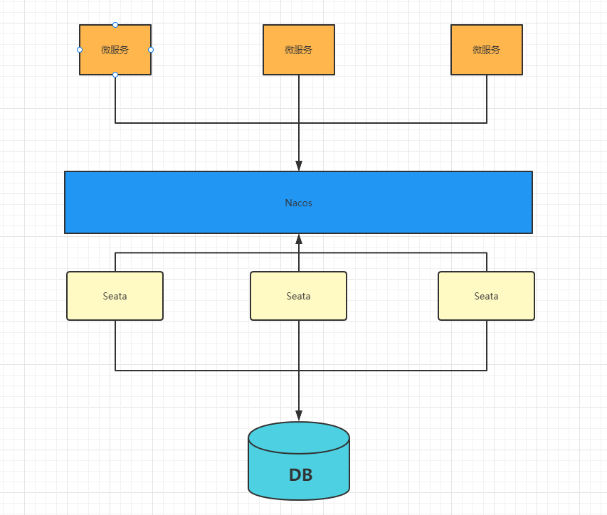
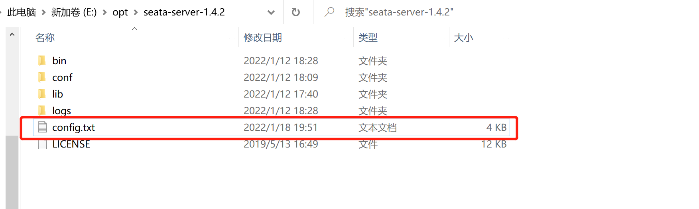
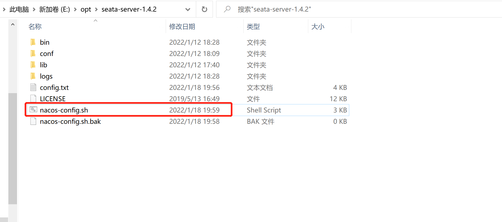
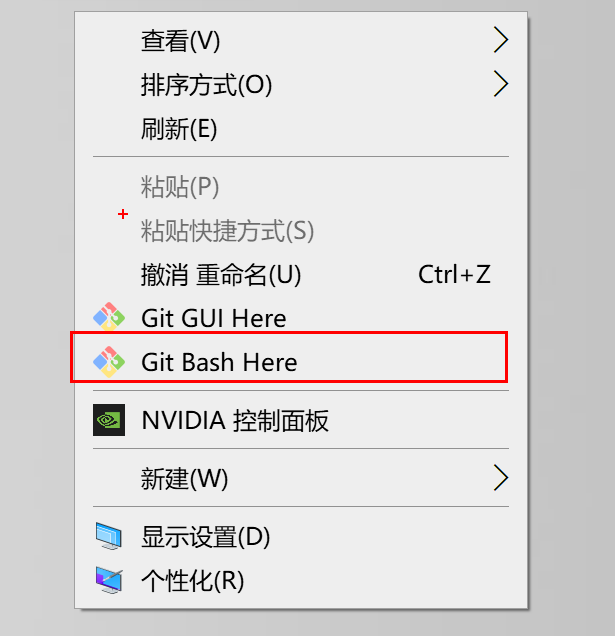
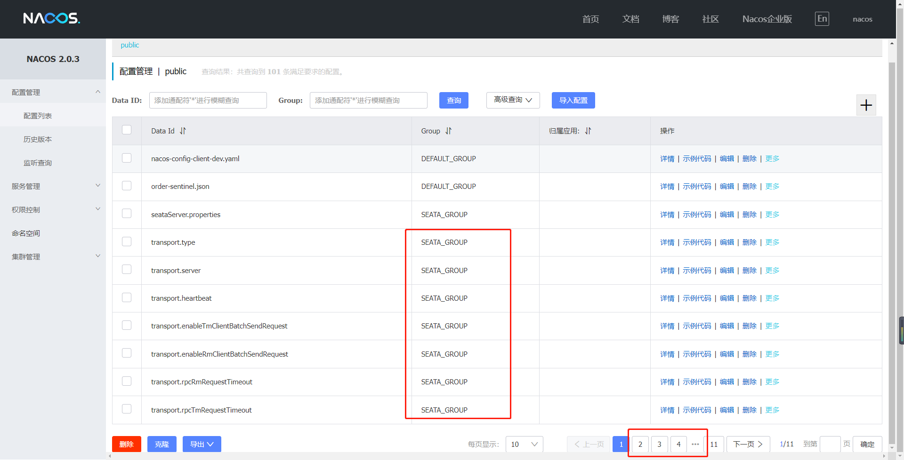

# Seata配置Nacos注册中心和配置中心

Seata支持注册服务到Nacos，以及支持Seata所有配置放到Nacos配置中心，在Nacos中统一维护；

高可用模式下就需要配合Nacos来完成



## 具体配置如下

### 注册中心

Seata-server端配置注册中心，在registry.conf中加入配置注册中心nacos

**注意：确保client与server的注册处于同一个namespace和group，不然会找不到服务。**

```java
registry {
  # file 、nacos 、eureka、redis、zk、consul、etcd3、sofa
  type = "nacos"

  nacos {
    application = "seata-server"
    serverAddr = "127.0.0.1:8848"
    group = "SEATA_GROUP" # 这里的配置要和客户端保持一致
    namespace = "" # 这里的配置要和客户端保持一致
    cluster = "default"
    username = "nacos"
    password = "nacos"
  }
    ......
```

### 配置中心

1. Seata-Server配置配置中心，在registry.conf中加入配置使用nacos作为配置中心

```java
config {
  # file、nacos 、apollo、zk、consul、etcd3
  type = "nacos"

  nacos {
    serverAddr = "127.0.0.1:8848"
    namespace = ""
    group = "SEATA_GROUP"
    username = ""
    password = ""
    dataId = "seataServer.properties"
  }
............
```

2. 我们需要把Seata的一些配置上传到Nacos中，配置比较多，所以官方给我们提供了一个config.txt，我们下载并且修改其中参数，上传到Nacos中

   下载地址：https://github.com/seata/seata/tree/develop/script/config-center

3. 具体修改：

   **注意：**事务分组：用于防护机房停电，来启用备用机房，或者异地机房，容错机制，当然如果Seata-Server配置了对应的事务分组，Client也需要配置相同的事务分组

   ```java
   service.vgroupMapping.可以自定义=default
   default这里必须等于 registry.config 中的cluster="default"(当然可以更改 )
   ```

```java
transport.type=TCP
transport.server=NIO
transport.heartbeat=true
transport.enableTmClientBatchSendRequest=false
transport.enableRmClientBatchSendRequest=true
transport.rpcRmRequestTimeout=5000
transport.rpcTmRequestTimeout=10000
transport.rpcTcRequestTimeout=10000
transport.threadFactory.bossThreadPrefix=NettyBoss
transport.threadFactory.workerThreadPrefix=NettyServerNIOWorker
transport.threadFactory.serverExecutorThreadPrefix=NettyServerBizHandler
transport.threadFactory.shareBossWorker=false
transport.threadFactory.clientSelectorThreadPrefix=NettyClientSelector
transport.threadFactory.clientSelectorThreadSize=1
transport.threadFactory.clientWorkerThreadPrefix=NettyClientWorkerThread
transport.threadFactory.bossThreadSize=1
transport.threadFactory.workerThreadSize=default
#-------------修改这个区域的映射--------------    
transport.shutdown.wait=3
service.vgroupMapping.mygroup=default # 事务分组
service.default.grouplist=127.0.0.1:8091
service.enableDegrade=false
service.disableGlobalTransaction=false
#------------------------------------------    
client.rm.asyncCommitBufferLimit=10000
client.rm.lock.retryInterval=10
client.rm.lock.retryTimes=30
client.rm.lock.retryPolicyBranchRollbackOnConflict=true
client.rm.reportRetryCount=5
client.rm.tableMetaCheckEnable=false
client.rm.tableMetaCheckerInterval=60000
client.rm.sqlParserType=druid
client.rm.reportSuccessEnable=false
client.rm.sagaBranchRegisterEnable=false
client.rm.sagaJsonParser=fastjson
client.rm.tccActionInterceptorOrder=-2147482648
client.tm.commitRetryCount=5
client.tm.rollbackRetryCount=5
client.tm.defaultGlobalTransactionTimeout=60000
client.tm.degradeCheck=false
client.tm.degradeCheckAllowTimes=10
client.tm.degradeCheckPeriod=2000
client.tm.interceptorOrder=-2147482648
store.mode=db # 修改
store.lock.mode=file
store.session.mode=file
store.publicKey=
store.file.dir=file_store/data
store.file.maxBranchSessionSize=16384
store.file.maxGlobalSessionSize=512
store.file.fileWriteBufferCacheSize=16384
store.file.flushDiskMode=async
store.file.sessionReloadReadSize=100
#-----------修改这个区域的JDBC连接-----------    
store.db.datasource=druid
store.db.dbType=mysql
store.db.driverClassName=com.mysql.jdbc.Driver
store.db.url=jdbc:mysql://127.0.0.1:3306/seata?useUnicode=true&rewriteBatchedStatements=true
store.db.user=root
store.db.password=root
store.db.minConn=5
store.db.maxConn=30
#------------------------------------------    
store.db.globalTable=global_table
store.db.branchTable=branch_table
store.db.distributedLockTable=distributed_lock
store.db.queryLimit=100
store.db.lockTable=lock_table
store.db.maxWait=5000
store.redis.mode=single
store.redis.single.host=127.0.0.1
store.redis.single.port=6379
store.redis.sentinel.masterName=
store.redis.sentinel.sentinelHosts=
store.redis.maxConn=10
store.redis.minConn=1
store.redis.maxTotal=100
store.redis.database=0
store.redis.password=
store.redis.queryLimit=100
server.recovery.committingRetryPeriod=1000
server.recovery.asynCommittingRetryPeriod=1000
server.recovery.rollbackingRetryPeriod=1000
server.recovery.timeoutRetryPeriod=1000
server.maxCommitRetryTimeout=-1
server.maxRollbackRetryTimeout=-1
server.rollbackRetryTimeoutUnlockEnable=false
server.distributedLockExpireTime=10000
client.undo.dataValidation=true
client.undo.logSerialization=jackson
client.undo.onlyCareUpdateColumns=true
server.undo.logSaveDays=7
server.undo.logDeletePeriod=86400000
client.undo.logTable=undo_log
client.undo.compress.enable=true
client.undo.compress.type=zip
client.undo.compress.threshold=64k
log.exceptionRate=100
transport.serialization=seata
transport.compressor=none
metrics.enabled=false
metrics.registryType=compact
metrics.exporterList=prometheus
metrics.exporterPrometheusPort=9898
tcc.fence.logTableName=tcc_fence_log
tcc.fence.cleanPeriod=1h
```

4. 修改好这个文件以后，我们就需要把这个文件放到seata目录下



5. 此时我们需要把这些配置一个个的加入到Nacos配置中，所以我们需要一个脚本来进行执行，官方已经提供好了，地址为：https://github.com/seata/seata/blob/develop/script/config-center/nacos/nacos-config.sh

6. 我们需要在seata-server-1.4.2文件夹中新建一个脚本文件nacos-config.sh，然后把脚本内容复制进去



7. 利用git来进行执行命令：

```java
sh nacos-config.sh -h localhost -p 8848 -g SEATA_GROUP -t 命名空间 -u nacos -w nacos
```

参数说明：

-h：host，默认值localhost

-p：port，默认值8848

-g：配置分组，默认为SEATA_GROUP

-t：租户信息，对应Nacos的命名空间ID，默认为空



8. 在执行naocs-config文件的时候要注意，它默认寻找config.txt的路径和我们的路径不同，所以要打开naocs-config文件进行修改，否则无法执行。


 ### 测试启动

当以上的这些配置完成以后，我们就可以启动nacos和seata-server了，此时我们查看Nacos的配置中心，就会看到我们传入的所有配置信息




## 附加

各位我们Seata-Server默认端口是8091，那么如果我们是集群部署方式，我们如何修改端口那？

在 Linux/Mac 下

```bash
$ sh ./bin/seata-server.sh
```

在 Windows 下

```cmd
bin\seata-server.bat
```

### 支持的启动参数

| 参数 | 全写         | 作用                       | 备注                                                         |
| :--- | :----------- | :------------------------- | :----------------------------------------------------------- |
| -h   | --host       | 指定在注册中心注册的 IP    | 不指定时获取当前的 IP，外部访问部署在云环境和容器中的 server 建议指定 |
| -p   | --port       | 指定 server 启动的端口     | 默认为 8091                                                  |
| -m   | --storeMode  | 事务日志存储方式           | 支持`file`,`db`,`redis`，默认为 `file` 注:redis需seata-server 1.3版本及以上 |
| -n   | --serverNode | 用于指定seata-server节点ID | 如 `1`,`2`,`3`..., 默认为 `1`                                |
| -e   | --seataEnv   | 指定 seata-server 运行环境 | 如 `dev`, `test` 等, 服务启动时会使用 `registry-dev.conf` 这样的配置 |

如：

```bash
$ sh ./bin/seata-server.sh -p 8091 -h 127.0.0.1 -m file
```