# Seata-AT模式

概念：AT模式是一种无侵入的分布式事务解决方案，在 AT 模式下，用户只需关注自己的“业务 SQL”，用户的 “业务 SQL” 作为一阶段，Seata 框架会自动生成事务的二阶段提交和回滚操作。


## 整体机制

两阶段提交协议的演变：

- 一阶段：业务数据和回滚日志记录在同一个本地事务中提交，释放本地锁和连接资源。
- 二阶段：
  - 提交异步化，非常快速地完成。
  - 回滚通过一阶段的回滚日志进行反向补偿。

### 一阶段

在一阶段中，Seata会拦截“业务SQL“，首先解析SQL语义，找到要更新的业务数据，在数据被更新前，保存下来"undo"，然后执行”业务SQL“更新数据，更新之后再次保存数据”redo“，最后生成行锁，这些操作都在本地数据库事务内完成，这样保证了一阶段的原子性。

### 二阶段

相对一阶段，二阶段比较简单，负责整体的回滚和提交，如果之前的一阶段中有本地事务没有通过，那么就执行全局回滚，否在执行全局提交，回滚用到的就是一阶段记录的"undo Log"，通过回滚记录生成反向更新SQL并执行，以完成分支的回滚。当然事务完成后会释放所有资源和删除所有日志。

### 具体图解

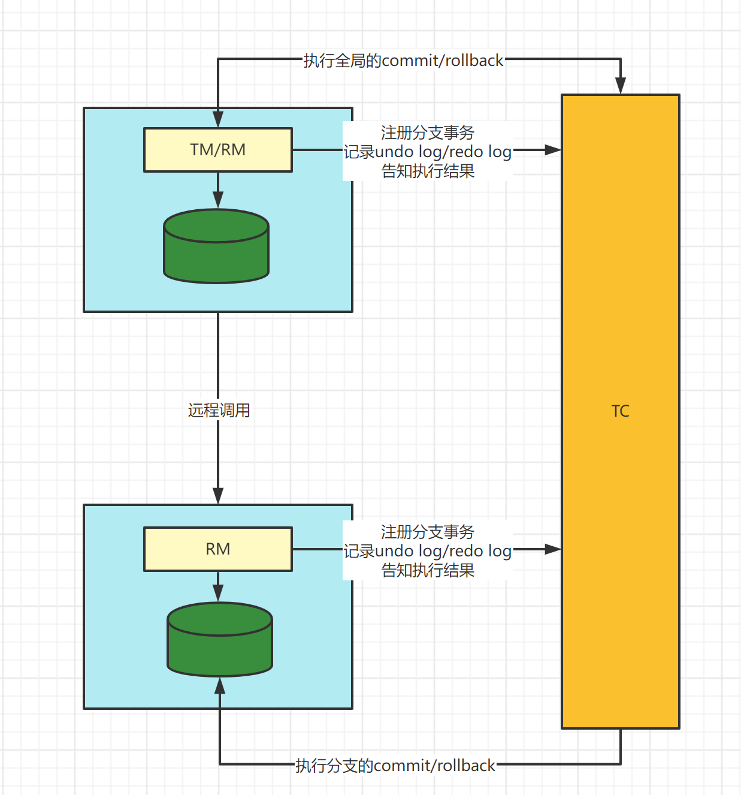

## 案例

1. 首先设计两个服务，一个订单order8801 一个库存stock8802

2. stock库存表为：

   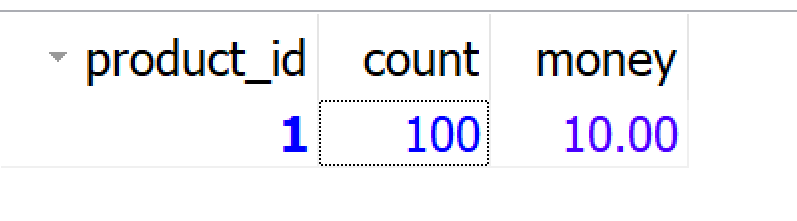

3. order订单表为：

   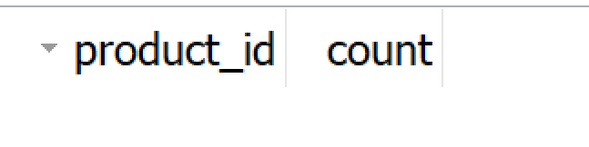

4. 订单服务通过OpenFegin远程调用库存服务，然后库存服务减库存，订单服务生成订单，完成基本的调用以后我们给订单服务添加异常

```java
@Service
public class OrderServiceImpl implements OrderService {
    @Resource
    private OrderMapper orderMapper;

    @Resource
    private StockClient stockClient;

    @Override
    public void create() {
        // 减库存
        stockClient.decrement();

        // 添加异常
        int i = 1/0;

        // 创建订单
        orderMapper.create();
    }
}
```

5. 此时我们会发现访问接口出现异常情况，但是库存减少，订单没有增加此时已经出现了分布式事务的问题

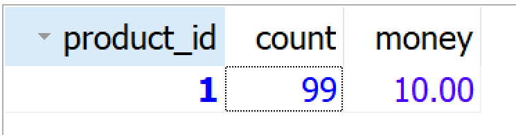

订单表，没有增加数据

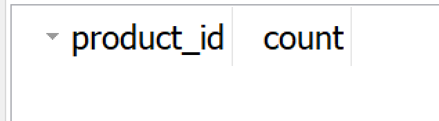

### 通过Seata的AT模式解决分布式事务

1. 首先增加对应的Seata依赖

```java
<dependency>
    <groupId>com.alibaba.cloud</groupId>
    <artifactId>spring-cloud-starter-alibaba-seata</artifactId>
</dependency>
```

2. 在对应的微服务数据库上加上undo_log表，此表用于数据的回滚

```java
CREATE TABLE `undo_log` (
  `id` bigint(20) NOT NULL AUTO_INCREMENT,
  `branch_id` bigint(20) NOT NULL,
  `xid` varchar(100) NOT NULL,
  `context` varchar(128) NOT NULL,
  `rollback_info` longblob NOT NULL,
  `log_status` int(11) NOT NULL,
  `log_created` datetime NOT NULL,
  `log_modified` datetime NOT NULL,
  `ext` varchar(100) DEFAULT NULL,
  PRIMARY KEY (`id`),
  UNIQUE KEY `ux_undo_log` (`xid`,`branch_id`)
) ENGINE=InnoDB AUTO_INCREMENT=1 DEFAULT CHARSET=utf8;
```

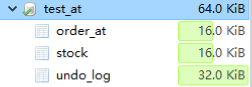

3. 配置yml（8801和8802Seata的配置保持一致）

```java
server:
  port: 8801
spring:
  application:
    name: seata-order
  cloud:
    nacos:
      discovery:
        server-addr: localhost:8848
    alibaba:
      seata:
        tx-service-group: mygroup   # 事务组, 随便写
  datasource:
    driver-class-name: com.mysql.jdbc.Driver
    url: jdbc:mysql://localhost:3306/test_at?characterEncoding=utf8&useSSL=false&serverTimezone=Asia/Shanghai&rewriteBatchedStatements=true
    username: root
    password: root
    type: com.alibaba.druid.pool.DruidDataSource

seata:
  tx-service-group: mygroup # 事务组名称，要和服务端对应
  service:
    vgroup-mapping:
      mygroup: default # key是事务组名称 value要和服务端的机房名称保持一致

```

4. 需要在order8801(TM)的Controller上添加注解

```java
@RestController
public class OrderController {
    @Autowired
    private OrderService orderService;

    @GetMapping("/order/create")
    @GlobalTransactional// 开启分布式事务
    public String create(){
        orderService.create();
        return "生成订单";
    }
}
```

5. 把8801和8802都跑起来，当然Nacos和Seata都要进行启动，这个时候我们进行访问Order的REST接口：http://localhost:8801/order/create，我们就会发现此时已经解决了分布式事务问题

   库存没有减少

   订单也没有增加

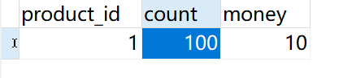

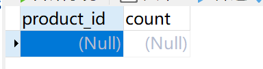

6. 那么为了验证undo_log表用于存储回滚的数据，我们在OrderServiceImpl上异常位置添加断点，同时以debug方式来启动8801订单服务

```java
@Service
public class OrderServiceImpl implements OrderService {
    @Resource
    private OrderMapper orderMapper;

    @Resource
    private StockClient stockClient;

    @Override
    public void create() {
        // 减库存
        stockClient.decrement();

        // 添加异常
        int i = 1/0;// 此处添加断点

        // 创建订单
        orderMapper.create();
    }
}
```

7. 然后访问接口：http://localhost:8801/order/create，程序会卡在断点上，此时我们来查看undo_log表和库存表，此时我们会发现，库存确实减少了，但是在undo_log表中出现了快照记录了当前修改前的数据，这个数据就是用于回滚的数据

   库存减少

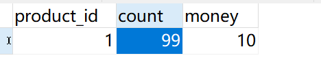

​		undo_log表记录快照

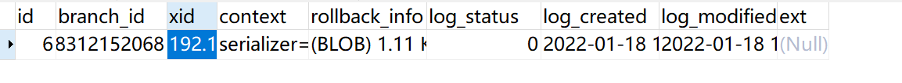 

​		放行以后，库存数量回复，回滚生效

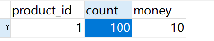

8. 此时我们就验证了AT事务的执行过程。