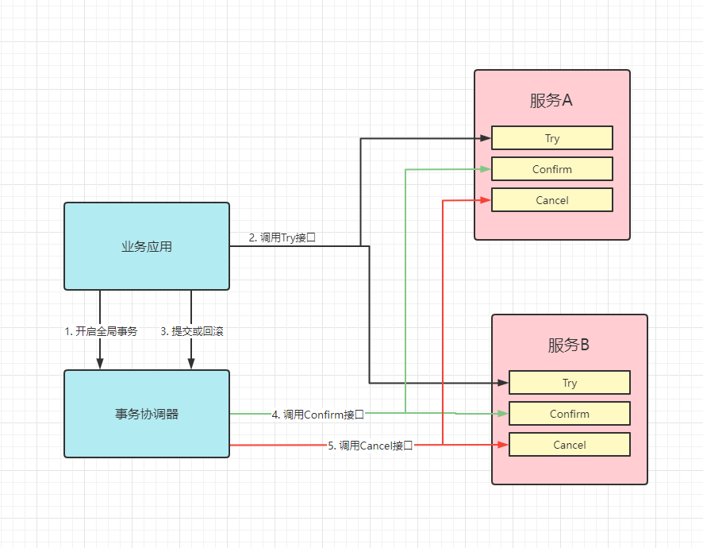
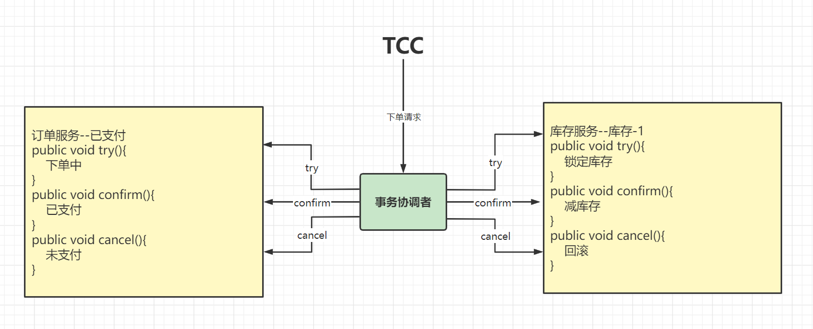

# TCC事务模式

首先我们先来了解常规的TCC模式。

### 什么是TCC

TCC 是分布式事务中的二阶段提交协议，它的全称为 Try-Confirm-Cancel，即资源预留（Try）、确认操作（Confirm）、取消操作（Cancel），他们的具体含义如下：

1. Try：对业务资源的检查并预留；
2. Confirm：对业务处理进行提交，即 commit 操作，只要 Try 成功，那么该步骤一定成功；
3. Cancel：对业务处理进行取消，即回滚操作，该步骤回对 Try 预留的资源进行释放。

TCC 是一种侵入式的分布式事务解决方案，以上三个操作都需要业务系统自行实现，对业务系统有着非常大的入侵性，设计相对复杂，但优点是 TCC 完全不依赖数据库，能够实现跨数据库、跨应用资源管理，对这些不同数据访问通过侵入式的编码方式实现一个原子操作，更好地解决了在各种复杂业务场景下的分布式事务问题。

### Seata的TCC模式

Seata TCC 模式跟通用型 TCC 模式原理一致。

### TCC和AT区别

AT 模式基于 **支持本地 ACID 事务** 的 **关系型数据库**：

- 一阶段 prepare 行为：在本地事务中，一并提交业务数据更新和相应回滚日志记录。
- 二阶段 commit 行为：马上成功结束，**自动** 异步批量清理回滚日志。
- 二阶段 rollback 行为：通过回滚日志，**自动** 生成补偿操作，完成数据回滚。

相应的，TCC 模式，不依赖于底层数据资源的事务支持：

- 一阶段 prepare 行为：调用 **自定义** 的 prepare 逻辑。
- 二阶段 commit 行为：调用 **自定义** 的 commit 逻辑。
- 二阶段 rollback 行为：调用 **自定义** 的 rollback 逻辑。

所谓 TCC 模式，是指支持把 **自定义** 的分支事务纳入到全局事务的管理中。

## 特点：

1. 侵入性比较强，并且需要自己实现相关事务控制逻辑
2. 在整个过程基本没有锁，性能较强

## 详细讲解

具体使用案例：https://seata.io/zh-cn/blog/integrate-seata-tcc-mode-with-spring-cloud.html