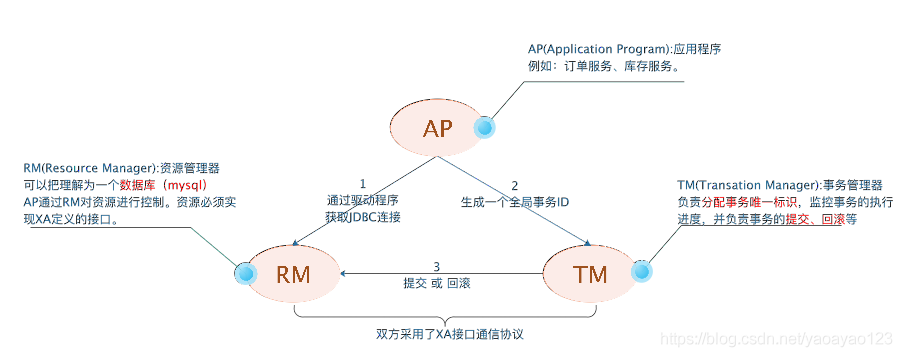
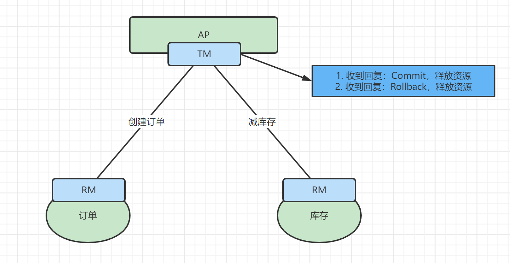
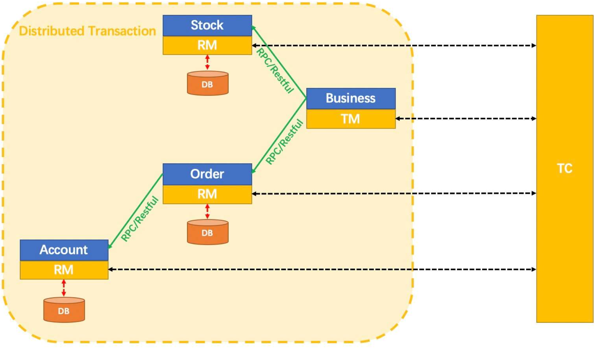
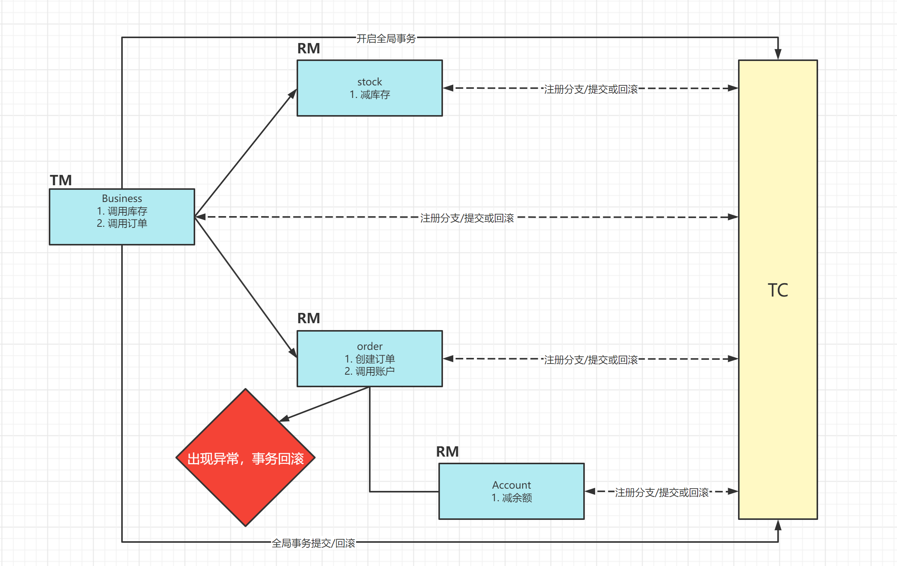
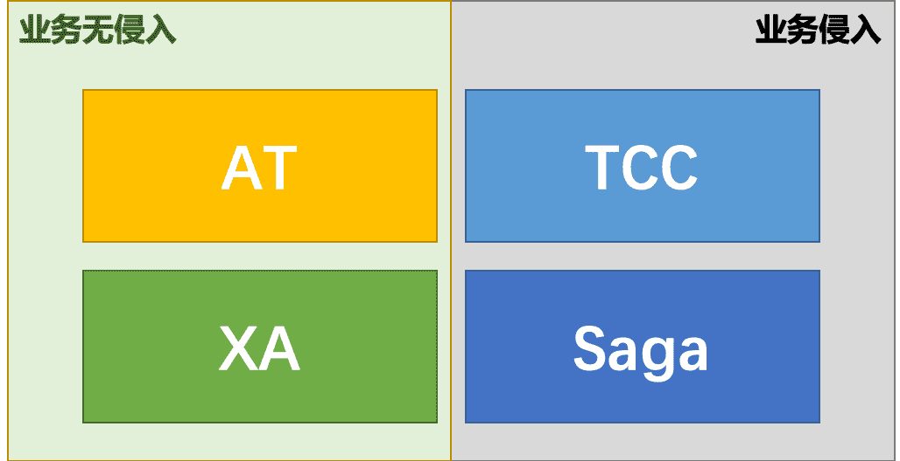

# Seata-XA模式

Seata 1.2.0 版本重磅发布新的事务模式：XA 模式，实现对 XA 协议的支持。

我们从三个方面来深入分析：

1. XA模式是什么？
2. 为什么支持XA？
3. XA模式如何实现的，以及如何使用？

## XA模式

首先我们需要先了解一下什么是XA？

XA 规范早在上世纪 90 年代初就被提出，用以解决分布式事务处理这个领域的问题。

注意：不存在某一种分布式事务机制可以完美适应所有场景，满足所有需求。

现在，无论 AT 模式、TCC 模式还是 Saga 模式，这些模式的提出，本质上都源自 XA 规范对某些场景需求的无法满足。

### 什么是XA协议

XA 规范 是 X/Open 组织定义的分布式事务处理（DTP，Distributed Transaction Processing）标准

XA 规范 描述了全局的事务管理器与局部的资源管理器之间的接口。 XA规范 的目的是允许的多个资源（如数据库，应用服务器，消息队列等）在同一事务中访问，这样可以使 ACID 属性跨越应用程序而保持有效。

XA 规范 使用两阶段提交（2PC，Two-Phase Commit）来保证所有资源同时提交或回滚任何特定的事务。

XA 规范 在上世纪 90 年代初就被提出。目前，几乎所有主流的数据库都对 XA 规范 提供了支持。

DTP模型定义如下角色：

- AP：即应用程序，可以理解为使用DTP分布式事务的程序
- RM：资源管理器，可以理解为事务的参与者，一般情况下是指一个数据库的实例（MySql），通过资源管理器对该数据库进行控制，资源管理器控制着分支事务
- TM：事务管理器，负责协调和管理事务，事务管理器控制着全局事务，管理实务生命周期，并协调各个RM。全局事务是指分布式事务处理环境中，需要操作多个数据库共同完成一个工作，这个工作即是一个全局事务。
- DTP模式定义TM和RM之间通讯的接口规范叫XA，简单理解为数据库提供的2PC接口协议，基于数据库的XA协议来实现的2PC又称为XA方案。

案例解释：

1. 应用程序（AP）持有订单库和商品库两个数据源。
2. 应用程序（AP）通过TM通知订单库（RM）和商品库（RM），来创建订单和减库存，RM此时未提交事务，此时商品和订单资源锁定。
3. TM收到执行回复，只要有一方失败则分别向其他RM发送回滚事务，回滚完毕，资源锁释放。
4. TM收到执行回复，全部成功，此时向所有的RM发起提交事务，提交完毕，资源锁释放。

#### XA协议的痛点

如果一个参与全局事务的资源 “失联” 了（收不到分支事务结束的命令），那么它锁定的数据，将一直被锁定。进而，甚至可能因此产生死锁。

这是 XA 协议的核心痛点，也是 Seata 引入 XA 模式要重点解决的问题。

### Seata的事务模式

Seata 定义了全局事务的框架。

全局事务 定义为若干 分支事务 的整体协调：

1. TM 向 TC 请求发起（Begin）、提交（Commit）、回滚（Rollback）全局事务。
2. TM 把代表全局事务的 XID 绑定到分支事务上。
3. RM 向 TC 注册，把分支事务关联到 XID 代表的全局事务中。
4. RM 把分支事务的执行结果上报给 TC。（可选）
5. TC 发送分支提交（Branch Commit）或分支回滚（Branch Rollback）命令给 RM。

Seata 的 全局事务 处理过程，分为两个阶段：

- 执行阶段 ：执行分支事务，并保证执行结果满足是 *可回滚的（Rollbackable）* 和 *持久化的（Durable）*。
- 完成阶段： 根据 执行阶段 结果形成的决议，应用通过 TM 发出的全局提交或回滚的请求给 TC，TC 命令 RM 驱动 分支事务 进行 Commit 或 Rollback。

Seata 的所谓事务模式是指：运行在 Seata 全局事务框架下的 分支事务 的行为模式。准确地讲，应该叫作 分支事务模式。

不同的 事务模式 区别在于 分支事务 使用不同的方式达到全局事务两个阶段的目标。即，回答以下两个问题：

- 执行阶段 ：如何执行并 保证 执行结果满足是 *可回滚的（Rollbackable）* 和 *持久化的（Durable）*。
  - 完成阶段： 收到 TC 的命令后，如何做到分支的提交或回滚？

我们以AT模式举例：

- 执行阶段：
  - 可回滚：根据 SQL 解析结果，记录回滚日志
  - 持久化：回滚日志和业务 SQL 在同一个本地事务中提交到数据库
- 完成阶段：
  - 分支提交：异步删除回滚日志记录
  - 分支回滚：依据回滚日志进行反向补偿更新

## Seata的XA模式

XA模式：

在 Seata 定义的分布式事务框架内，利用事务资源（数据库、消息服务等）对 XA 协议的支持，以 XA 协议的机制来管理分支事务的一种 事务模式。

- 执行阶段：
  - 可回滚：业务 SQL 操作放在 XA 分支中进行，由资源对 XA 协议的支持来保证 可回滚
  - 持久化：XA 分支完成后，执行 XA prepare，同样，由资源对 XA 协议的支持来保证 *持久化*（即，之后任何意外都不会造成无法回滚的情况）
- 完成阶段：
  - 分支提交：执行 XA 分支的 commit
  - 分支回滚：执行 XA 分支的 rollback

### 为什么要在Seata中支持XA

为什么要在 Seata 中增加 XA 模式呢？支持 XA 的意义在哪里呢？

本质上，Seata 已经支持的 3 大事务模式：AT、TCC、Saga 都是 补偿型 的。

补偿型 事务处理机制构建在 事务资源 之上（要么在中间件层面，要么在应用层面），事务资源 本身对分布式事务是无感知的。

事务资源 对分布式事务的无感知存在一个根本性的问题：无法做到真正的 全局一致性 。

比如，一条库存记录，处在 补偿型 事务处理过程中，由 100 扣减为 50。此时，仓库管理员连接数据库，查询统计库存，就看到当前的 50。之后，事务因为异外回滚，库存会被补偿回滚为 100。显然，仓库管理员查询统计到的 50 就是 脏 数据。所以补偿型事务是存在中间状态的（中途可能读到脏数据）

### XA的价值

与 补偿型 不同，XA 协议 要求 事务资源 本身提供对规范和协议的支持。

因为 事务资源 感知并参与分布式事务处理过程，所以 事务资源（如数据库）可以保障从任意视角对数据的访问有效隔离，满足全局数据一致性。

比如，刚才提到的库存更新场景，XA 事务处理过程中，中间状态数据库存 50 由数据库本身保证，是不会仓库管理员的查询统计看到的。

除了 全局一致性 这个根本性的价值外，支持 XA 还有如下几个方面的好处：

1. 业务无侵入：和 AT 一样，XA 模式将是业务无侵入的，不给应用设计和开发带来额外负担。
2. 数据库的支持广泛：XA 协议被主流关系型数据库广泛支持，不需要额外的适配即可使用。
3. 多语言支持容易：因为不涉及 SQL 解析，XA 模式对 Seata 的 RM 的要求比较少。
4. 传统基于 XA 应用的迁移：传统的，基于 XA 协议的应用，迁移到 Seata 平台，使用 XA 模式将更平滑。

## XA模式的使用

我们从官方案例入手，具体的官方案例下载地址：https://github.com/seata/seata-samples

官方案例演示图：

案例解析：

整体运行机制：

## 总结

在当前的技术发展阶段，不存一个分布式事务处理机制可以完美满足所有场景的需求。

一致性、可靠性、易用性、性能等诸多方面的系统设计约束，需要用不同的事务处理机制去满足。

Seata 项目最核心的价值在于：构建一个全面解决分布式事务问题的 标准化 平台。

基于 Seata，上层应用架构可以根据实际场景的需求，灵活选择合适的分布式事务解决方案。

XA 模式的加入，补齐了 Seata 在 全局一致性 场景下的缺口，形成 AT、TCC、Saga、XA 四大 事务模式 的版图，基本可以满足所有场景的分布式事务处理诉求。