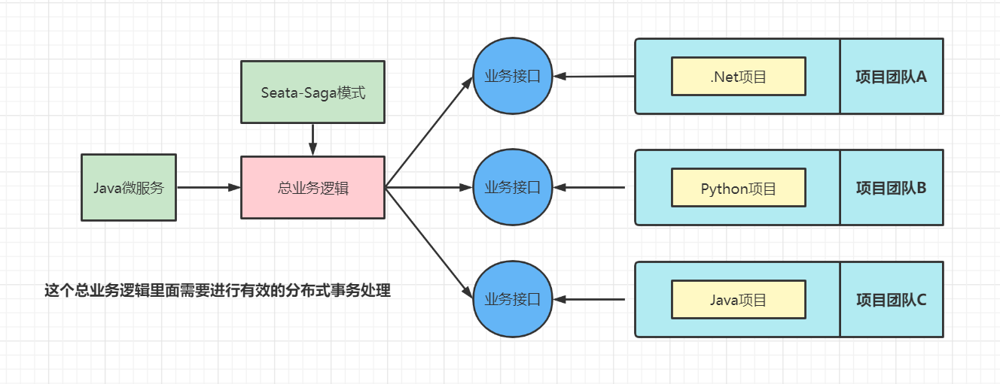
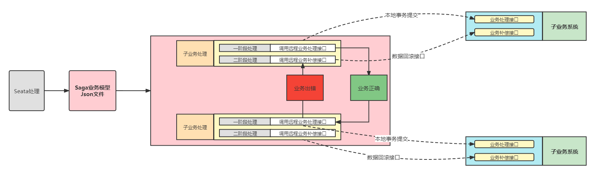
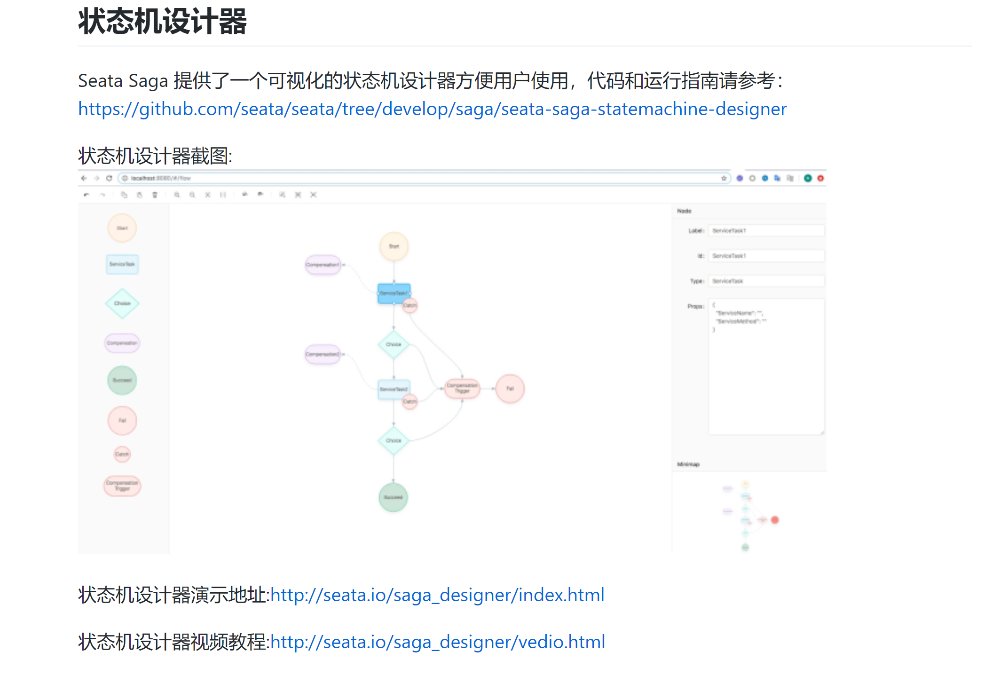

# Seata中的Saga事务模式

### 基本概念

Saga模式是SEATA提供的长事务解决方案，在Saga模式中，业务流程中每个参与者都提交本地事务，当出现某一个参与者失败则补偿前面已经成功的参与者，一阶段正向服务和二阶段补偿服务（执行处理时候出错了，给一个修复的机会）都由业务开发实现。

Saga 模式下分布式事务通常是由事件驱动的，各个参与者之间是异步执行的，Saga 模式是一种长事务解决方案。

### 为什么需要Saga

之前我们学习的Seata分布式三种操作模型中所使用的的微服务全部可以根据开发者的需求进行修改，但是在一些特殊环境下，比如老系统，封闭的系统（无法修改，同时没有任何分布式事务引入），那么AT、XA、TCC模型将全部不能使用，为了解决这样的问题，才引用了Saga模型。

比如：事务参与者可能是其他公司的服务或者是遗留系统，无法改造，可以使用Saga模式。

Saga模式是Seata提供的长事务解决方案，提供了**异构系统的事务统一处理模型**。在Saga模式中，所有的子业务都不在直接参与整体事务的处理（只负责本地事务的处理），而是全部交由了最终调用端来负责实现，而在进行总业务逻辑处理时，在某一个子业务出现问题时，则自动补偿全面已经成功的其他参与者，这样一阶段的正向服务调用和二阶段的服务补偿处理全部由总业务开发实现。

### Saga状态机

目前Seata提供的Saga模式只能通过状态机引擎来实现，需要开发者手工的进行Saga业务流程绘制，并且将其转换为Json配置文件，而后在程序运行时，将依据子配置文件实现业务处理以及服务补偿处理，而要想进行Saga状态图的绘制，一般需要通过Saga状态机来实现。

基本原理：

- 通过状态图来定义服务调用的流程并生成json定义文件
- 状态图中一个节点可以调用一个服务，节点可以配置它的补偿节点
- 状态图 json 由状态机引擎驱动执行，当出现异常时状态引擎反向执行已成功节点对应的补偿节点将事务回滚
- 可以实现服务编排需求，支持单项选择、并发、子流程、参数转换、参数映射、服务执行状态判断、异常捕获等功能

### Saga状态机的应用

官方提供了一个状态机设计器

官方文档地址：https://seata.io/zh-cn/docs/user/saga.html

Seata Safa状态机可视化图形设计器使用地址：https://github.com/seata/seata/blob/develop/saga/seata-saga-statemachine-designer/README.zh-CN.md

