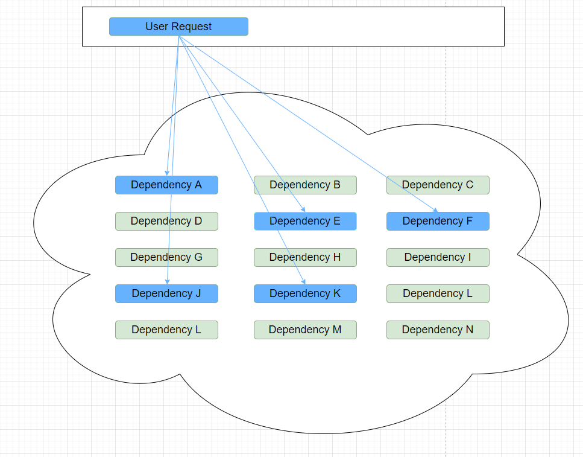

# Sentinel介绍

## 什么是Sentinel

1. **分布式系统的流量防卫兵**：随着微服务的普及，服务调用的稳定性变得越来越重要。[Sentinel](https://github.com/alibaba/Sentinel)以“流量”为切入点，在流量控制、断路、负载保护等多个领域开展工作，保障服务可靠性。

2. 特点：
   1. 
   2. **+丰富的应用场景**：Sentinel 承接了阿里巴巴近 10 年的双十一大促流量的核心场景，例如秒杀（即突发流量控制在系统容量可以承受的范围）、消息削峰填谷、集群流量控制、实时熔断下游不可用应用等。
   3. **完备的实时监控**：Sentinel 同时提供实时的监控功能。您可以在控制台中看到接入应用的单台机器秒级数据，甚至 500 台以下规模的集群的汇总运行情况。
   4. **广泛的开源生态**：Sentinel 提供开箱即用的与其它开源框架/库的整合模块，例如与 Spring Cloud、Apache Dubbo、gRPC、Quarkus 的整合。您只需要引入相应的依赖并进行简单的配置即可快速地接入 Sentinel。同时 Sentinel 提供 Java/Go/C++ 等多语言的原生实现。
   5. **完善的 SPI 扩展机制**：Sentinel 提供简单易用、完善的 SPI 扩展接口。您可以通过实现扩展接口来快速地定制逻辑。例如定制规则管理、适配动态数据源等。
   
3. 官网文档：https://github.com/alibaba/Sentinel/wiki/%E4%BB%8B%E7%BB%8D

## Sentinel好处

​	分布式系统面临的问题：复杂的体系结构中的应用程序有数十个依赖关系，每个依赖关系在某些时候将不可避免的失败，比如如下的例子中，当我们调用A、E、F、J、K这几个服务的时候如果其中一个服务出现问题会造成什么问题？其实就会出现整体系统效率全部下降，而且严重就会出现**服务雪崩**的问题！

​	**服务雪崩：**

​		多个微服务之间调用的时候，假设A调用B和C，B和C又调用其他的微服务，这就是所谓的**扇出**。如果扇出的某个链路上某个微服务调用的响应时间过程或者不可用，微服务A的调用就用占用越来越多的系统资源，从而引起系统崩溃，这也就是**服务雪崩**。其实就是服务的**高可用**遭到了破坏。

​		对于高流量的应用来说，单一的后端依赖可能会导致服务器上的所有资源都在几秒钟内饱和。同时还有可能造成这些应用程序导致服务之间的延迟增加，备份列队，线程和其他的系统资源紧张，导致整个系统发生更多的级联故障。这些都表示需要对故障和延迟进行隔离和管理，以便单个依赖关系失败，不能取消整个应用程序或系统，所以通常发生了一个模块的某个实例失败后，这时候这个模块依然还会接受流量，然后这个有问题的模块还调用其他的模块，这样就会发生级联故障，或者叫做**雪崩**。

​		要解决这种问题的出现我们就需要用到服务降级，而Sentinel就可以保证在一个依赖出现问题的情况下，不会导致整体服务失败，避免级联故障，提高分布式系统的弹性。

​	**Sentinel的熔断降级通过断路器实现：**

​		断路器：它本身是一种开关装置，当某个服务单元发生故障之后，通过断路器的故障监控（类似于熔断保险丝），向调用方返回一个符合预期的、可处理的备选响应（FallBack），而不是长时间的等待或者抛出调用方法无法出的异常，这样就保证了服务调用方的不会被长时间、不必要的占用，从而避免了故障在分布式系统中蔓延（类似于病毒传染），从而避免了故障在系统中蔓延，乃至崩溃。

​	**好处体现：**

​	对比与其他的产品而言，比如说Hystrix，他不需要我们自己手动搭建监控平台，而且它有一套类似于Nacos的Web界面，可以让我们进行更加细粒度的配置流控、速率、服务熔断、服务降级等

​	目前主流编程都是 约定>配置>代码，虽然我们的配置都可以写在代码中，但是我们还是要大面积的学习配置和注解的方式，尽量少些代码，这也是Sentinel的理念和初衷。

 

## Sentinel下载和安装

​	下载地址：https://github.com/alibaba/Sentinel/releases

官方提供的手册：https://spring-cloud-alibaba-group.github.io/github-pages/hoxton/en-us/index.html#_spring_cloud_alibaba_sentinel

**Sentinel 分为两个部分**

- 核心库（Java客户端）不依赖任何框架/库，只需要Java运行时环境，同时对Dubbo/SpringCloud 等框架也有较好的支持。 
- 控制台（Dashboard）基于 SpringBoot开发，打包后可以直接运行，不需要额外的Tomcat等应用容器。

**启动步骤**

- 前提：jdk1.8环境和8080端口不能被占用

- 启动命令：java -jar sentinel-dashboard-1.8.2.jar

- 访问地址：localhost:8080

- 输入默认账号密码：sentinel/sentinel

  

  

到这里为止，我们的Sentinel安装成功。