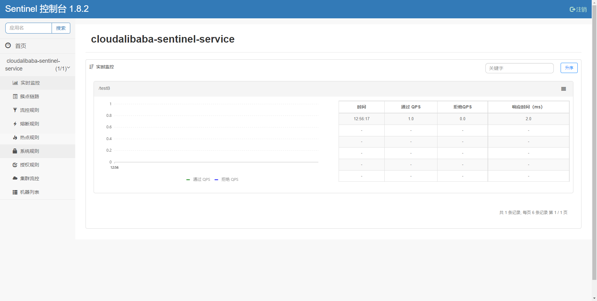
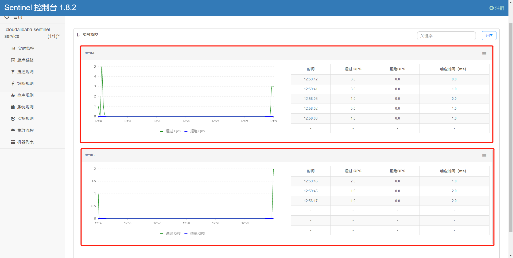

# Sentinel初始化监控


## Sentinel初始化工程演示

​	我们现在通过一个案例来让大家了解Sentinel的初始化演示，现在我们需要做几件事：

1. 启动Nacos8848成功
2. 创建新的Module：cloudalibaba-sentinel-service8401
3. 启动Sentinel8080
4. 启动微服务8401
5. 启动8401微服务后查看Sentinel控制台


## 搭建Sentinel项目

1. Sentinel的官方文档网址：https://sentinelguard.io/zh-cn/docs/quick-start.html
2. 创建项目cloudalibaba-sentinel-service8401
3. 导入依赖：

```xml
<!-- Nacos客户端依赖 -->
<dependency>
    <groupId>com.alibaba.cloud</groupId>
    <artifactId>spring-cloud-starter-alibaba-nacos-discovery</artifactId>
</dependency>
<!-- sentinel依赖 -->
<dependency>
    <groupId>com.alibaba.cloud</groupId>
    <artifactId>spring-cloud-starter-alibaba-sentinel</artifactId>
</dependency>
```

4. 配置yaml文件，目的是让当前8401注册进Nacos，然后被Sentinel8080进行监控

```yaml
server:
  port: 8401

spring:
  application:
    name: cloudalibaba-sentinel-service
  cloud:
    nacos:
      discovery:
        server-addr: localhost:8848
    sentinel:
      transport:
        # 配置Sentinel dashboard地址
        dashboard: localhost:8080
        # 默认8719端口，键入被占用会自动从8719+1，直到找到未被占用的端口
        port: 8719

management:
  endpoints:
    web:
      exposure:
        include: '*'
```

5. 编写FlowLimitController

```java
package com.example.cloudalibabasentinel8401.controller;

import org.springframework.web.bind.annotation.GetMapping;
import org.springframework.web.bind.annotation.RestController;

@RestController
public class FlowLimitController {
    @GetMapping("/testA")
    public String testA(){
        return "-----testA";
    }

    @GetMapping("/testB")
    public String testB(){
        return "-----testB";
    }
}
```


## 测试

1. 当以上的这些配置配置好以后，我们就可以进行测试了，那我们的测试方式就是，首先保证Nacos和Sentinel都是启动状态，然后再来启动项目，按照我们的理解这个时候，就应该在Sentinel的dashboard上能体现出它监控的服务，但是此时并没有，原因是因为Sentinel本身采用的是懒加载机制，所以我们需要首先访问服务对应的接口，Sentinel才能工作。

```java
http://localhost:8401/testA
http://localhost:8401/testB
```

2. 访问之后我们来查看Sentinel的dashboard



3. 那么这个时候我们频繁快速的访问testA或者testB那么我们再来查看实时监控的时候，就会出现波动，体现此时Sentinel正在监控这我们的8401这个服务



