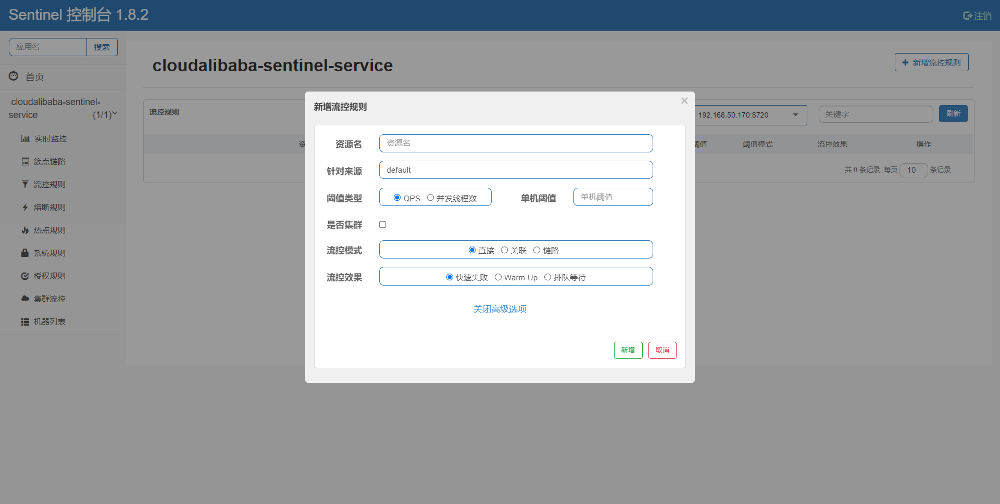
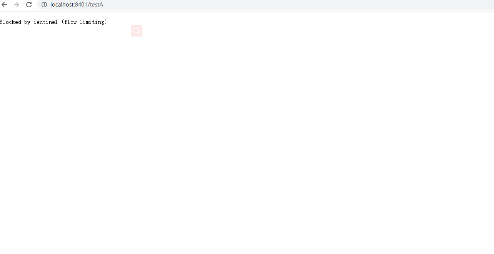

# Sentinel流控规则

## 流控规则基本介绍




# 名词解释

- 资源名：唯一名称，默认请求路径
- 针对来源：Sentinel可以针对调用者进行限流，填写微服务名，默认default（不区分来源）
- 阈值类型/单机阈值：
  - QPS（每秒钟的请求数量）：当调用该API的QPS达到阈值的时候，进行限流
  - 线程数：当调用该API的线程数量达到阈值的时候，进行限流
- 是否集群：当前不需要集群
- 流控模式：
  - 直接：API达到限流条件时，直接限流
  - 关联：当关联的资源达到阈值时，就限流自己
  - 链路：只记录指定链路上的流量（指定资源从入口资源进来的流量，如果达到阈值，就进行限流）(API级别的针对来源)
- 流控效果：
  - 快速失败：直接失败，抛异常
  - Wam Up：根据codeFactor（冷加载因子，默认3）的值，从阈值/codeFacotor，经过预热时长，才达到设置的QPS阈值
  - 排队等待：匀速排队，让请求以匀速的速度通过，阈值类型必须设置为QPS，否则无效


## 具体操作

### 新增流控

**QPS直接失败案例**

1. 添加有两种方式，可以直接在流控规则选项中添加，也可以在簇点链路中添加，一般会采取第二种方式


2. 现在我们给"/testA"添加流控。


3. 这里的意思就是我们现在单机阈值设定为1，代表的是当前这个接口只能被1秒访问一次，超过这个阈值，就会被Sentinel阻塞，现在默认为直接失败，也就是会在前台有一个体现


**线程数直接失败案例**

1. 刚才我们可以的设置是通过QPS（每秒钟请求的数量）来设置的限流规则，但是我们这里其实还有一个线程数，是什么意思那？


2. QPS和并发线程数规则详解


3. 那我们要演示这种效果，我们就需要让一个线程再进来办理的时候需要0.8秒，但是这个时候后面的线程也在疯狂的访问，所以后面的线程就会不会生效。

```java
package com.example.cloudalibabasentinel8401.controller;

import com.alibaba.csp.sentinel.annotation.SentinelResource;
import org.springframework.web.bind.annotation.GetMapping;
import org.springframework.web.bind.annotation.RestController;

import java.util.concurrent.TimeUnit;

@RestController
public class FlowLimitController {
    @GetMapping("/testA")
    public String testA(){
        //暂停0.8秒
        try {
            TimeUnit.MILLISECONDS.sleep(800);
        } catch (InterruptedException e) {
            e.printStackTrace();
        }
        return "-----testA";
    }

    @GetMapping("/testB")
    public String testB(){
        return "-----testB";
    }
}
```

4. 这个时候我们重启项目，然后重新通过访问testA接口，通过两个网页（线程）来快速访问，这个时候我们来看效果，这里要注意，要重新添加流控规则。



**注意：这个时候虽然效果一致，但是是两种完全不同的规则，一种是QPS，一种是并发线程，这点大家一定要分清！**

