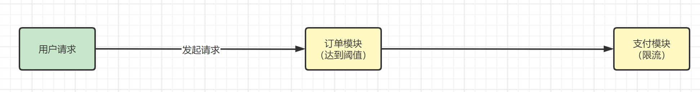

# 流控规则-关联

​	首先我们先来回顾一下之前讲过的一些概念

## 名词解释

- 资源名：唯一名称，默认请求路径
- 针对来源：Sentinel可以针对调用者进行限流，填写微服务名，默认default（不区分来源）
- 阈值类型/单机阈值：
  - QPS（每秒钟的请求数量）：当调用该API的QPS达到阈值的时候，进行限流
  - 线程数：当调用该API的线程数量达到阈值的时候，进行限流
- 是否集群：当前不需要集群
- 流控模式：
  - 直接：API达到限流条件时，直接限流
  - 关联：当关联的资源达到阈值时，就限流自己
  - 链路：只记录指定链路上的流量（指定资源从入口资源进来的流量，如果达到阈值，就进行限流）(API级别的针对来源)
- 流控效果：
  - 快速失败：直接失败，抛异常
  - Wam Up：根据codeFactor（冷加载因子，默认3）的值，从阈值/codeFacotor，经过预热时长，才达到设置的QPS阈值
  - 排队等待：匀速排队，让请求以匀速的速度通过，阈值类型必须设置为QPS，否则无效


## 关联

​	官方解释：当关联的资源达到阈值时，就限流自己。

​	通俗解释来说，比如那我们的程序，现在有**testA**接口和**testB**接口，当A关联的资源B达到阈值后，就限流自己，也就是B到达阈值，限流A本身。就好像我家孩子在外面打架，我来处理一样。换到程序里面来说比如一个电商系统中，支付系统达到阈值，就限流下订单系统。




## 具体演示

​	当关联资源**/testB**的qps阈值超时1时，就限流**/testA**的Rest访问地址，当关联资源到阈值后限制配置好的资源名，首先我们先把FlowLimitController接口恢复原样

```java
@RestController
public class FlowLimitController {
    @GetMapping("/testA")
    public String testA(){
        return "-----testA";
    }

    @GetMapping("/testB")
    public String testB(){
        return "-----testB";
    }
}
```

​	给testA添加流控规则


​	为了演示效果，所以这里我们需要借助一个工具Postman，来模仿并发密集访问/testB，先来测试访问testB接口


​	这个时候我们需要多次密集访问TestB接口，所以我们需要添加配置，具体操作如下：


把数值修改为：

- Iterations：为20
- Delay：300

意思就是20个线程每间隔0.3秒访问一次，然后跑起来


​		这个时候我们来看网页中testA接口的效果

