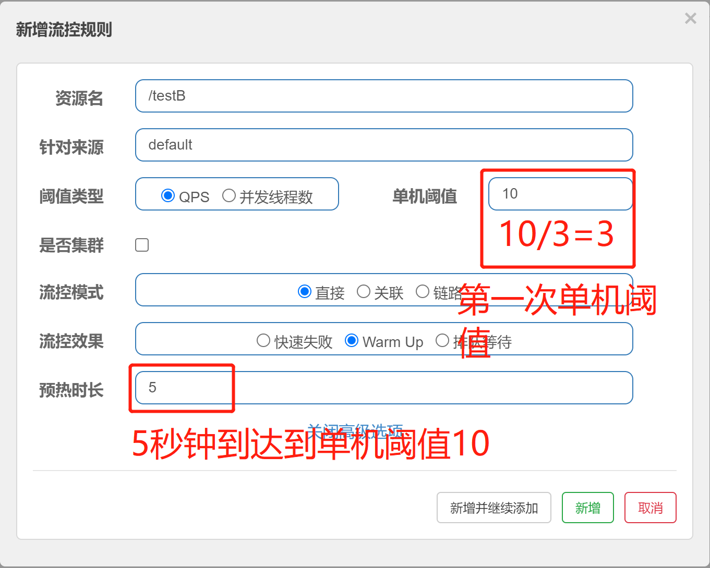
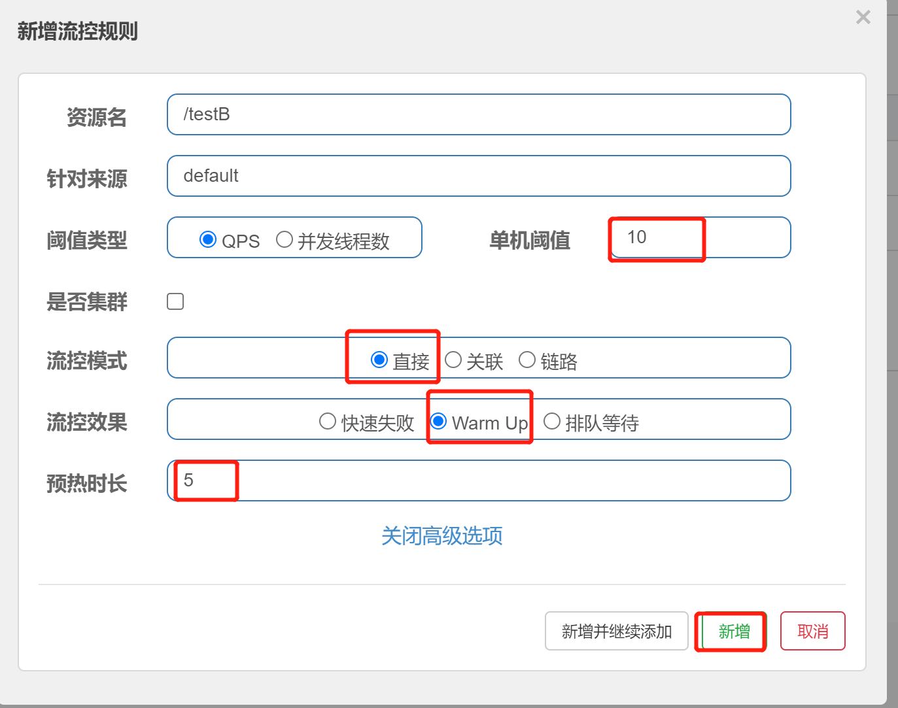

# Sentinel流控效果-预热

## 名词解释

- 资源名：唯一名称，默认请求路径
- 针对来源：Sentinel可以针对调用者进行限流，填写微服务名，默认default（不区分来源）
- 阈值类型/单机阈值：
  - QPS（每秒钟的请求数量）：当调用该API的QPS达到阈值的时候，进行限流
  - 线程数：当调用该API的线程数量达到阈值的时候，进行限流
- 是否集群：当前不需要集群
- 流控模式：
  - 直接：API达到限流条件时，直接限流
  - 关联：当关联的资源达到阈值时，就限流自己
  - 链路：只记录指定链路上的流量（指定资源从入口资源进来的流量，如果达到阈值，就进行限流）(API级别的针对来源)
- **流控效果：**
  - 快速失败：直接失败，抛异常
  - **Warm Up：根据coldFactor（冷加载因子，默认3）的值，从阈值/codeFacotor，经过预热时长，才达到设置的QPS阈值**
  - 排队等待：匀速排队，让请求以匀速的速度通过，阈值类型必须设置为QPS，否则无效

## 预热

官网手册地址：https://sentinelguard.io/zh-cn/docs/flow-control.html

概念：Warm Up方式，即预热/冷启动方式。该方式主要用于系统长期处于低水位的情况下，当流量突然增加时，直接把系统拉升到高水位可能瞬间把系统压垮。通过"冷启动"，让通过的流量缓慢增加，在一定时间内逐渐增加到阈值上限，给冷系统一个预热的时间，避免冷系统被压垮的情况。

​	预热公式：阈值/coldFactor（默认值为3），经过预热时间后才会达到阈值。

​	冷启动的过程系统允许通过的QPS曲线如下图：

简单理解：

​	使用场景：一般秒杀系统中会有这样的流控设置，为了防止秒杀瞬间造成系统崩溃。

## 案例

​	默认coldFactor为3，当发起请求即请求QPS从（阈值/3）开始，经过多长预热时长才逐步升至设定的QPS阈值，当前阈值设置为10，预热时长设置为5秒。

​	最终的效果，系统初始化时阈值/3约等于3，即阈值在此时为3，经过5秒后阈值才慢慢升高到10

首先我们先来设置流控效果：

测试，我们用最简单的方法进行测试，直接在浏览器上手动刷新，然后我们来看Sentinel的实时监控

