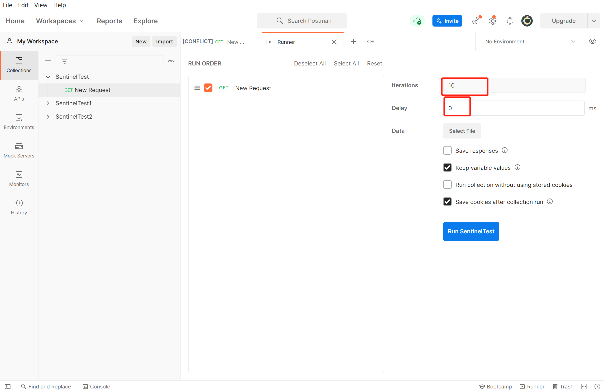

# Sentinel流控效果-排队等待

## 名词解释

- 资源名：唯一名称，默认请求路径
- 针对来源：Sentinel可以针对调用者进行限流，填写微服务名，默认default（不区分来源）
- 阈值类型/单机阈值：
  - QPS（每秒钟的请求数量）：当调用该API的QPS达到阈值的时候，进行限流
  - 线程数：当调用该API的线程数量达到阈值的时候，进行限流
- 是否集群：当前不需要集群
- 流控模式：
  - 直接：API达到限流条件时，直接限流
  - 关联：当关联的资源达到阈值时，就限流自己
  - 链路：只记录指定链路上的流量（指定资源从入口资源进来的流量，如果达到阈值，就进行限流）(API级别的针对来源)
- **流控效果：**
  - 快速失败：直接失败，抛异常
  - Warm Up：根据coldFactor（冷加载因子，默认3）的值，从阈值/codeFacotor，经过预热时长，才达到设置的QPS阈值
  - **排队等待（匀速器）：匀速排队，让请求以匀速的速度通过，阈值类型必须设置为QPS，否则无效**

## 排队等待

​	官方文档：https://sentinelguard.io/zh-cn/docs/flow-control.html

​	概念：匀速排队方式会严格控制请求通过的间隔时间，也即是让请求以均匀的速度通过，对应的是漏桶算法。

​	这种方式主要用于处理间隔性突发的流量，例如消息队列。想象一下这样的场景，在某一秒有大量的请求到来，而接下来的几秒则处于空闲状态，我们希望系统能够在接下来的空闲期间逐渐处理这些请求，而不是在第一秒直接拒绝多余的请求（削峰填谷）。

​	例图：


### 匀速器

​	它的中心思想是，以固定的间隔时间让请求通过。当请求到来的时候，如果当前请求距离上个通过的请求通过的时间间隔不小于预设值，则让当前请求通过。否则，计算当前请求的预期通过时间，如果该请求的预期通过时间小于规则预设的 timeout 时间，则该请求会等待直到预设时间到来通过（排队等待处理）；若预期的通过时间超出最大排队时长，则直接拒接这个请求。


​	Sentinel 匀速排队等待策略是漏桶算法结合虚拟队列等待机制实现的。

​	注意：匀速排队模式暂时不支持 QPS > 1000 的场景。


## 演示

流控规则：


为了看到效果，我们在代码中进行打印，更改8401微服务中的FlowLimitController

```java
package com.example.cloudalibabasentinel8401.controller;

import com.alibaba.csp.sentinel.annotation.SentinelResource;
import com.example.cloudalibabasentinel8401.service.TestService;
import lombok.extern.slf4j.Slf4j;
import org.springframework.beans.factory.annotation.Autowired;
import org.springframework.web.bind.annotation.GetMapping;
import org.springframework.web.bind.annotation.RestController;

import java.util.concurrent.TimeUnit;

@RestController
@Slf4j
public class FlowLimitController {
    @Autowired
    TestService testService;
    @GetMapping("/testA")
    public String testA(){
        log.info(Thread.currentThread().getName()+"：testA");
        return testService.common();
    }

    @GetMapping("/testB")
    public String testB(){
        return testService.common();
    }
}
```

最后我们可以通过Postman来进行测试，发送请求时没有延迟，同时发送10条请求，然后我们会发现就是排队效果1秒执行一个请求，同时我们在Idea中也可以看到打桩效果



