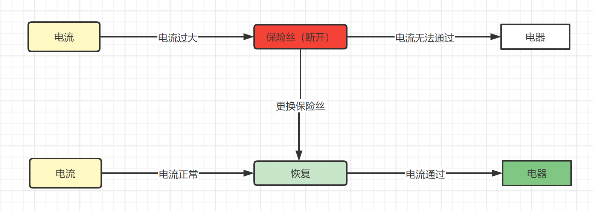

# Sentinel熔断策略-慢调用比例


## 慢调用比例

​	概念：选择以慢调用比例作为阈值，需要设置允许的慢调用 RT（即最大的响应时间），请求的响应时间大于该值则统计为慢调用。当单位统计时长（`statIntervalMs`）内请求数目大于设置的最小请求数目，并且慢调用的比例大于阈值，则接下来的熔断时长内请求会自动被熔断。经过熔断时长后熔断器会进入探测恢复状态（HALF-OPEN 状态），若接下来的一个请求响应时间小于设置的慢调用 RT 则结束熔断，若大于设置的慢调用 RT 则会再次被熔断。


​	简单理解：


举例：




## 案例演示

首先我们先添加一个控制器方法：

```java
//FlowLimitController.java
@GetMapping("/testC")
public String testC(){
    try {
        TimeUnit.SECONDS.sleep(5);
    } catch (InterruptedException e) {
        e.printStackTrace();
    }
    return "----testC";
}
```

设置熔断策略，1QPS>5 并且这些请求的RT>300 并且大于比例阈值触发熔断


## 测试

通过JMeter测试，1秒钟发起10个线程请求/testC，此时就会触发熔断效果，停止测试以后，10秒钟以后恢复正常

