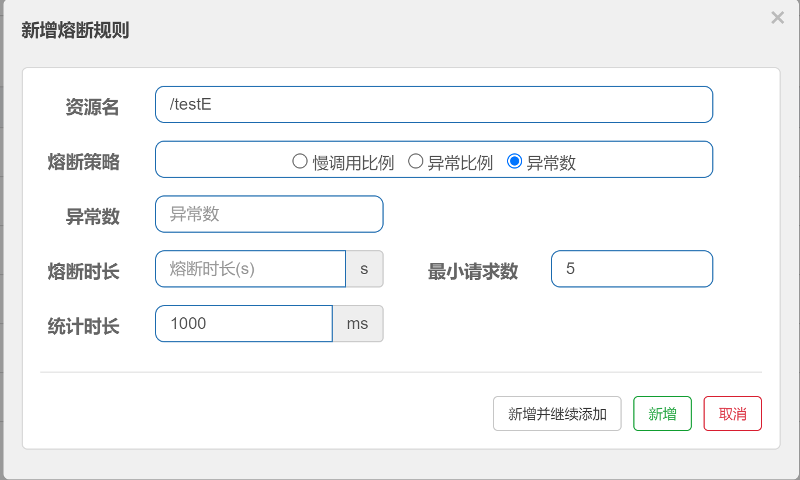
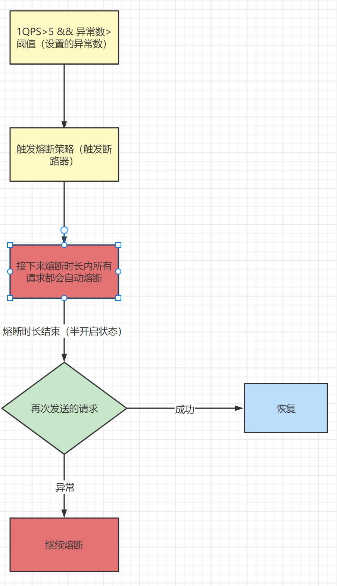
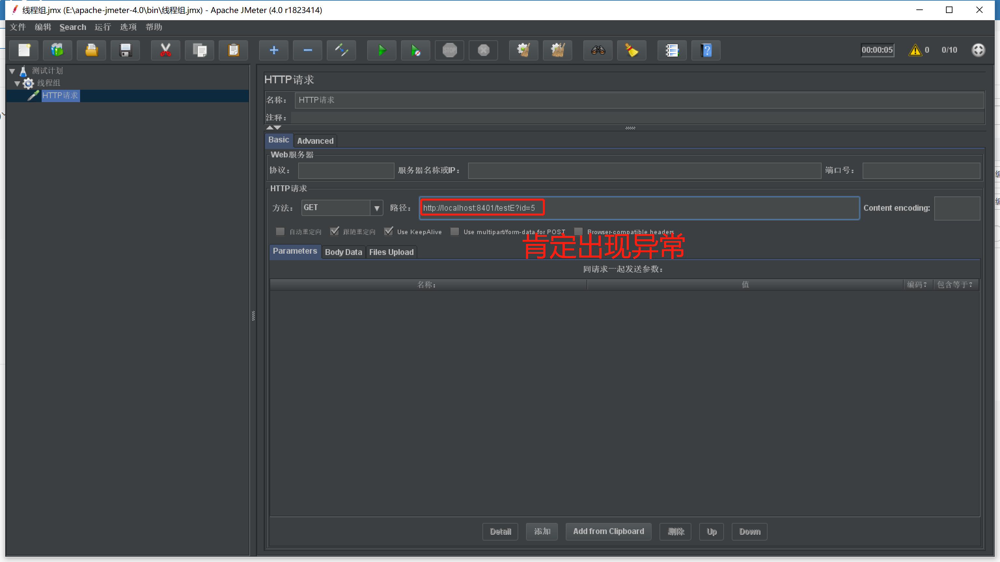
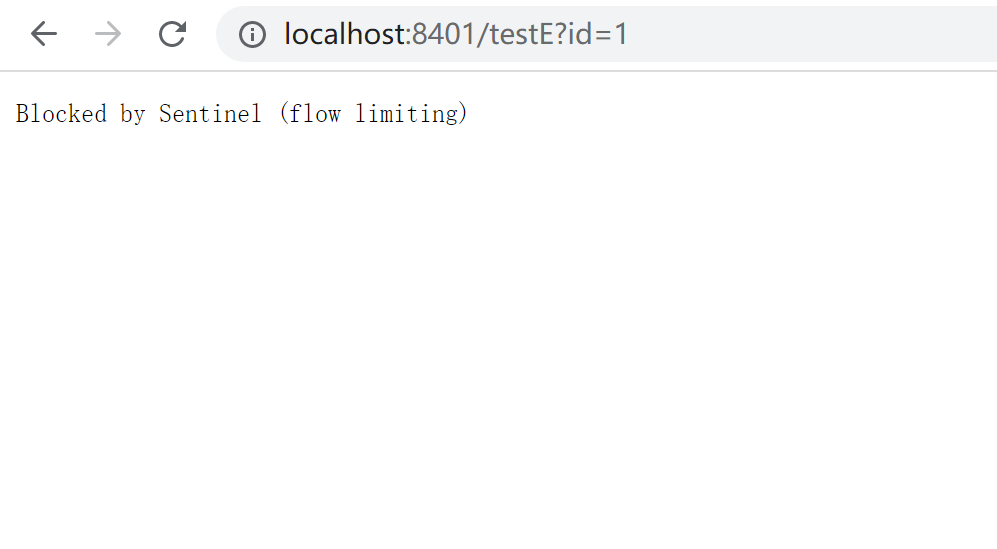

# Sentinel熔断策略-异常数

## 异常数

​	概念：异常数 (`ERROR_COUNT`)：当单位统计时长内的异常数目超过阈值之后会自动进行熔断。经过熔断时长后熔断器会进入探测恢复状态（HALF-OPEN 状态），若接下来的一个请求成功完成（没有错误）则结束熔断，否则会再次被熔断。

​	注意：异常降级**仅针对业务异常**，对 Sentinel 限流降级本身的异常（`BlockException`）不生效。



简单理解：



## 案例演示

编写接口

```java
//FlowLimitController
@GetMapping("/testE")
public String testE(Integer id){
    if(id != null && id > 1){
        throw new RuntimeException("异常数测试");
    }
    return "------------testE";
}
```

设置异常数策略，当1秒钟内请求超过5并且异常数大约5个的时候触发熔断


## 测试

通过JMeter来测试



1秒钟发送10个请求


此时就会触发熔断

