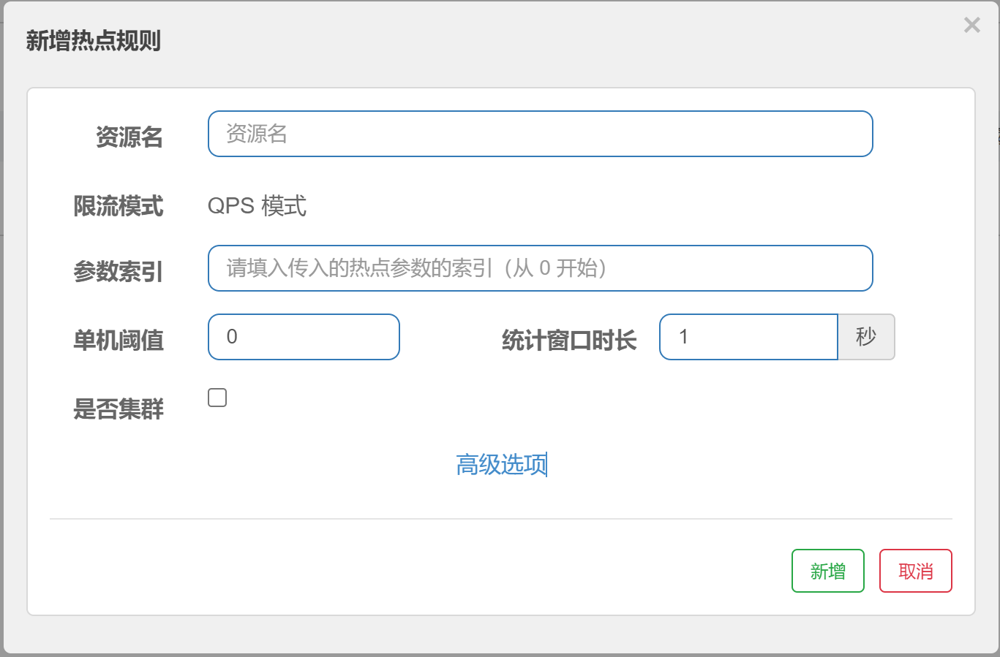

# Sentinel 热点规则（上）

## 概念

何为热点？热点即经常访问的数据。很多时候我们希望统计某个热点数据中访问频次最高的 Top K 数据，并对其访问进行限制。比如：

- 商品 ID 为参数，统计一段时间内最常购买的商品 ID 并进行限制
- 用户 ID 为参数，针对一段时间内频繁访问的用户 ID 进行限制

热点参数限流会统计传入参数中的热点参数，并根据配置的限流阈值与模式，对包含热点参数的资源调用进行限流。热点参数限流可以看做是一种特殊的流量控制，仅对包含热点参数的资源调用生效

官网：https://sentinelguard.io/zh-cn/docs/parameter-flow-control.html




这里还有相对应的高级选项，我们这里先了解基本规则。

## 使用@SentinelResource注解

其实这个热点限流其实就是更加细粒度的流控规则，那么如果想使用它就必须要配合对应SentinelResource注解。

Sentinel 提供了 @SentinelResource 注解用于定义资源，它有很多的参数，我们这里主要关注两个参数：

1. value：代表资源名称，必需项，因为需要通过resource name找到对应的规则，这个是必须配置的
2. blockHandler：blockHandler 对应处理 BlockException 的方法名称，可选项，访问范围需要是 public，返回类型需要与原方法相匹配，参数类型需要和原方法相匹配并且最后加一个额外的参数，类型为 BlockException。

## 案例讲解


### @SentinelResource(value="xxx")

那现在我们要完成以上图中的效果，这个时候我们首先要编写代码，在FlowLimitController中编写代码

```java
@GetMapping("/testHotKey")
@SentinelResource("testHotKey")
public String testHotKey(@RequestParam(value = "hot1",required = false) String hot1,
                         @RequestParam(value = "hot2",required = false)String hot2,
                         @RequestParam(value = "hot13",required = false) String hot3){
    return "----testHotKey";
}
```

然后再来配置热点规则


这里要说明一下，参数索引0实际上代表的就是我们设置的hot1参数


测试，此时如果我们传入参数hot1，并且超过阈值，就会出现限流，但是此时的限流效果为报错，显示不友好


### @SentinelResource(value="xxx",blockHandler="xxx")

刚才的演示中，我们明显发现这种限流方法的提示效果非常不友好，所以如果我们需要能够得到友好的提示，我们就需要使用@SentinelResource注解提供的另外一个参数blockHandler，这个参数是可以指定当出现异常时的处理方法，具体操作如下：

```java
@GetMapping("/testHotKey")
@SentinelResource(value = "testHotKey",blockHandler = "handler_HotKey")
public String testHotKey(@RequestParam(value = "hot1",required = false) String hot1,
                         @RequestParam(value = "hot2",required = false)String hot2,
                         @RequestParam(value = "hot13",required = false) String hot3){
    return "----testHotKey";
}

//处理异常方法，方法签名要和对应的接口方法保持一致
public String handler_HotKey(String hot1, String hot2,String hot3,BlockException exception){
    return "系统繁忙稍后重试。。";
}
```

然后热点规则不变，我们最终的到的限流效果如下：

