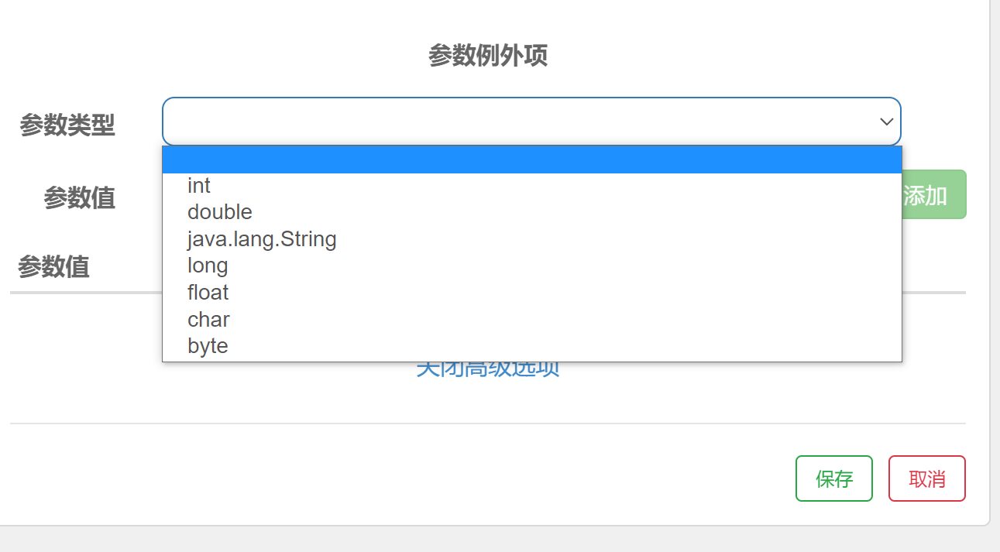
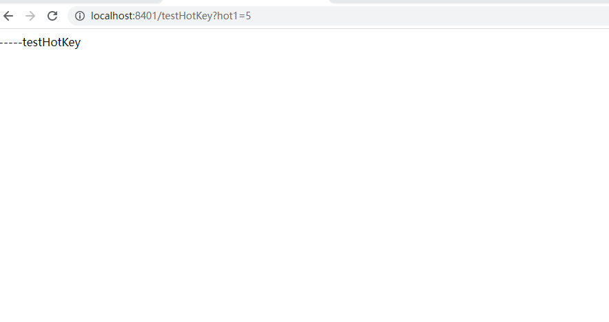

# Sentinel 热点规则（下）

## 概念

何为热点？热点即经常访问的数据。很多时候我们希望统计某个热点数据中访问频次最高的 Top K 数据，并对其访问进行限制。比如：

- 商品 ID 为参数，统计一段时间内最常购买的商品 ID 并进行限制
- 用户 ID 为参数，针对一段时间内频繁访问的用户 ID 进行限制

热点参数限流会统计传入参数中的热点参数，并根据配置的限流阈值与模式，对包含热点参数的资源调用进行限流。热点参数限流可以看做是一种特殊的流量控制，仅对包含热点参数的资源调用生效

官网：https://sentinelguard.io/zh-cn/docs/parameter-flow-control.html


## 参数例外项

​	其实参数例外项就是可以达到更加细粒度的控制，比如我们当前的例子中，目前hot1参数在访问时超过阈值就会被限流，但是我们可以通过参数例外项设置hot1具体等于特殊的某个值的时候，触发不同的限流效果。假如hot1的值等于5时，它的阈值可以达到200。

​	**注意：**参数例外项中的参数类型仅支持一下7种数据类型



## 案例演示

当前我们需要让hot1的值为5的时候阈值可以达到200，首先Sentinel页面中修改对应热点规则（在这之前，先演示传递一个参数，否则配置失败）


此时的规则为：如果当前hot1值为除5以外的其他值，都会走普通的阈值规则，但是如果一旦hot1的值为5的时候，将会走参数例外项，此时的阈值为200，我们通过浏览器测试，当hot1的值等于5是只要阈值不超过200就不会出现限流。



​	注意：题我们到现在代码中使用了@SentinelResource注解，此注解处理的是**Sentinel控制台配置的异常**，通过blockHandler属性设置对应方法来处理和程序本身异常无关。

​	所以以下程序中如果hot1的值等于6还是会出现RuntimeException。

```
@SentinelResource(value = "testHotKey",blockHandler = "handler_HotKey")
public String testHotKey(@RequestParam(value = "hot1",required = false) String hot1,
                         @RequestParam(value = "hot2",required = false) String hot2,
                         @RequestParam(value = "hot3",required = false) String hot3){
    if("6".equals(hot1)){
        throw new RuntimeException("运行时异常");
    }
    return "-----testHotKey";
}
```