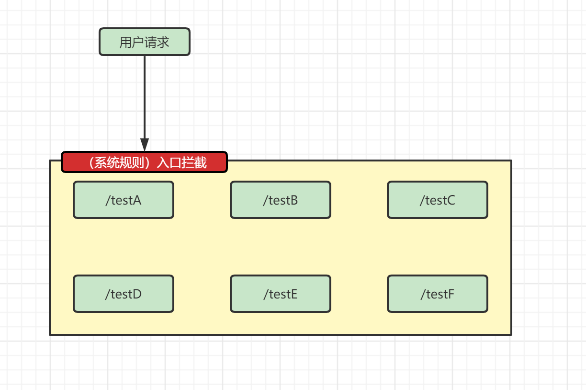
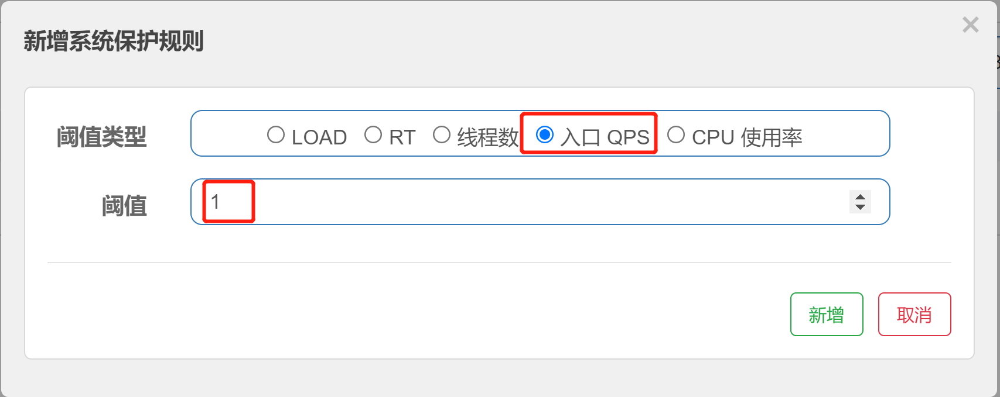

# Sentinel 系统规则	

​	Sentinel 系统自适应限流从整体维度对应用入口流量进行控制，结合应用的 Load、CPU 使用率、总体平均 RT、入口 QPS 和并发线程数等几个维度的监控指标，通过自适应的流控策略，让系统的入口流量和系统的负载达到一个平衡，让系统尽可能跑在最大吞吐量的同时保证系统整体的稳定性。

## 系统规则

​	系统保护规则是从应用级别的入口流量进行控制，从单台机器的 load、CPU 使用率、平均 RT、入口 QPS 和并发线程数等几个维度监控应用指标，让系统尽可能跑在最大吞吐量的同时保证系统整体的稳定性。

​	系统保护规则是应用整体维度的，而不是资源维度的，并且**仅对入口流量生效**。入口流量指的是进入应用的流量，比如 Web 服务或 Dubbo 服务端接收的请求，都属于入口流量。

**系统规则支持一下的模式：**

- **Load 自适应**（仅对 Linux/Unix-like 机器生效）：系统的 load1（1分钟平均负载） 作为启发指标，进行自适应系统保护。当系统 load1（1分钟平均负载） 超过设定的启发值（阈值），且系统当前的并发线程数超过估算的系统容量时才会触发系统保护（BBR 阶段）。系统容量由系统的 `maxQps(秒级统计的最大QPS) * minRt(秒级统计的最小响应时间)` 估算得出。设定参考值一般是 `CPU cores * 2.5`。
- **CPU usage**（1.5.0+ 版本）：当系统 CPU 使用率超过阈值即触发系统保护（取值范围 0.0-1.0），比较灵敏。
- **平均 RT**：当单台机器上所有入口流量的平均 RT 达到阈值即触发系统保护，单位是毫秒。
- **并发线程数**：当单台机器上所有入口流量的并发线程数达到阈值即触发系统保护。
- **入口 QPS**：当单台机器上所有入口流量的 QPS 达到阈值即触发系统保护。

## 案例演示

这里我们只通过入口QPS来进行测试，直接设置规则

最后测试效果不管现在我们访问那个接口只要超过阈值就会被限流

