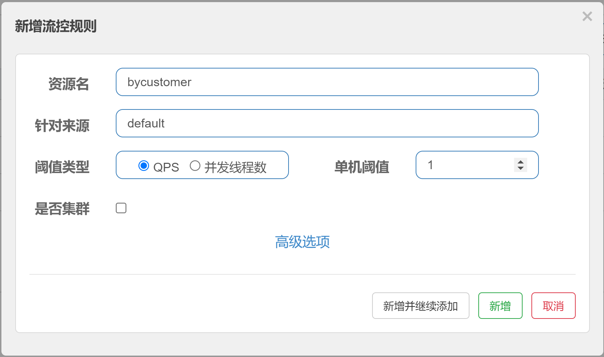

# @SentinelResource 自定义限流逻辑处理

​	Sentinel 提供了@SentinelResource注解用于定义资源,并提供了AspectJ的扩展用于自定义资源,处理BlockException等。

## 案例复习

之前我们用过这个注解，同时了解了它的两个属性：

- value：资源名称，必须项（唯一，不能为空）
- blockHandler：对应处理BlockException的函数名称可选项.blockHandler函数访问需要public,返回类型需要与原方法相匹配,参数类型需要和原方法相匹配并且最后加一个额外的参数,类型为BlockException.blockHandler 函数默认需要和原方法在同一个类中

我们之前利用这个注解完成了热点规则的学习，同时做了一个案例，我们简单复习一下，这个案例的核心思想就是我们传递一个指定参数，然后通过注解@SentinelResource注解标注资源进行限流，当出现限流以后，通过blockHandler属性设置限流以后的解决方法。


其实这个注解不仅仅可以用到热点规则上，还可以用到流控上，我们可以做一个资源的流控和一个请求的流控，通过此注解来解决限流之后问题。

## @SentinelResource 资源限流

**核心点：**使用@SentinelResource注解的blockHandler属性，定义出现限流效果时的解决方法。

编写一个新的控制器类型SentinelResourceTestController，使用@SentinelResource注解同时使用blockHandler属性

```java
@GetMapping("/byResource")
@SentinelResource(value = "byResource",blockHandler = "handler_resource")
public String byResource(){
    return "-----byResource";
}

public String handler_resource(BlockException exception){
    return "系统繁忙";
}
```

这里要注意一定要给byResource资源添加流控


具体规则


测试，测试我们去快速访问http://localhost:8401/byResource，就会出现我们使用@SentinelResource注解中blockHandler属性提供的解决限流异常的方法。


## @SentinelResource URL限流

**核心点：**使用@SentinelResource注解，但是不使用blockHandler属性，系统会调用默认限流异常处理方法。

其实这个注解，我们还可以更换请求地址为资源，比如我们在新建一个测试接口方法

```java
@GetMapping("/byRest")
@SentinelResource(value = "byRest")
public String byRest(){
    return "-----byRest";
}
```

给这个接口地址添加流控


此时如果没有自己定义限流处理方法，会走系统默认的


## 结论

1. @SentinelResource 既可以配置资源名称也可以配置URL
2. 如果配置了@SentinelResource的blockHandler属性对应方法，出现限流会调用对应方法
3. 如果没有配置@SentinelResource的blockHandler属性，系统会走默认的限流处理。


## 自定义限流处理逻辑

其实我们在使用@SentinelResource注解这两种方案的时候，会出现一些问题：

1. 没有体现我们自己的业务要求。
2. 自定义处理方法和业务代码耦合在一起。
3. 每个业务方法都添加一个限流处理方法，代码将会加剧膨胀。
4. 无法实现统一全局处理。 

解决：@SentinelResource除了blockHandler可以设置自定义限流处理逻辑方法以外，还提供另外一个属性来设置限流处理逻辑类型blockHandlerClass属性，此属性中设置的方法必需为 static 函数，否则无法解析。

### 具体逻辑

**第一步**

创建CustomerBlockHandler类型用于处理自定义限流处理逻辑，首先创建myhandler.CustomerBlockHandler

```java
/**
 * 此类型用来处理限流自定义逻辑
 */
public class CustomerBlockHandler {
    public static String handlerException1(BlockException exception){
        return "handlerException1：系统异常，请稍后重试！";
    }
    public static String handlerException2(BlockException exception){
        return "handlerException2：网络崩溃了，请稍后重试！";
    }
}
```

**第二步**

我们在SentinelResourceTestController类型中添加一个接口方法，同时设置@SentinelResource注解和blockHandlerClass属性对应的类型和这个类型中对应的处理方法

```java
/**
* 此方法用到了自定义限流处理类型CustomerBlockHandler
* 中的handlerException1方法来处理限流逻辑。
*/
@GetMapping("/bycustomer")
@SentinelResource(value = "bycustomer",
                  blockHandlerClass = CustomerBlockHandler.class,
                  blockHandler = "handlerException1")
public String bycustomer(){
    return "-----bycustomer";
}
```

**第三步**

测试：给bycustomer资源添加限流规则，然后来测试在超过限流阈值时处理方法是否为CustomerBlockHandler中handlerException1来进行处理。




添加流控规则以后，我们再来频繁访问http://localhost:8401/bycustomer，就会看见是CustomerBlockHandler类型的handlerException1方法来处理自定义限流逻辑


### 对应关系图

