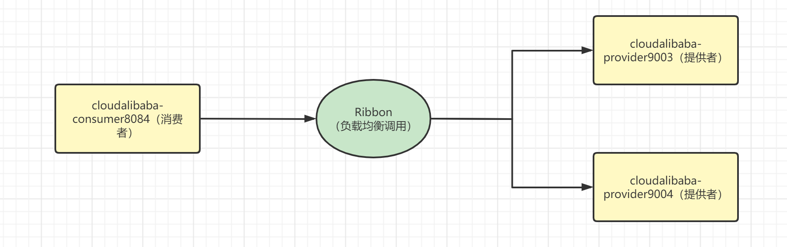

# Sentinel服务熔断环境搭建

服务熔断：应对微服务雪崩效应的一种链路保护机制，类似保险丝。

需要完成Sentinel整合Ribbon+openFeign，所以我们先要搭建环境，那么先从整合Ribbon开始

## 环境搭建

为了演示操作，所以在这里我们需要利用Ribbon进行负载均衡的调用，所以我们需要创建一个服务消费者cloudalibaba-consumer8084和两个服务提供者cloudalibaba-provider9003和cloudalibaba-provider9004，以下是结构图



其实我们之前就搭建过这种结构，比较简单，所以我们快速搭建

### 新建cloudalibaba-provider-9003/9004

在建立9003和9004之前，先建立一个共享项目cloudalibaba-commons，在其中新建一个类型JsonResult，这个类型用于返回JSON数据类型

```java
package com.mashibing.cloudalibabacommons.entity;

import lombok.AllArgsConstructor;
import lombok.Data;
import lombok.NoArgsConstructor;

@Data
@AllArgsConstructor
@NoArgsConstructor
public class JsonResult<T> {
    private Integer code;
    private T data;
}
```

创建服务提供者9003，9004基本上是一样的，所以我们建立9003复制就可以得到9004

**pom**

```java
<?xml version="1.0" encoding="UTF-8"?>
<project xmlns="http://maven.apache.org/POM/4.0.0" xmlns:xsi="http://www.w3.org/2001/XMLSchema-instance"
         xsi:schemaLocation="http://maven.apache.org/POM/4.0.0 https://maven.apache.org/xsd/maven-4.0.0.xsd">
    <modelVersion>4.0.0</modelVersion>
    <parent>
        <groupId>com.mashibing</groupId>
        <artifactId>SpringAlibabaMSB</artifactId>
        <version>0.0.1-SNAPSHOT</version>
        <relativePath/> <!-- lookup parent from repository -->
    </parent>
    <groupId>com.mashibing</groupId>
    <artifactId>cloudalibaba-provider-9003</artifactId>
    <version>0.0.1-SNAPSHOT</version>
    <name>cloudalibaba-provider-9003</name>
    <description>cloudalibaba-provider-9003</description>
    <properties>
        <java.version>1.8</java.version>
    </properties>
    <dependencies>
        <dependency>
            <groupId>org.springframework.boot</groupId>
            <artifactId>spring-boot-starter</artifactId>
        </dependency>
        <dependency>
            <groupId>org.springframework.boot</groupId>
            <artifactId>spring-boot-starter-test</artifactId>
            <scope>test</scope>
        </dependency>
        <dependency>
            <groupId>com.alibaba.cloud</groupId>
            <artifactId>spring-cloud-starter-alibaba-nacos-discovery</artifactId>
        </dependency>
        <dependency>
            <groupId>com.mashibing</groupId>
            <artifactId>cloudalibaba-commons</artifactId>
            <version>0.0.1-SNAPSHOT</version>
        </dependency>
    </dependencies>

    <build>
        <plugins>
            <plugin>
                <groupId>org.springframework.boot</groupId>
                <artifactId>spring-boot-maven-plugin</artifactId>
            </plugin>
        </plugins>
    </build>

</project>
```

**yml**

```java
server:
  port: 9003

spring:
  application:
    name: nacos-provider
  cloud:
    nacos:
      discovery:
        server-addr: localhost:8848 #配置Nacos地址

management:
  endpoints:
    web:
      exposure:
        include: '*'
```

**主启动添加注解**

```java
package com.mashibing.cloudalibabaprovider9003;

import org.springframework.boot.SpringApplication;
import org.springframework.boot.autoconfigure.SpringBootApplication;
import org.springframework.cloud.client.discovery.EnableDiscoveryClient;

@SpringBootApplication
@EnableDiscoveryClient
public class CloudalibabaProvider9003Application {

    public static void main(String[] args) {
        SpringApplication.run(CloudalibabaProvider9003Application.class, args);
    }

}
```

**控制器**

```java
package com.mashibing.cloudalibabaprovider9003.controller;

import com.mashibing.cloudalibabacommons.entity.JsonResult;
import lombok.extern.java.Log;
import org.springframework.beans.factory.annotation.Value;
import org.springframework.web.bind.annotation.GetMapping;
import org.springframework.web.bind.annotation.PathVariable;
import org.springframework.web.bind.annotation.RestController;

import java.util.HashMap;

@RestController
public class DataController {
    @Value("${server.port}")
    private String serverPort;

    //模仿数据库存储数据
    public static HashMap<Long,String> hashMap = new HashMap<>();
    static {
        hashMap.put(1l,"鼠标");
        hashMap.put(2l,"键盘");
        hashMap.put(3l,"耳机");
    }

    @GetMapping("info/{id}")
    public JsonResult<String> msbSql(@PathVariable("id") Long id){
        JsonResult<String> result = new JsonResult(1L,200,hashMap.get(id));
        return result;
    }
}
```

**注意：**9004和9003 一致，但是要注意修改yml文件端口号

### 新建cloudalibaba-consumer8084

**pom**

```java
<?xml version="1.0" encoding="UTF-8"?>
<project xmlns="http://maven.apache.org/POM/4.0.0" xmlns:xsi="http://www.w3.org/2001/XMLSchema-instance"
         xsi:schemaLocation="http://maven.apache.org/POM/4.0.0 https://maven.apache.org/xsd/maven-4.0.0.xsd">
    <modelVersion>4.0.0</modelVersion>
    <parent>
        <groupId>com.mashibing</groupId>
        <artifactId>SpringAlibabaMSB</artifactId>
        <version>0.0.1-SNAPSHOT</version>
        <relativePath/> <!-- lookup parent from repository -->
    </parent>
    <groupId>com.mashibing</groupId>
    <artifactId>cloudalibaba-consumer8084</artifactId>
    <version>0.0.1-SNAPSHOT</version>
    <name>cloudalibaba-consumer8084</name>
    <description>cloudalibaba-consumer8084</description>
    <properties>
        <java.version>1.8</java.version>
    </properties>
    <dependencies>
        <dependency>
            <groupId>org.springframework.boot</groupId>
            <artifactId>spring-boot-starter</artifactId>
        </dependency>

        <dependency>
            <groupId>org.springframework.boot</groupId>
            <artifactId>spring-boot-starter-test</artifactId>
            <scope>test</scope>
        </dependency>
        <!--SpringCloud ailibaba nacos -->
        <dependency>
            <groupId>com.alibaba.cloud</groupId>
            <artifactId>spring-cloud-starter-alibaba-nacos-discovery</artifactId>
        </dependency>
        <!--SpringCloud ailibaba sentinel -->
        <dependency>
            <groupId>com.alibaba.cloud</groupId>
            <artifactId>spring-cloud-starter-alibaba-sentinel</artifactId>
        </dependency>
        <dependency>
            <groupId>com.mashibing</groupId>
            <artifactId>cloudalibaba-commons</artifactId>
            <version>0.0.1-SNAPSHOT</version>
        </dependency>
    </dependencies>

    <build>
        <plugins>
            <plugin>
                <groupId>org.springframework.boot</groupId>
                <artifactId>spring-boot-maven-plugin</artifactId>
            </plugin>
        </plugins>
    </build>

</project>
```

**yml**

```java
server:
  port: 8084
spring:
  application:
    name: nacos-consumer
  cloud:
    nacos:
      discovery:
        server-addr: localhost:8848
    sentinel:
      transport:
        #配置Sentinel dashboard地址
        dashboard: localhost:8080
        #默认8719端口，假如被占用会自动从8719开始依次+1扫描,直至找到未被占用的端口
        port: 8719

#消费者将要去访问的微服务名称(注册成功进nacos的微服务提供者)
service-url:
  nacos-user-service: http://nacos-provider
```

主启动添加注解和9003/9004一致

**控制器**

```java
package com.mashibing.cloudalibabaconsumer8084;

import com.mashibing.cloudalibabacommons.entity.JsonResult;
import lombok.extern.slf4j.Slf4j;
import org.springframework.beans.factory.annotation.Autowired;
import org.springframework.beans.factory.annotation.Value;
import org.springframework.web.bind.annotation.GetMapping;
import org.springframework.web.bind.annotation.PathVariable;
import org.springframework.web.bind.annotation.RestController;
import org.springframework.web.client.RestTemplate;

@RestController
@Slf4j
public class DemoController {
    //服务提供者URL
    @Value("${service-url.nacos-user-service}")
    private String SERVICE_URL;

    @Autowired
    private RestTemplate restTemplate;

    @GetMapping("/consumer/fallback/{id}")
    public JsonResult<String> fallback(@PathVariable Long id){
        //通过Ribbon发起远程访问，访问9003/9004
        JsonResult<String> result = restTemplate.getForObject(SERVICE_URL+"/info/"+id,JsonResult.class);
    	return result;
    }
}
```


## 最后测试

访问http://localhost:8084/consumer/fallback/1

查看最后结果是否为9003/9004切换调用

