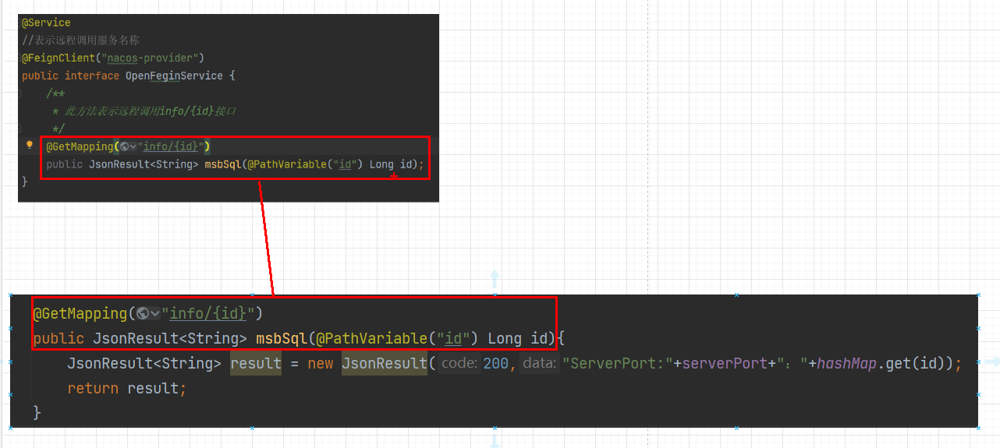
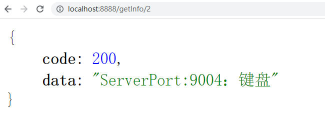

# OpenFeign基础应用

## 概念

OpenFeign是一种声明式、模板化的HTTP客户端。在Spring Cloud中使用OpenFeign，可以做到使用HTTP请求访问远程服务，就像调用本地方法一样的，开发者完全感知不到这是在调用远程方法，更感知不到在访问HTTP请求，用法其实就是编写一个接口，在接口上添加注解即可。

可以简单理解它是借鉴Ribbon的基础之上，封装的一套服务接口+注解的方式的远程调用器。

## OpenFeign能干什么

它的宗旨是在编写Java Http客户端接口的时候变得更加容易，其底层整合了Ribbon，所以也支持负载均衡。

之前我们使用Ribbon的时候，利用RestTemplate对Http请求进行封装处理，但是在实际开发中，由于对服务依赖的调用不可能就一处，往往一个接口会被多处调用，所以通常都会针对每个微服务自行封装一些客户端类来包装这些依赖服务的调用。所以OpenFeign在此基础之上做了进一步的封装，由它来帮助我们定义和实现依赖服务接口的定义，我们只需创建一个接口并使用注解的方式来配置它，即可完成对微服务提供方的接口绑定，简化Ribbon的操作。

## 具体使用

 这里我们通过一个案例来演示，首先我们要明确使用OpenFeign是使用在消费者端去远程调用，就必须要是用FeignClient注解，来标注要调用的服务提供者名称，然后在通过一个接口来定义要调用的方法，所以我们首先新建一个Model：cloudalibaba-openFeign-consumer-8888


### pom

注意：需要在父级项目引入对应依赖坐标

```java
<dependency>
    <groupId>org.springframework.cloud</groupId>
    <artifactId>spring-cloud-starter-openfeign</artifactId>
    <version>${openfeign-version}</version>
</dependency>
```

```java
<?xml version="1.0" encoding="UTF-8"?>
<project xmlns="http://maven.apache.org/POM/4.0.0" xmlns:xsi="http://www.w3.org/2001/XMLSchema-instance"
         xsi:schemaLocation="http://maven.apache.org/POM/4.0.0 https://maven.apache.org/xsd/maven-4.0.0.xsd">
    <modelVersion>4.0.0</modelVersion>
    <parent>
        <groupId>com.mashibing</groupId>
        <artifactId>SpringAlibabaMSB</artifactId>
        <version>0.0.1-SNAPSHOT</version>
        <relativePath/> <!-- lookup parent from repository -->
    </parent>
    <groupId>com.mashibing</groupId>
    <artifactId>cloudalibaba-openFeign-consumer-8888</artifactId>
    <version>0.0.1-SNAPSHOT</version>
    <name>cloudalibaba-openFeign-consumer-8888</name>
    <description>cloudalibaba-openFeign-consumer-8888</description>
    <properties>
        <java.version>1.8</java.version>
    </properties>
    <dependencies>
        <dependency>
            <groupId>org.springframework.boot</groupId>
            <artifactId>spring-boot-starter</artifactId>
        </dependency>
        <dependency>
            <groupId>org.springframework.boot</groupId>
            <artifactId>spring-boot-starter-test</artifactId>
            <scope>test</scope>
        </dependency>
        <dependency>
            <groupId>com.alibaba.cloud</groupId>
            <artifactId>spring-cloud-starter-alibaba-nacos-discovery</artifactId>
        </dependency>
        <dependency>
            <groupId>org.springframework.cloud</groupId>
            <artifactId>spring-cloud-starter-openfeign</artifactId>
        </dependency>
        <dependency>
            <groupId>com.mashibing</groupId>
            <artifactId>cloudalibaba-commons</artifactId>
            <version>0.0.1-SNAPSHOT</version>
        </dependency>
    </dependencies>


    <build>
        <plugins>
            <plugin>
                <groupId>org.springframework.boot</groupId>
                <artifactId>spring-boot-maven-plugin</artifactId>
            </plugin>
        </plugins>
    </build>
</project>
```

### YML配置

```java
server:
  port: 8888
spring:
  application:
    name: nacos-consumer-openFeign
  cloud:
    nacos:
      discovery:
        server-addr: localhost:8848

management:
  endpoints:
    web:
      exposure:
        include: '*'
```

### 主启动中添加注解

```
@SpringBootApplication
@EnableDiscoveryClient
@EnableFeignClients//添加此注解
public class CloudalibabaOpenFeignConsumer8888Application {

    public static void main(String[] args) {
        SpringApplication.run(CloudalibabaOpenFeignConsumer8888Application.class, args);
    }

}
```

### 调用服务提供者对外提供接口

这里要调用的是服务提供者9003/9004



```java
package com.mashibing.cloudalibabaopenFeignconsumer8888.service;

import com.mashibing.cloudalibabacommons.entity.JsonResult;
import org.springframework.cloud.openfeign.FeignClient;
import org.springframework.stereotype.Service;
import org.springframework.web.bind.annotation.GetMapping;
import org.springframework.web.bind.annotation.PathVariable;

/**
 * 此接口就是配合使用OpenFeign的接口，
 * 在此接口中添加@FeignClient接口同时标注
 * 要调用的服务端名称，同时使用与服务提供者
 * 方法签名一致的抽象方法来表示远程调用的
 * 具体内容
 */
@Service
//表示远程调用服务名称
@FeignClient("nacos-provider")
public interface openFeignService {
    /**
     * 此方法表示远程调用info/{id}接口
     */
    @GetMapping("info/{id}")
    public JsonResult<String> msbSql(@PathVariable("id") Long id);
}

```

### 控制器

```java
package com.mashibing.cloudalibabaopenFeignconsumer8888.controller;

import com.mashibing.cloudalibabacommons.entity.JsonResult;
import com.mashibing.cloudalibabaopenFeignconsumer8888.service.OpenFeignService;
import org.springframework.beans.factory.annotation.Autowired;
import org.springframework.web.bind.annotation.GetMapping;
import org.springframework.web.bind.annotation.PathVariable;
import org.springframework.web.bind.annotation.RestController;

@RestController
public class OpenFeignController {

    @Autowired
    private OpenFeignService openFeignService;

    @GetMapping("getInfo/{id}")
    public JsonResult<String> getInfo(@PathVariable("id") Long id){
        return openFeignService.msbSql(id);
    }

}
```

## 测试结果

能够远程调用的同时还有负载均衡效果

