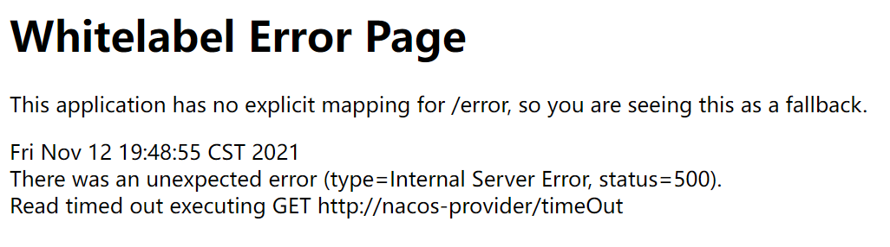

# OpenFeign超时时间控制

## 概念

OpenFeign 客户端默认等待1秒钟，但是如果服务端业务超过1秒，则会报错。为了避免这样的情况，我们需要设置feign客户端的超时控制。

## 解决办法

由于OpenFeign 底层是ribbon 。所以超时控制由ribbon来控制。在yml文件中配置

## 超时案例演示

首先演示超时效果，我们现在9003/9004上设置一个延迟3秒执行的方法，来模仿长业务线调用。

```java
@GetMapping("/timeOut")
public String timeOut() {
    try {
        System.out.println("延迟响应");
        TimeUnit.SECONDS.sleep(3);
    } catch (InterruptedException e) {
        e.printStackTrace();
    }
    return serverPort;
}
```

客户端8888通过OpenFeign来进行调用

```java
//OpenFeginController
@GetMapping("/testTimeout")
    public String TestTimeout(){
        return openFeginService.timeOut();
    }
}
```

### 测试结果

客户端报错：




## 设置超时控制案例演示

首先我们需要在8888消费者端的yml文件中配置超时时间，因为OpenFeign本身整合了Ribbon所以，这里其实我们用的是Ribbon来配置

### YML

```java
server:
  port: 8888
spring:
  application:
    name: nacos-consumer-openfegin
  cloud:
    nacos:
      discovery:
        server-addr: localhost:8848

#设置feign客户端超时时间(OpenFeign默认支持ribbon)
ribbon:
  #指的是建立连接所用的时间，适用于网络状况正常的情况下,两端连接所用的时间
  ReadTimeout: 5000
  #指的是建立连接后从服务器读取到可用资源所用的时间
  ConnectTimeout: 5000

management:
  endpoints:
    web:
      exposure:
        include: '*'
```

### 测试结果

正常响应

