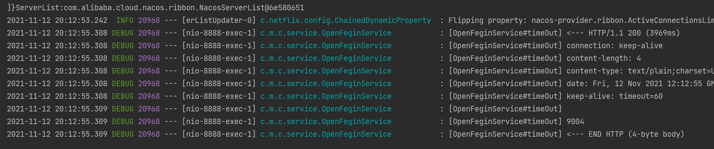

## OpenFeign日志打印

## 概念

Feign 提供了日志打印功能，我们可以通过配置来调整日志级别，从而了解 Feign 中 Http 请求的细节。
简单理解，就是对Feign接口的调用情况进行监控和输出

**日志级别：**

- NONE：默认的，不显示任何日志；

- BASIC：仅记录请求方法、URL、响应状态码及执行时间；

- HEADERS：除了 BASIC 中定义的信息之外，还有请求和响应的头信息；

- FULL：除了 HEADERS 中定义的信息之外，还有请求和响应的正文及元数据。

## 具体使用

需要在启动类中通过@Bean注解注入OpenFeign的日志功能

```java
@SpringBootApplication
@EnableFeignClients
public class CloudalibabaOpenFeginConsumer8888Application {

    public static void main(String[] args) {
        SpringApplication.run(CloudalibabaOpenFeginConsumer8888Application.class, args);
    }

    @Bean
    Logger.Level feignLoggerLevel(){
        //开启详细日志
        return Logger.Level.FULL;
    }
}

```

在yml中配置中配置

```java
server:
  port: 8888
spring:
  application:
    name: nacos-consumer-openfegin
  cloud:
    nacos:
      discovery:
        server-addr: localhost:8848

#设置feign客户端超时时间(OpenFeign默认支持ribbon)
ribbon:
  #指的是建立连接所用的时间，适用于网络状况正常的情况下,两端连接所用的时间
  ReadTimeout: 5000
  #指的是建立连接后从服务器读取到可用资源所用的时间
  ConnectTimeout: 5000

logging:
  level:
    # openfeign日志以什么级别监控哪个接口
    com.mashibing.cloudalibabaopenfeginconsumer8888.service.OpenFeginService: debug

management:
  endpoints:
    web:
      exposure:
        include: '*'
```

测试效果，发起一次调用以后的日志内容：

