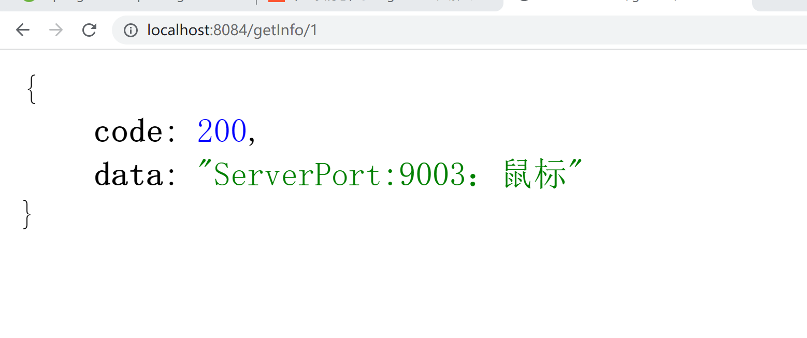

# Sentinel整合OpenFegin

根据之前的学习，我们已经学习过了包括Sentinel整合Ribbon，包括对OpenFegin的基本学习，那么这节课，我们就需要通过Sentinel来进行整合OpenFegin

## 引入OpenFegin

我们需要在当前的8084项目中引入对应的依赖

```java
<dependency>
    <groupId>org.springframework.cloud</groupId>
    <artifactId>spring-cloud-starter-openfeign</artifactId>
</dependency>
```

激活Sentinel对OpenFeign的支持，所以配置yml

```java
# 激活Sentinel对OpenFeign的支持
feign:
  sentinel:
    enabled: true
```

主启动类要添加@EnableFeignClients注解

```java
@SpringBootApplication
@EnableDiscoveryClient
@EnableFeignClients//注入Feign
public class CloudalibabaConsumer8084Application {

    public static void main(String[] args) {
        SpringApplication.run(CloudalibabaConsumer8084Application.class, args);
    }
    @Bean
    @LoadBalanced
    public RestTemplate getRestTemplate() {
        return new RestTemplate();
    }
}
```

## OpenFegin接口编写

这里我们的接口写法和之前保持一致，但是要注意，我们这里要多增加一个FeignClient的属性：

- fallback: 定义容错的处理类，当调用远程接口失败或超时时，会调用对应接口的容错逻辑，fallback指定的类必须实现@FeignClient标记的接口

```java
//当没有成功调用/info/{id}接口时会走fallback属性标注的类型的处理方法
@Service
@FeignClient(value = "nacos-provider",fallback = FeignServiceImpl.class)
public interface FeignService {
    /**
     * 远程调用对应方法
     */
    @GetMapping("info/{id}")
    public JsonResult<String> msbSql(@PathVariable("id") Long id);
}
```

实现类必须添加@Component注解，否则无法注入到容器中

```java
@Component
public class FeignServiceImpl implements FeignService{
    @Override
    public JsonResult<String> msbSql(Long id) {
        return new JsonResult<>(444,"服务降级返回！");
    }
}
```

这里完成后我们来编写控制器

```java
@Autowired
private FeignService feignService;

@GetMapping("getInfo/{id}")
public JsonResult<String> getInfo(@PathVariable("id") Long id){
    if(id > 3){
        throw new RuntimeException("没有该id");
    }
    return feignService.msbSql(id);
}
```

## 测试

此时如果我们访问http://localhost:8084/getInfo/1的地址，是没有问题的，但是如果此时我们人为结束9003/9004服务，这个时候就会触发fallback属性对应的处理类型，完成服务降级。



断开服务以后

