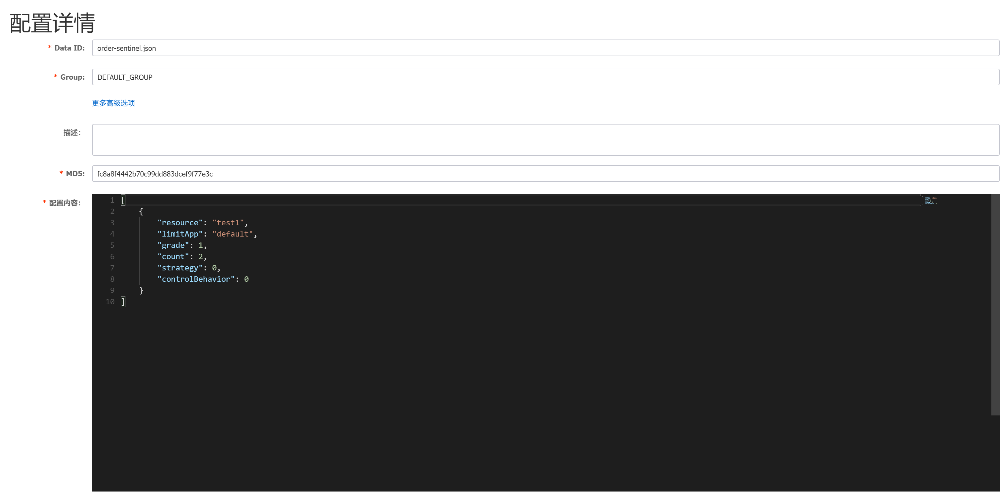
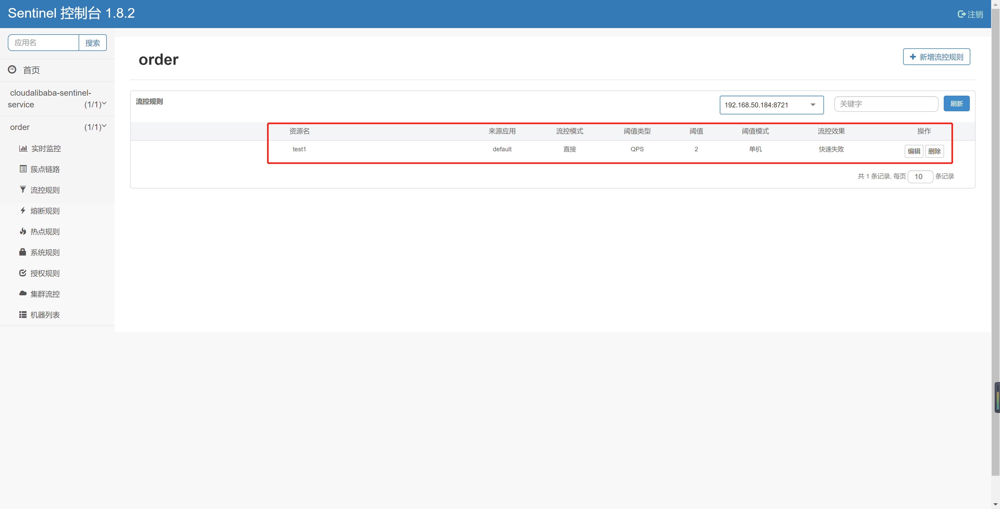

# Sentinel持久化配置

 我们首先需要知道：在Sentinel Dashboard中配置规则之后重启应用就会丢失，所以实际生产环境中需要配置规则的持久化实现，Sentinel提供多种不同的数据源来持久化规则配置，包括file，redis、nacos、zk。


## Sentinel规则持久化到Nacos

将限流规则持久化进Nacos保存，只要刷新8401某个接口地址，Sentinel控制台的流控规则就能感应到，同时只要Nacos里面的配置不删除，针对8401上Sentinel的流控规则就持续有效。


其实就是实现Sentinel Dashboard与Nacos之间的相互通信

通过Nacos配置文件修改流控规则---拉取--->Sentinel Dashboard界面显示最新的流控规则

**注意：**在Nacos控制台上修改流控制，虽然可以同步到Sentinel Dashboard，但是Nacos此时应该作为一个流控规则的持久化平台，所以正常操作过程应该是开发者在Sentinel Dashboard上修改流控规则后同步到Nacos，遗憾的是目前Sentinel Dashboard不支持该功能。

## 具体操作

第一件事情我们首先要引入依赖：

```java
<dependency>
    <groupId>com.alibaba.csp</groupId>
    <artifactId>sentinel-datasource-nacos</artifactId>
    <version>1.8.1</version>
</dependency>
```

第二件事情我们需要配置YML

```java
# 端口号
server:
  port: 8890
# 服务名
spring:
  application:
    name: order
  cloud:
    nacos:
      discovery:
        # nacos注册中心地址
        server-addr: localhost:8848
    sentinel:
      transport:
        dashboard: localhost:8080
      datasource: # 配置Sentinel的持久化
        nacos:
          nacos:
            serverAddr: localhost:8848
            groupId: DEFAULT_GROUP
            dataId: order-sentinel.json
            ruleType: flow
  profiles:
    active: dev


```

第三步我们需要进入到Nacos控制台，添加配置



具体配置内容：

```java
[   
    {
        "resource": "test1",
        "limitApp": "default",
        "grade": 1,
        "count": 2,
        "strategy": 0,
        "controlBehavior": 0
        "clusterMode": false
    }
]
---------------具体内容含义-----------------
resource：资源名称；
limitApp：来源应用；
grade：阈值类型，0表示线程数，1表示QPS；
count：单机阈值；
strategy：流控模式，0表示直接，1表示关联，2表示链路；
controlBehavior：流控效果，0表示快速失败，1表示Warm Up，2表示排队等待；
clusterMode：是否集群。
```

控制器

```java
@RestController
public class OrderController {
    @GetMapping("/order/test1")
    @SentinelResource(value = "test1")
    public String test1() throws InterruptedException {
        return "test1 ";
    }
}
```


## 测试

当我们重启项目以后，我们访问对应接口http://localhost:8890/order/test1，就会在Sentinel界面上看到对应的限流规则：

