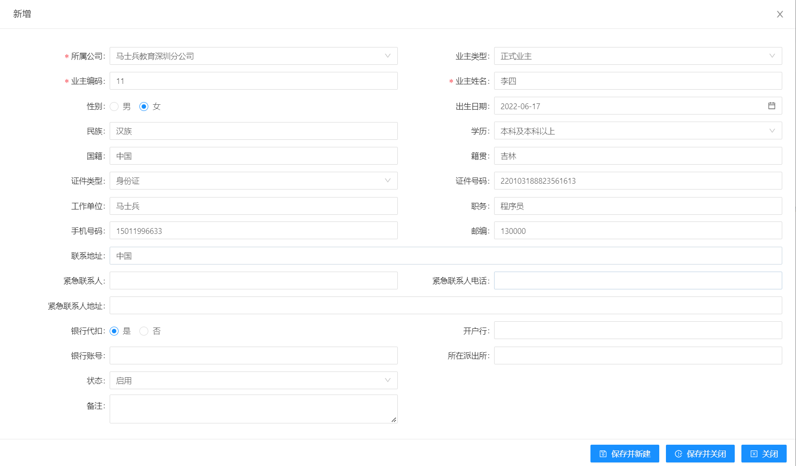
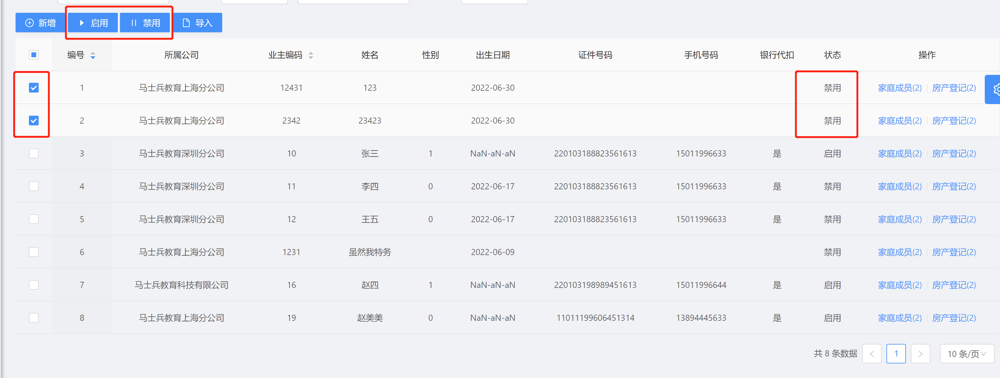
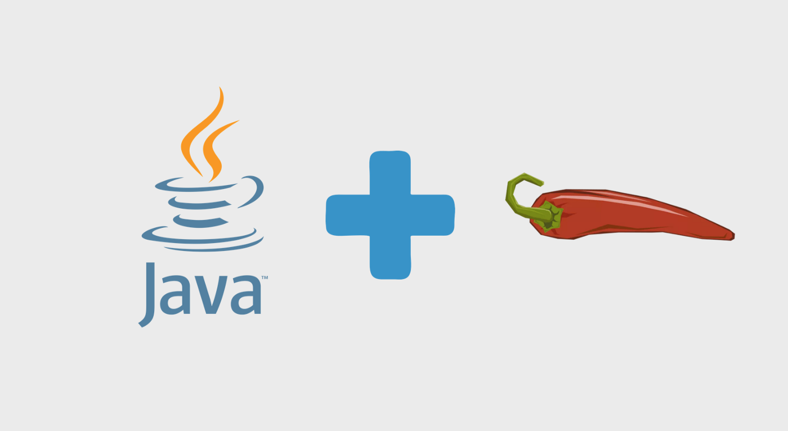
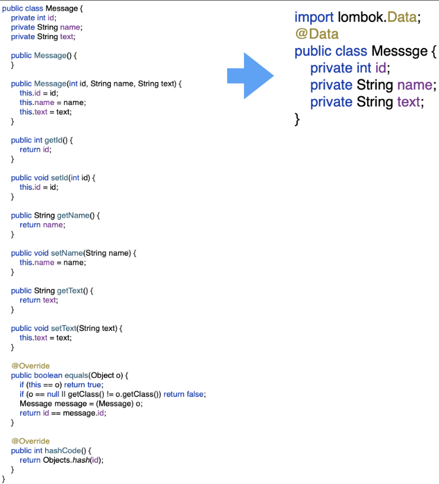
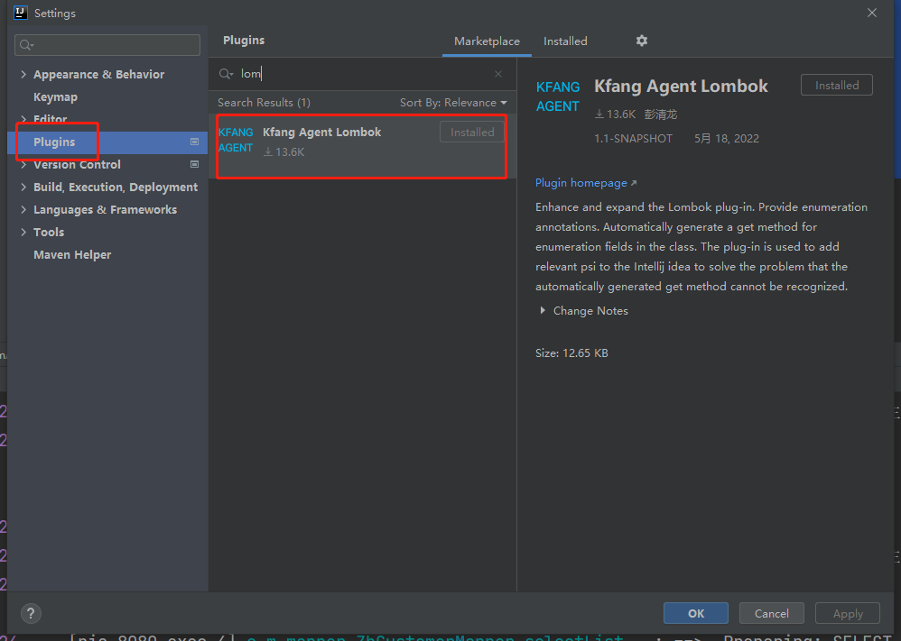
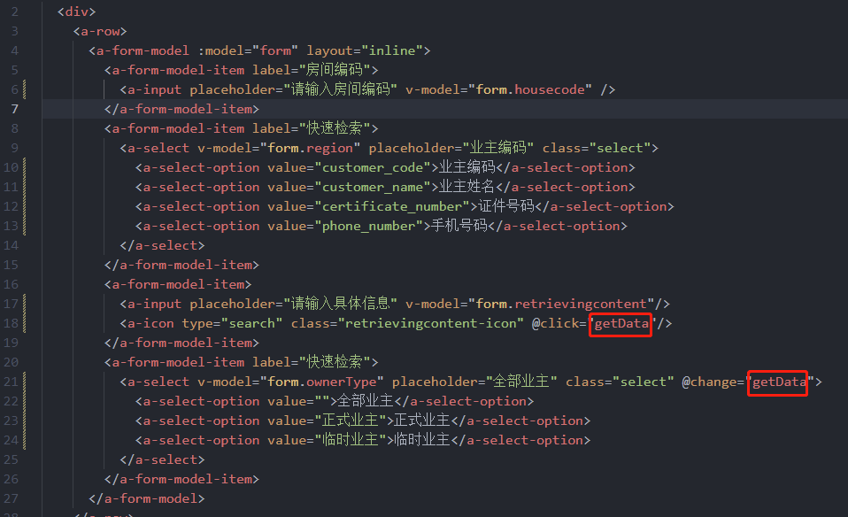
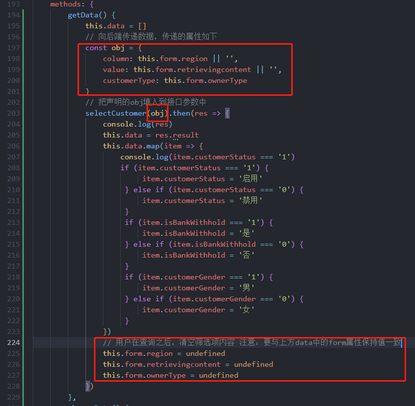
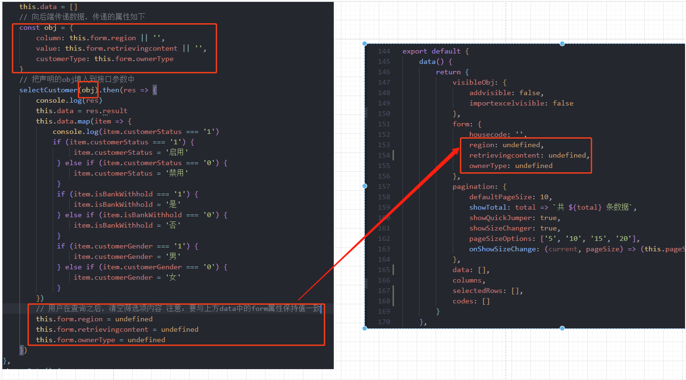
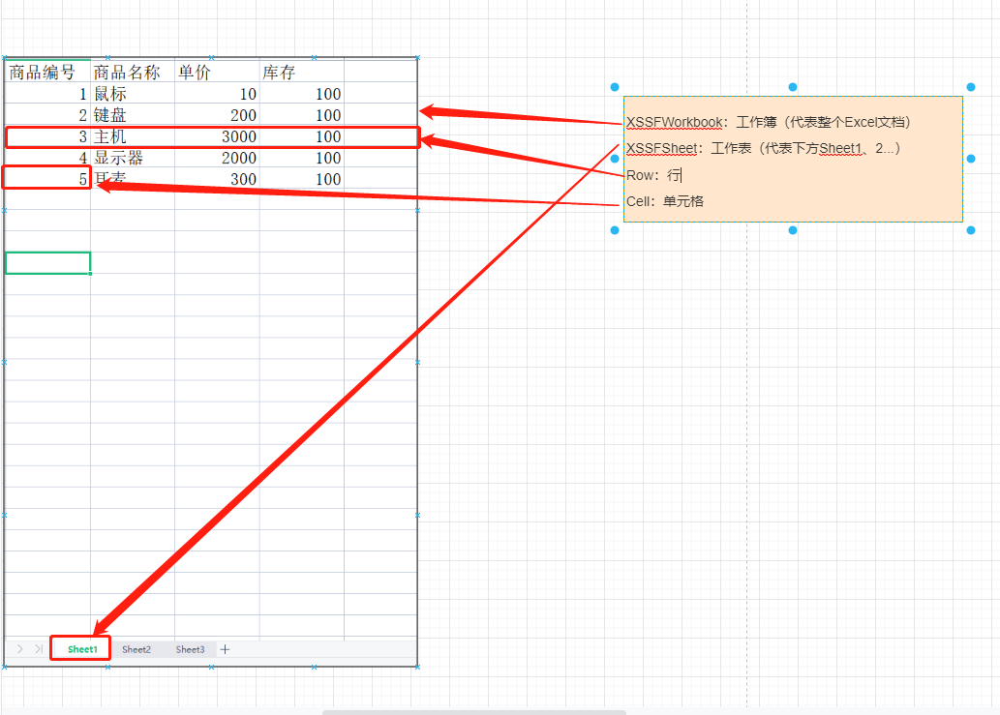
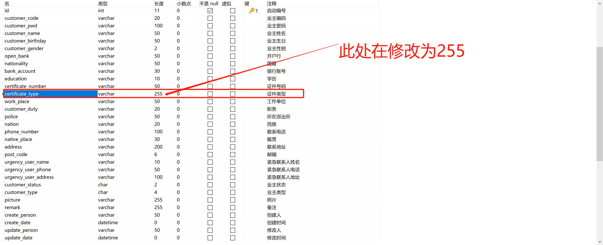

# 合家云-业主信息模块

## 业主信息模块

打开这个页面我们可以看到业主信息模块包含很多的功能，大概有：新增数据、改变数据状态、根据条件查询业主信息、包括批量导入数据等，那我们就一个个来完成，


### 业主信息新增



各位可以看到新增功能，这里说白了就是一个数据库插入的操作，所以首先这里我们要找到对应的数据库的表，这个业务对应的表为：zh_customer

知道了对应的表，那么这里前端请求的接口为：/zhCustomer/insertCustomer


前端传递的参数就是对应我们zh_customer表的数据，所以可以直接通过实体类来接收

#### 控制器

我们开始写写的业务模块了，所以我们需要重新建立一个新的Controller，包括后续的Service和Mapper都需要新建，对应不同的业务有不同的类，好区分，但是这里我们因为使用了MyBatisPlus所以不需要我们自己在做这种新建操作了，可以直接找到对应的类型来使用即可

Controller：ZhCustomerController

Service接口：ZhCustomerService

Service实现类：ZhCustomerServiceImpl

Mapper：ZhCustomerMapper

控制器具体编写：

```java
/**
 * <p>
 * 业主信息表 前端控制器
 * </p>
 *
 * @author lian
 * @since 2022-04-11
 */
@RestController
@RequestMapping("/zhCustomer")
public class ZhCustomerController {
    /**
    * 新增业主信息
    * @return 业主信息
    */
    @PostMapping("/insertCustomer")
    public R insertCustomer(ZhCustomer customer){
        System.out.println("insertCustomer");
        Integer result = zhCustomerService.insertCustomer(customer);
        if(result == 0){
            return new R("业主编码已存在！");
        }
        return new R("添加成功！");
    }
}
```

#### 业务层

接口：

```java
/**
 * <p>
 * 业主信息表 服务类
 * </p>
 *
 * @author lian
 * @since 2022-04-11
 */
public interface ZhCustomerService extends IService<ZhCustomer> {
    /**
     * 新增业主信息方法
     * @param customer 业主信息
     * @return 返回新增的业主信息
     */
    Integer insertCustomer(ZhCustomer customer);
}  
```

实现类：

```java
/**
 * <p>
 * 业主信息表 服务实现类
 * </p>
 *
 * @author lian
 * @since 2022-04-11
 */
@Service
public class ZhCustomerServiceImpl extends ServiceImpl<ZhCustomerMapper, ZhCustomer> implements ZhCustomerService {

    @Resource
    private ZhCustomerMapper zhCustomerMapper;

    @Override
    public Integer insertCustomer(ZhCustomer customer) {
        Integer result = 0;
        QueryWrapper<ZhCustomer> queryWrapper = new QueryWrapper<>();
        queryWrapper.eq("customer_code",customer.getCustomerCode());
        ZhCustomer zhCustomer = zhCustomerMapper.selectOne(queryWrapper);
        if(zhCustomer == null){
            result = zhCustomerMapper.insert(customer);
        }
        return result;
    }
}  
```

完成这些要注意下，和之前的新增一样，我们需要把后端的日志类型稍微改一下，这里为了方便我们就直接改为String了，其实就是业主生日：

```java
ZhCustomer类型
/**
 * 业主生日
 */
private String customerBirthday;
```

### 业主信息查询

完成了新增业务以后，我们现在还需要完成查询功能，也就是在打开业主信息页面的时候，做一个全部业主信息数据的查询，然后把对应的数据展示在页面上

前端接口：/zhCustomer/selectCustomer

#### 控制器

ZhCustomerController

```java
/**
* 查询全部业主信息
* @return
*/
@GetMapping("/selectCustomer")
public R SelectAllCustomer(){
    System.out.println("SelectCustomer");
    List<ZhCustomer> zhCustomers = zhCustomerService.SelectAllCustomer();
    return new R(zhCustomers);
}
```

#### 业务层

接口：ZhCustomerService

```java
/**
* 查询全部业主信息
* @return 全部业主信息
*/
List<ZhCustomer> SelectAllCustomer();
```

实现类：ZhCustomerServiceImpl

```java
@Override
public List<ZhCustomer> SelectAllCustomer() {
    List<ZhCustomer> zhCustomers = zhCustomerMapper.selectAll();
    return zhCustomers;
}
```

#### 持久层

因为这里我们需要自己定义方法，同时写联合查询，那么我们就需要自己定义方法和对应的SQl语句映射

接口：ZhCustomerMapper

```java
/**
* 查询全部业主数据
* @return
*/
List<ZhCustomer> selectAll();
```

映射xml：ZhCustomerMapper.xml

```java
<select id="selectAll" resultMap="customerMap">
    SELECT
    z.*,c.company_full_name
    FROM zh_customer z
    LEFT JOIN tbl_company c ON z.company = c.id;
</select>

<resultMap id="customerMap" type="com.mashibing.bean.ZhCustomer">
    <id column="id" property="id" />
    <result column="customer_code" property="customerCode" />
    <result column="customer_pwd" property="customerPwd" />
    <result column="customer_name" property="customerName" />
    <result column="customer_birthday" property="customerBirthday" />
    <result column="customer_gender" property="customerGender" />
    <result column="open_bank" property="openBank" />
    <result column="nationality" property="nationality" />
    <result column="bank_account" property="bankAccount" />
    <result column="education" property="education" />
    <result column="certificate_number" property="certificateNumber" />
    <result column="certificate_type" property="certificateType" />
    <result column="work_place" property="workPlace" />
    <result column="customer_duty" property="customerDuty" />
    <result column="police" property="police" />
    <result column="nation" property="nation" />
    <result column="phone_number" property="phoneNumber" />
    <result column="native_place" property="nativePlace" />
    <result column="address" property="address" />
    <result column="post_code" property="postCode" />
    <result column="urgency_user_name" property="urgencyUserName" />
    <result column="urgency_user_phone" property="urgencyUserPhone" />
    <result column="urgency_user_address" property="urgencyUserAddress" />
    <result column="customer_status" property="customerStatus" />
    <result column="customer_type" property="customerType" />
    <result column="picture" property="picture" />
    <result column="remark" property="remark" />
    <result column="create_person" property="createPerson" />
    <result column="create_date" property="createDate" />
    <result column="update_person" property="updatePerson" />
    <result column="update_date" property="updateDate" />
    <result column="company_full_name" property="company" />
    <result column="is_bank_withhold" property="isBankWithhold" />
</resultMap>
```

### 快速检索1


我们来看这个功能，这个功能其实就是前端选择具体的查询类型，然后用户输入具体的值，把这两个值作为查询条件传入后端，后端在进行查询，那好确定了需求，那我们就来编写业务

首先还是查看前端接口：zhCustomer/selectCustomerByColumnAndValue

传递的参数：column(此数据前端写死)、value

#### 控制器

```java
/**
* 根据用户选择的列和对应的值来查询业主信息
* @param column 对应查询的列
* @param value 对应列的值
* @return 业主信息
*/
@PostMapping("/selectCustomerByColumnAndValue")
public R selectCustomerByColumnAndValue(@RequestParam("column") String column,
                                        @RequestParam("value") String value){
    System.out.println("selectCustomerByParam");
    List<ZhCustomer> zhCustomers = zhCustomerService.selectCustomerByColumnAndValue(column,value);
    return new R(zhCustomers);
}
```

#### 业务层

```java
/**
* 根据用户选择的列和对应的值来查询业主信息
* @param customerCode 对应查询的列
* @param value 对应列的值
* @return 业主信息
*/
List<ZhCustomer> selectCustomerByColumnAndValue(String customerCode,String value);
-------------------------------
@Override
public List<ZhCustomer> selectCustomerByColumnAndValue(String column, String value) {
    QueryWrapper<ZhCustomer> queryWrapper = new QueryWrapper<>();
    queryWrapper.eq(column,value);
    List<ZhCustomer> zhCustomers = zhCustomerMapper.selectList(queryWrapper);
    return zhCustomers;
}
```

### 快速检索2

我们再看这个功能：


这个功能和上一个极其类似，这个说白了就是根据业主类型来进行查询，当时要住一点的是，如果选择全部业主，就要查询全部的业主信息，那么这里要注意一点，业主类型是写死的，也就是只有临时业主和正式业主

前端接口：/zhCustomer/selectByCustomerByCustomerType

参数：customerType 业主类型

#### 控制器

```java
/**
* 根据业主类型来进行查询业主信息
* @param customerType 业主类型
* @return 查询的业主信息
*/
@PostMapping("/selectByCustomerByCustomerType")
public R selectByCustomerByCustomerType(String customerType){
    System.out.println("selectByCustomerByCustomerType");
    List<ZhCustomer> zhCustomers = zhCustomerService.selectByCustomerByCustomerType(customerType);
    return new R(zhCustomers);
}
```

#### 业务层

```java
@Override
public List<ZhCustomer> selectByCustomerByCustomerType(String customerType) {
    List<ZhCustomer> customers;
    // 如果参数为空，直接调用全部数据查询方法
    if(customerType.equals("")){
        return SelectAllCustomer();
    }else{
        QueryWrapper<ZhCustomer> queryWrapper = new QueryWrapper<>();
        queryWrapper.eq("customer_type",customerType);
        customers = zhCustomerMapper.selectList(queryWrapper);
    }
    return customers;
}
```

### 业主状态管理功能

接下里完成业主状态管理功能，也就是下图中的所显示的，用户可以选择具体业主，然后点击启用或者禁用按钮，就可以改变业主信息的状态，是启用还是禁用



那么这个状态实际上就保存在zh_customer这张表中，那么其中的customer_status就是启用或者禁用的状态，那么其实这个业务就是去修改这个字段的值，1代表启用状态0代表禁用状态

那么这里还要注意一下，其实这两个状态按钮走的是一个接口，整体的业务逻辑就是，前端发送请求，并携带启用“1”或者禁用“0”的状态信息发送到后端，后端针对对应的业主编号和对应状态来修改数据库customer_status字段保存的数据，所以就是一个修改业务。

现在我们就需要先确定接口：


发送的参数：


在我们看到这个参数以后，其实我们就明白了，前端发送的就是两个参数

customerCodes: 业主编码

status：要修改的状态

但是大家会发现这里的customerCodes属性的值为什么是带一个"|"，实际上这是前端和后端约定好的，也就是当用户选择一个业主信息的时候，就会单独传递一个业主的编号，但是如果用户选择的是多个，那么前端就会传递多个业主编号，但是通过“|”进行分割，需要后端解析参数的时候把每个业主编号拆出来。

#### 具体操作

确定了这些内容以后，我们现在来完成此业务，首先还是控制器

```java
/**
* 根据前端传递的业主编码信息来修改业主状态
* customerCodes 此参数为业主编码，如果出现多个业主编码，会通过"/"进行分割
* status 状态：1开启 0禁用
* @return 修改业主状态信息的结果
*/
@PostMapping("/UpdateCustomerStatusByCustomerCode")
public R UpdateCustomerStatusByCustomerCode(@RequestBody Map map){
    System.out.println("UpdateCustomerStatusByCustomerCode");
    String customerCodes = (String) map.get("customerCodes");
    String status = (String) map.get("status");
    Integer result = zhCustomerService.UpdateCustomerStatusByCustomerCode(customerCodes,status);
    if(result == 1){
        return new R("修改成功！");
    }else{
        return new R("修改失败！");
    }
}
```

业务层接口

```java
/**
* 根据前端传递的业主编码信息来修改业主状态为启用
* 状态为：
*  1开启
*  0禁用
* @param customerCodes 此参数为业主编码，如果出现多个业主编码，会通过"/"进行分割
* @return 修改业主状态信息的结果
*/
Integer UpdateCustomerStatusByCustomerCode(String customerCodes,String status);
```

业务层实现类

```java
@Override
public Integer UpdateCustomerStatusByCustomerCode(String customerCodes,String status) {
    Integer result = 0;
    UpdateWrapper<ZhCustomer> updateWrapper = new UpdateWrapper<>();
    System.out.println(customerCodes);
    System.out.println(customerCodes.contains("|"));
    if(customerCodes.contains("|")){
        System.out.println("多个数据");
        String[] codes = customerCodes.split("[|]");
        for (int i = 0;i<codes.length;i++) {
            //这里要注意必须重新创建UpdateWrapper对象，否则，查询条件会累加
            UpdateWrapper<ZhCustomer> updateWrapper1 = new UpdateWrapper<>();
            updateWrapper1.set("customer_status",status).eq("customer_code",codes[i]);
            result = zhCustomerMapper.update(null,updateWrapper1);
        }
        return result;
    }else{
        updateWrapper.set("customer_status",status).eq("customer_code",customerCodes);
        result = zhCustomerMapper.update(null,updateWrapper);
        return result;
    }
}
```

### 查询重构

现在我们的这个业务其实存在一些问题，其实就是后端代码过于冗余的问题，其实各位可以想一下，我们现在前端页面中的几查询功能，实际上是可以进行统一管理的，目前现有的查询功能如下：

- 查询全部业主信息
- 根据指定条件查询业主信息
- 根据业主类型查询业主信息

其实各位想一下，这些查询功能是否能够在一个接口中完成，其实是可以的，因为无非就是查询全部数据和按照条件进行查询数据，那么有了这个思想的前提想，其实我们就可以进行后端查询接口的重构，最终达到只用一个查询接口，完成此页面中的全部查询功能（页面中还包含一个根据房间编号信息来查询，此查询在后续业主入住功能完成之后在进行开发）

#### 控制器

删除全部查询接口，只保留SelectCustomer接口

```java
/**
* 统一查询入口（优化查询）
* 通过用户传递的参数来进行对应的查询
* @param message 用户传递的参数
* @return 查询结果：业主信息
*/
@PostMapping("/selectCustomer")
public R SelectCustomer(@RequestBody CustomerMessage message){
    System.out.println("SelectCustomer");
    List<ZhCustomer> zhCustomers = zhCustomerService.SelectCustomer(message);
    return new R(zhCustomers);
}
```

#### 值对象

因为此接口会涉及到接收前端传递不同的参数，甚至前端不传递参数，所以这个位置，我们和前端进行约定使用json的方式进行传递参数，这样的话我们后端只需要通过一个值对象：CustomerMessage来进行接受数据即可，那么这个位置其实我们的值对象可以进行简化的开发，也就是使用Lombox技术即可

**Lombok 简介**



Lombok是一个java库，可以自动插入到你的编辑器和构建工具中，让你的java变得更加简单。再也不用写其getter或equals方法了，只需一个注解，你的类就可以拥有一个功能齐全的JavaBean（简化开发JavaBean）。



为了在IDEA中支持Lombok功能，需要安装Lombok插件，打开File>Settings>安装Lombok插件，安装以后才能支持Lombok提供的功能。(装拆件，安装之后需要重启)



由于SpringBoot已经支持了Lombok，所以在SpringBoot项目中的使用Lombok时自需要引用Lombok的依赖即可

```java
<dependency>
    <groupId>org.projectlombok</groupId>
    <artifactId>lombok</artifactId>
</dependency>
```

创建CustomerMessage值对象，编写属性即可，在类型上使用Lombok的@Data注解，添加了这个注解以后，IDEA在编译期间就会自动给Msg类型添加：无参数构造器、getter、setter、toString、euquals、hashCode方法

```java
@Data
@NoArgsConstructor
@AllArgsConstructor
public class CustomerMessage {
    private String column;
    private String value;
    private String customerType;
}
```

Lombok提供的常用注解：

- `@Getter/@Setter`：用在类或属性上，用在类上可以作用于这个类的所有属性，写在属性上只作用于属性名，再也不用自己手写setter和getter方法了
- `@ToString`：用在类上，可以自动覆写toString方法，当然还可以加其他参数，例如@ToString(exclude=”id”)排除id属性，或者@ToString(callSuper=true, includeFieldNames=true)调用父类的toString方法，包含所有属性
- `@EqualsAndHashCode`：用在类上，自动生成equals方法和hashCode方法
- `@NoArgsConstructor, @RequiredArgsConstructor and @AllArgsConstructor`：用在类上，自动生成无参构造和使用所有参数的构造函数以及把所有@NonNull属性作为参数的构造函数
- `@Data`：注解在类上，相当于同时使用了 `@ToString`、`@EqualsAndHashCode`、`@Getter`、`@Setter`和 `@RequiredArgsConstrutor`这些注解，对于 `POJO类`十分有用 `@Value`：用在类上，是@Data的不可变形式，相当于为属性添加final声明，只提供getter方法，而不提供setter方法
- `@Slf4j` 自动创建Slf4j日志对象log，用于记录系统日志信息Logger用于处理日志，简单理解是就是打桩语句System.out.println()的专业替代品，相对于打桩输出语句Logger具有更好的性能，更全面的输出信息，更好的按级别分类管理。Logger使用并不麻烦，特别是有了Lombok以后，自需要使用@Slf4j以后就使用log变量输出日志信息：
  - Logger用于处理日志，简单理解是就是打桩语句System.out.println()的专业替代品，相对于打桩输出语句Logger具有更好的性能，更全面的输出信息，更好的按级别分类管理。Logger使用并不麻烦，特别是有了Lombok以后，自需要使用@Slf4j以后就使用log变量输出日志信息：
  - 首先日志API Slf4j是SpringBoot默认导入的包，无需导入。然后在类中使用@Slf4j创建日志对象log，并且在需要的地方使用log输出信息：

```java
import lombok.extern.slf4j.Slf4j;
@Slf4j
public class LoggerDemo {
    public LoggerDemo() {
        log.debug("Hello World！");
    }
}
```

测试

```java
@Test
public void testLogger(){
    LoggerDemo demo = new LoggerDemo();
}
```

利用Lombok可以大大简化代码，提高开发效率，程序员感觉非常香甜！因此这类可以少许代码就能替代大量编码的语法工具被称为“语法糖”！也有人认为破坏了代码纯粹与严谨，Lombok是“语法毒药”。

#### 业务层

接口

```java
/**
* 查询入口（优化查询）
* 通过用户传递的参数来进行对应的查询
* @param message 用户传递的参数
* @return 查询结果：业主信息
*/
List<ZhCustomer> SelectCustomer(@RequestBody CustomerMessage message);
```

实现类

```java
/**
* 查询优化方法，统一查询入口
* @param message 用户传递的参数
* @return
*/
@Override
public List<ZhCustomer> SelectCustomer(CustomerMessage message) {
    QueryWrapper<ZhCustomer> queryWrapper = new QueryWrapper<>();
    if(!StringUtils.isEmpty(message.getColumn()) &&!StringUtils.isEmpty(message.getValue())){
        queryWrapper.eq(message.getColumn(),message.getValue());
    }
    if(!StringUtils.isEmpty(message.getCustomerType())) {
        System.out.println(message.getCustomerType());
        queryWrapper.eq("customer_type", message.getCustomerType());
    }
    List<ZhCustomer> customers = zhCustomerMapper.selectList(queryWrapper);
    return customers;
}
```

业务层写的比较复杂的时候我们最好做一个单元测试来确定正确性

注意：测试三个功能，全查、精准查询（两个参数）、类型查询

```
@Test
    void contextLoads() {
        CustomerMessage customerMessage = new CustomerMessage();
        customerMessage.setCustomerType("正式业主");
        List<ZhCustomer> zhCustomers = customerService.selectCustomer(customerMessage);
        for (ZhCustomer zhCustomer : zhCustomers) {
            log.info("查询的具体业主信息:{}",zhCustomer);
        }
    }
```

#### 修改前端

因为我们现在前端是根据我们之前的写法，调用了多个查询接口，所以这里需要我们手动调整一下，首先打开src\views\owner\information.vue这个页面文件，此页面就是当前我们看到的业主信息页面

**调整位置1**

在页面的最开始位置，调整页面的点击事件调用的方法



**调整位置2**

找到下方的getData方法



**调整位置3**

对应位置调整，因为现在采用的前端框架要求必须一致，否则placeholder不生效(对功能没有影响，不想调整也无所谓)


具体对应：



**调整位置4**

修改js脚本文件的请求方式为post，具体路径：src\api\owner.js，找到具体方法：

```java
export function selectCustomer(parameter) {
    return axios({
        url: '/zhCustomer/selectCustomer',
        method: 'post',//此处改为post
        data: parameter
    })
}
```

### 使用Java POI读Excel文档

#### Poi介绍

Poi是由apache公司提供的Java编写的免费开源跨平台的Java API，提供让Java程序对Microsoft Office档案读和写的功能。也是目前针对Excel读写比较常用的实现方案。

使用前提，需要导入对应的依赖

```java
<dependency>
     <groupId>org.apache.poi</groupId>
     <artifactId>poi</artifactId>
     <version>3.9</version>
</dependency>
<dependency>
     <groupId>org.apache.poi</groupId>
     <artifactId>poi-ooxml</artifactId>
     <version>3.9</version>
</dependency>
```

Poi包结构：

HSSF —— 读写 Microsoft Excel xls（07版本之前的Excel）

XSSF —— 读写 Microsoft Excel OOXML XLSX（07版本之后的Excel）

HWPF —— 读写 Word

HSLF —— 读写 PowerPoint（PPT）

其实我们主要用的就是XSSF

#### 读取Excel

Poi如何读取操作表格？其实在Poi内部封装了一些对象

XSSFWorkbook：工作簿

XSSFSheet：工作表

Row：行

Cell：单元格



#### 具体使用

那这里我做了一个简答的表格来模仿，如何将表格中的数据读取出来，并且放入到实体类中，后续用于写入数据库

具体表格a.xlsx：


那么我们在测试类中新建poitest包，然后新建一个Product类型，这个类型就是模仿实体类的类型

```java
import lombok.AllArgsConstructor;
import lombok.Data;

@Data
@AllArgsConstructor
public class Product {
    private Integer id;
    private String name;
    private Double price;
    private Integer count;
}
```

然后我们再来新建一个测试类型，用户解析表格中的数据，将具体数据保存到Product类型中

```java
/**
 * 利用Poi读取excel表格数据
 */
public class readDemo {
    public static void main(String[] args) {
        try {
            List<Product> products = read("E:\idea-family/a.xlsx");
            System.out.println(products);
        } catch (Exception e) {
            e.printStackTrace();
        }
    }

    public static List<Product> read(String path) throws Exception {
        List<Product> products = new ArrayList<>();
        // 1. 创建输入流
        FileInputStream fip = new FileInputStream(path);
        // 2. 再输入流中获取工作簿
        XSSFWorkbook workbook = new XSSFWorkbook(fip);
        // 3. 在工作簿中获取目标工作表
        Sheet sheet = workbook.getSheetAt(0);
        // 4. 获取工作表中的行数（有数据的）
        int rowNum = sheet.getPhysicalNumberOfRows();
        // 5. 遍历所有的行，但是要注意第一行标题不获取，所以从下标1开始获取
        for(int i = 1;i<rowNum;i++){
            // 获取所有行
            Row row = sheet.getRow(i);
            if(row!=null){
                //用于保存每条数据的集合
                List<String> list = new ArrayList<>();
                for (Cell cell : row) {
                    if(cell!=null){
                        //把单元各种的所有数据格式设置为String
                        cell.setCellType(Cell.CELL_TYPE_STRING);
                        //获取所有单元格数据
                        String value = cell.getStringCellValue();
                        if(value!=null&&!value.equals("")){
                            //将每个单元格的数据存储到集合中
                            list.add(value);
                        }
                    }
                }
                //把获取到的每一条数据封装成一个Product类型
                if(list.size()>0){
                    Product product = new Product(Integer.parseInt(list.get(0)),list.get(1),Double.parseDouble(list.get(2)),Integer.parseInt(list.get(3)));
                    //将product封装到list集合中
                    products.add(product);
                }
            }
        }
        return products;
    }
}
```

最后我们进行测试，数据保存到了实体类集合中


### 导入功能

在我们学会了如何解析Excel表格信息以后，我们现在就需要来研究一下这个业务


其实这个业务整体逻辑为：

选择具体公司-》下载Excel模板-》用户自己编辑信息-》上传Excel-》开始上传-》上传成功刷新页面，显示Excel中的用户信息

明确了这个业务逻辑以后，那么现在我们已经学会了如何完成Excel信息转换为Bean对象的功能，那我们就能完成这个业务了。

#### 具体完成

1. 创建接口：

```java
/**
* 根据前端传递的Excel表格文件和对应公司信息，解析出业主信息数据，存入到数据库中
* @param file Excel文件（固定格式）
* @param company 对应公司编号
* @return 是否新增成功
*/
@PostMapping("/uploadExcel")
public R uploadExcel(MultipartFile file,String company){
    System.out.println("uploadExcel");
    return new R();
}
```

2. 具体解析Excel表格的方法，此方法最好的方式其实可以抽出出来，所以这里我们就单独搞一个com.mashibing.util.ExcelUtil这个类型来专门解析Excel表格，这里要注意的是，因为我们之前映射实体类的方式为构造函数（或者set方法）这种方式写法比较繁琐，而且容易出现错误，所以现在这里改为map映射的方式，通过Spring提供的BeanMap，通过反射的形式把Map中的数据映射到实体类中

```java
public class ExcelUtil {
    /**
     * 解析表格方法
     * @param stream 文件输入流
     * @param clazz 实体类类型
     * @return 解析表格的结果
     * @throws Exception
     */
    public static <T> List<T> readExcel(FileInputStream stream,Class<T> clazz) throws Exception {
        List<T> result = new ArrayList<>();
        // 1. 输入流中获取工作簿
        XSSFWorkbook workbook = new XSSFWorkbook(stream);
        // 2. 在工作簿中获取目标工作表
        Sheet sheet = workbook.getSheetAt(0);
        // 3. 获取工作表中的行数（先获取第一行数据，因为模板中第一行数据包含对应的字段）
        int rowNum = sheet.getPhysicalNumberOfRows();
        Row row = sheet.getRow(0);
        // 4. 存储所有实体类对应属性的集合（用于映射）
        List<String> key = new ArrayList<>();
        // 5. 遍历第一行数据，遍历出所有要新增数据的属性，并且放入到key集合中
        for (Cell cell : row) {
            cell.setCellType(Cell.CELL_TYPE_STRING);
            key.add(cell.getStringCellValue());
        }
        //6. 遍历所有的正式数据，但是要注意第二行标题不获取，所以从下标2开始获取
        for(int i = 2;i<rowNum;i++){
            // 7. 获取所有行
            row = sheet.getRow(i);
            if(row!=null){
                //8. 用于保存每条数据的Map，并且在Map中建立属性与数据的映射关系
                Map<String,String> excelMap = new HashMap<>();
                // 计数器用于映射数据使用
                int j = 0;
                // 9. 遍历所有单元格中的数据，并且把key和value（单元格的数据），放入到excelMap中进行映射
                for (Cell cell : row) {
                    if(cell!=null){
                        //10. 把单元格中的所有数据格式设置为String
                        cell.setCellType(Cell.CELL_TYPE_STRING);
                        //11. 获取所有单元格数据
                        String value = cell.getStringCellValue();
                        if(value!=null&&!value.equals("")){
                            //12. 将每个单元格的数据存储到集合中
                            excelMap.put(key.get(j),value);
                            j++;
                        }
                    }
                }
                // 12. 创建对应实体类类型
                T t = clazz.newInstance();
                /**
                 * Spring提供的BeanMap，通过反射的形式把Map中的数据映射到实体类中
                 */
                BeanMap beanMap = BeanMap.create(t);
                beanMap.putAll(excelMap);
                result.add(t);
            }
        }
        return result;
    }
}
```

3. 在控制器中进行调用和测试，看是否能够成功解析Excel表和映射到实体类中数据，查看打印结果是否成功输出ZhCustomer类型的数据

```java
/**
* 根据前端传递的Excel表格文件和对应公司信息，解析出业主信息数据，存入到数据库中
* @param file Excel文件（固定格式）
* @param company 对应公司编号
* @return 是否新增成功
*/
@PostMapping("/uploadExcel")
public R uploadExcel(MultipartFile file,String company){
    System.out.println("uploadExcel");
    if(file!=null&&file.getSize()>0){
        try {
            // 调用readExcel方法来进行解析Excel
            List<ZhCustomer> customers = ExcelUtil.readExcel((FileInputStream)file.getInputStream(),ZhCustomer.class);
            for (ZhCustomer customer : customers) {
                System.out.println(customer);
            }
        } catch (Exception e) {
            e.printStackTrace();
        }
    }
    return new R();
}
```

4. 以上步骤没有问题以后，那就是业务层的编写和调用了

   在这里要注意，因为表格里面的“证件类型”这一项的字节大小和用户在前端页面添加的字节大小不同，所以数据库zh_customer中的对应列的大小需要修改，否则数据会插入不进去

   

   接口：

```java
/**
* 接收解析Excel表中的所有数据，以实体类ZhCustomer集合类型接收，并且做新增业主数据操作
* @param customers 集合类型的实体类数据
* @return 新增结果
*/
Integer insertAll(List<ZhCustomer> customers,String company);
```

实现类：

```java
@Override
public Integer insertAll(List<ZhCustomer> customers,String company) {
    Integer result = 0;
    if(customers.size()>0){
        for (ZhCustomer customer : customers) {
            customer.setCompany(company);
            result = zhCustomerMapper.insert(customer);
        }
    }
    return result;
}
```

5. 最后修改接口，完成调用。

```java
/**
* 根据前端传递的Excel表格文件和对应公司信息，解析出业主信息数据，存入到数据库中
* @param file Excel文件（固定格式）
* @param company 对应公司编号
* @return 是否新增成功
*/
@PostMapping("/uploadExcel")
public R uploadExcel(MultipartFile file,String company){
    System.out.println("uploadExcel");
    if(file!=null&&file.getSize()>0){
        try {
            // 调用readExcel方法来进行解析Excel
            List<ZhCustomer> customers = ExcelUtil.readExcel((FileInputStream)file.getInputStream(),ZhCustomer.class);
            //调用业务层传递实体类customers集合数据
            zhCustomerService.insertAll(customers,company);
            return new R("批量添加成功!");
        } catch (Exception e) {
            e.printStackTrace();
            return new R("批量添加失败！");
        }
    }
    return new R("文件无法接受！");
}
```

在这里提一下业主装修和请修的功能，我们这里不再编写，因为全部是业务层的CRUD，而且此业务的数据表有一些问题，所以这块跳过，这个项目主要目的就是熟悉SpringBoot项目的开发，完成主线业主即可

## 业主入住

此功能比较简单，其实就是一个新增操作，此页面内容有一些修改，多了一个选择业主的操作，同时对页面进行了一定的修改，最终的显示效果：


通过这里可以看到，其实整体业务逻辑就是：

选择业主（根据选择出的业主信息，查询出所属公司）-》选择住宅（根据业主信息中的所属公司信息来查询）-》选择楼宇（根据住宅信息查询出楼宇信息）-》选择单元（根据楼宇信息查询出单元信息）-》选择房间（根据单元信息查出房间信息）

填写入住日期，选择使用状态（空闲、自住、出租、转卖）

最后点击保存，把信息插入到数据表中

数据表为：zh_customer_estate（业主房产对应表）

那么其实分析到这里就能看出来了，实际上这里很多接口都是我们之前写过的接口，所以此页面的所有查询接口都不需要我们重新去编写，只需要前端调用即可，这里我们需要写的就是把这些数据新增的一个接口

### 具体操作

#### 控制器

```java
/**
* 新增业主入职信息
* @param zhCustomerEstate 业主与房产关系数据
* @return 是否添加成功
*/
@PostMapping("/insertCustomerOrEstate")
public R insertCustomerOrEstate(@RequestBody ZhCustomerEstate zhCustomerEstate){
    System.out.println("insertCustomerOrEstate");
    Integer result = zhCustomerService.insertCustomerOrEstate(zhCustomerEstate);
    if(result == 1){
        return new R("1");
    }else{
        return new R("2");
    }
}
```

#### 业务层

要注意，我们这里使用的实体类为ZhCustomerEstate，那么这个位置要注意修改一下“入住日期”数据类型为Date，当然包括set和get方法

```java
/**
* 入住日期
*/
private Date liveDate;

```

接口：

```java
 /**
 * 新增业主入职信息
 * @param zhCustomerEstate 业主与房产关系数据
 * @return 是否添加成功
 */
Integer insertCustomerOrEstate(ZhCustomerEstate zhCustomerEstate);
```

实现类：

```java
@Override
public Integer insertCustomerOrEstate(ZhCustomerEstate zhCustomerEstate) {
    Integer result = 0;
    if(zhCustomerEstate != null){
        result = zhCustomerEstateMapper.insert(zhCustomerEstate);
        return result;
    }
    return result;
}
```
