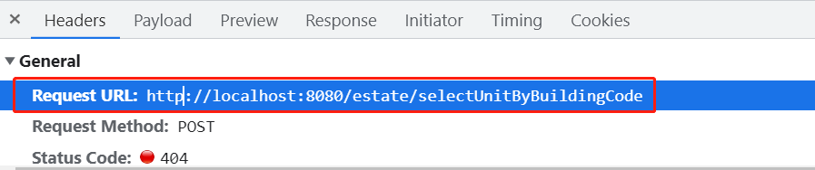
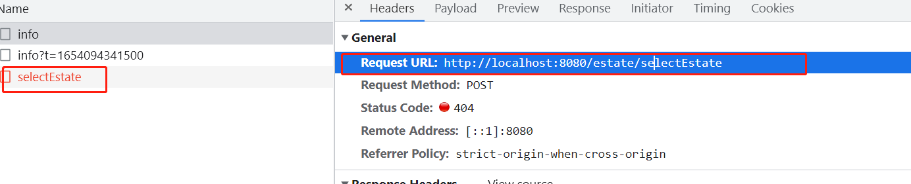
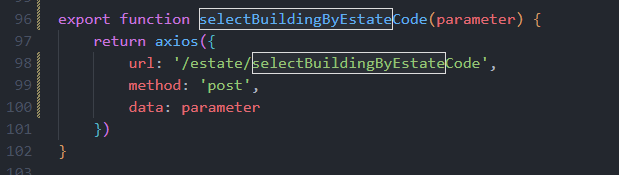

# 合家云-楼盘管理

从这节课开始，我们来完成楼盘管理业务，首先西安来完成住宅小区业务->新增住宅向导


在当前这个业务中，有很多细小的业务，咱们先看新增住宅向导这个位置，我们先来看新增住宅向导，其实这个小业务就是一个查询的业务，也就是说，查询数据库中的tbl_company表中的数据，只要找到对应的公司名称和id值即可

## 新增住宅向导

### 所属公司查询功能

首先我们先要确定前端访问的接口地址，我们可以找到前端项目中estate.js文件，其中的selectCompany方法中的url地址就是前端要访问的接口，这个请求是在用户点击“新增住宅向导”按钮发送的。

```java
export function selectCompany() {
    return axios({
        url: '/estate/selectCompany',
        method: 'get'
    })
}
```

那么我们现在确定了这个前端接口以后，我们就可以直接的编写后端业务，首先从前往后编写，先来编写控制器，针对不同的业务，我们需要新建不同的控制器，那么我们现在新建一个EstateController

```java
// 房产控制器
@RestController
public class EstateController {
    @RequestMapping("/estate/insertEstate")
    public String selectCompany(){
        System.out.println("selectCompany");
        return "";
    }
}
```

然后现在因为是一个比较简单的查询功能，我们直接从持久层开始入手，直接找到TblCompanyMapper来编写方法，以及对应的查询语句

```java
public interface TblCompanyMapper extends BaseMapper<TblCompany> {
    /**
     * 查询公司信息方法
     * @return 公司信息
     */
    @Select("SELECT id,company_full_name FROM tbl_company")
    List<TblCompany> selectCompany();
}
```

然后再来编写业务层，新建EstateService接口和对应实现类

```java
public interface EstateService {
    List<TblCompany> selectCompany();
}
```

实现类

```java
@Override
public List<TblCompany> selectCompany() {
    return tblCompanyMapper.selectCompany();
}
```

最后完善控制器，那么要注意要响应结果依旧是一个需要带result的属性，从前端可以看到在前端项目的：

src>views>propertymanage>property>addGuide>selectCompany()

```java
selectCompany().then(res => {
    this.select = res.result
}).catch(err => {
    this.$notification['error']({
        message: '错误',
        description: err.toString(),
        duration: 1
    })
})
```

所以控制器最终编写为：

```java
@RequestMapping("/estate/selectCompany")
public R selectCompany(){
    System.out.println("selectCompany");
    List<TblCompany> companies = service.selectCompany();
    return new R(companies);
}
```

然后最后我们来进行测试，完成的效果：


### 新增住宅向导信息输入

现在我们需要完成住宅信息的输入，其实说白了就是用户在页面上属于对应住宅信息，然后把数据保存到后端，所以这个位置对应也需要发起一个请求，那么这个请求为http://localhost:8080/estate/insertEstate

前端发起请求的代码 estate.js文件中

```java
export function insertEstate(parameter) {
    return axios({
        url: '/estate/insertEstate',
        method: 'post',
        data: parameter
    })
}
```

所以对应后端编写对应的接口 EstateController

那么这里我们要考虑到，前端其实是通过表单把数据传入进来，所以后端要接受对应的参数，住宅信息所对应的表就是fc_estate这张表，所以此时我们要接收的参数就是这个表对应的实体类对象

```java
@RequestMapping("/estate/insertEstate")
public R insertEstate(FcEstate fcEstate){
    System.out.println("insertEstate");
    return null;
}
```

控制器我们现编写到这里，那么现在要考虑的就是Service层和Dao层，所以我们先来编写Service层EstateService，那么这里我们要考虑的是，其实插入数据以后，数据库成功插入以后，会返回一个1，所以我们Service层的返回值应该为Integer，参数为FcEstate

```java
Integer insertEstate(FcEstate fcEstate);
```

实现类

```java
@Override
public Integer insertEstate(FcEstate fcEstate) {
    return null;
}
```

各位这里我们需要想一下，我们这里用的是MyBatisPlus，所以其实持久层不需要我们在编写其他的代码，其实只要调用insert方法即可，所以我们可以直接在业务层引入对应的持久层

```java
@Resource
private FcEstateMapper fcEstateMapper;


@Override
public Integer insertEstate(FcEstate fcEstate) {
    Integer result = fcEstateMapper.insert(fcEstate);
    System.out.println(result);
    return result;
}
```

这里完成之后，直接编写完善控制器，注意这里前端要求的结果是一个文字，用于弹窗，所以直接写一个成功就可以，还要注意的是前端这里的判断逻辑使用的判断message是否为1，如果不是则直接走错误逻辑，所以这里我们数据库操作成功结果1，要通过message属性返回，需要转成字符串。

```java
@RequestMapping("/estate/insertEstate")
public R insertEstate(FcEstate fcEstate){
    System.out.println("insertEstate");
    Integer result = service.insertEstate(fcEstate);
    return new R(200,result.toString(),"插入成功");
}
```

现在我们做测试，测试我们就能跳转到第二个页面了


但是各位我们现在还不能直接开展第二个页面的业务，因为此时我们的第一个页面还有一个小问题没有解决


就是当前这个图片的住宅编码，这个编码我们希望它应该是唯一的，所以此时我们需要做的事情就是，在编写这个住宅编码的时候，需要查询一次数据库，做一次数据的对比，也就是在插入数据之前，做一个业务的判断，所以此时我们应该回到后端的业务层做一个判断 EstateServiceImpl

```java
/**
* 在做真正数据插入之前，应该对住宅编码做一个判断，判断当前住宅编码是否存在，
* 如果存在则不允许插入
* @param fcEstate
* @return
*/
@Override
public Integer insertEstate(FcEstate fcEstate) {
    int result = 0;
    QueryWrapper<FcEstate> queryWrapper = new QueryWrapper<>();
    queryWrapper.eq("estate_code",fcEstate.getEstateCode());
    FcEstate fe = fcEstateMapper.selectOne(queryWrapper);
    if(fe == null){
        result = fcEstateMapper.insert(fcEstate);
    }
    return result;
}

```

然后再来调整控制器

```java
@RequestMapping("/estate/insertEstate")
public R insertEstate(FcEstate fcEstate){
    System.out.println("insertEstate");
    Integer result = service.insertEstate(fcEstate);
    if(result == 0){
        return new R("房产编码已经存在");
    }
    return new R(200,result.toString(),"插入成功");
}
```

此时如果我们写的房产编码已经存在，会在前端页面直接提示，并且不会调整，如果不存在，就会正常插入新数据

### 维护楼宇信息

现在我们已经成功跳转到第二个页面了，在第二个页面中，这里其实就是对应我么输入的楼盘信息，来显示对应的楼宇信息，首先这个位置其实已经有一个回显了，就是我们的楼宇数量这个是跟我们刚刚输入的数量一致的，那么现在就应该显示对应的楼宇信息

这里我们还是先确认对应发请求的接口，在前端项目src>api>estate.js中

```java
export function selectBuilding(parameter) {
    return axios({
        url: '/estate/selectBuilding',
        method: 'post',
        data: parameter
    })
}
```

这里还有一点我们要知道，我们在查询这个数据的时候，前端会传递两个参数，通过这两个参数我们进行查询，这两个参数为:buildingNumber和estateCode，所以我们需要接收

在这里我要说一下这个业务，这个业务说白了就是你前面填写了多少条楼宇数据，这个位置就应该现实多少个楼宇信息，所以其实我们这里的业务要做的就是数据的插入与回显，现在我们已经能够在跳转页面看到我们插入的楼宇数量了，所以我们现在要把对应的楼宇信息进行插入

那么有了这个接口地址以后，我们现在来编写后端逻辑，先写接口方法

```java
@RequestMapping("/estate/selectBuilding")
public R selectBuilding(Integer buildingNumber,String estateCode){
    System.out.println("selectBuilding");
    return null;
}
```

然后我们需要编写业务层，注意的是这里会有多条楼宇数据，所以我们这里需要通过List来接收，然后这里说一下，对应这个楼宇信息的表为fc_building，这里还要注意，在做这个操作前，一定要把fc_building表数据清空，重新生成

```java
/**
* 根据传递的楼宇数量和住宅编码来生成对应楼宇信息，同时回显
* @param buildingNumber 楼宇数量
* @param estateCode 房产（住宅）编码
* @return 回显的数据
*/
@Override
public List<FcBuilding> selectBuilding(Integer buildingNumber,String estateCode) {
    List<FcBuilding> fcBuildings = new ArrayList<>();
    for (int i = 0;i<buildingNumber;i++){
        FcBuilding fcBuilding = new FcBuilding();
        fcBuilding.setBuildingCode("B"+(i+1));
        fcBuilding.setBuildingName("第"+(i+1)+"号楼");
        fcBuilding.setEstateCode(estateCode);
        fcBuildingMapper.insert(fcBuilding);
        fcBuildings.add(fcBuilding);
    }
    return fcBuildings;
}
```

编写Controller

```java
@RequestMapping("/estate/selectBuilding")
public R selectBuilding(Integer buildingNumber,String estateCode){
    System.out.println("selectBuilding");
    List<FcBuilding> fcBuildings = service.selectBuilding(buildingNumber,estateCode);
    return new R(fcBuildings);
}
```

此时我们来进行测试，就会发现能够成功的出现我们想要的效果了


接下来，我们要做的事情就是完成每个楼宇后面的编辑按钮功能


在这里涉及到保存和取消，此时我们现在可以先不管取消，取消现在前端实现了，但是保存这个按钮它肯定是需要把用户在前端输入的内容，保存到后端。

我们需要先找到对应发送的请求接口地址，然后来编辑后端业务，那么在前端控制台中我们可以看到具体地址为：

http://localhost:8080/estate/updateBuilding

那么这里还要注意一下，其实这个业务并不是插入业务，因为当前的数据已经存在了，我们只是具体修改对应的数据，那么现在针对对应接口编写后端代码

```java
@RequestMapping("/estate/updateBuilding")
public String updateBuilding(FcBuilding fcBuilding){
    System.out.println("updateBuilding");
    return "";
}
```

对应编写业务层，直接调用持久层方法传入参数

接口：

```java
Integer updateBuilding(FcBuilding fcBuilding);
```

实现类：

```java
/**
* 完成楼宇数据更新
* @param fcBuilding
* @return
*/
@Override
public Integer updateBuilding(FcBuilding fcBuilding) {
    Integer result = fcBuildingMapper.updateById(fcBuilding);
    return result;
}
```

控制器调用

```java
@RequestMapping("/estate/updateBuilding")
public R updateBuilding(FcBuilding fcBuilding){
    System.out.println("updateBuilding");
    Integer result = service.updateBuilding(fcBuilding);
    if(result == 1){
        return new R("更新数据成功！");
    }
    return new R("更新数据失败！");
}
```

这里有一个问题，各位要注意一下，就是因为前端项目的原因，我们封顶时间和竣工日志使用的LocalDataTime类型是无法接受参数的，所以我们改为Date类型，用于接收日期参数。

```java
/**
* 竣工日期
*/
private Date finishDate;

public Date getFinishDate() {
    return finishDate;
}

public void setFinishDate(Date finishDate) {
    this.finishDate = finishDate;
}

public Date getOverRoofDate() {
    return overRoofDate;
}

public void setOverRoofDate(Date overRoofDate) {
    this.overRoofDate = overRoofDate;
}

/**
     * 封顶日期
     */
private Date overRoofDate;
```

然后我们来进行测试，在前端添加数据，要注意的是前端业务有一个可以选择单元数量的功能，这个可以直接使用


### 维护单元信息

其实这个业务和维护楼宇信息的业务逻辑比较类似，因为它本质上也不是查询，而且新增数据，做回显，所以这里我们前端会发起一个请求，并且传递参数后端接收并且添加数据做回显。

其实整体的思想就是不同的楼的单元信息，来做显示，所以在维护楼宇信息页面，当前第几号楼对应有多少个单元，在这个页面就应该显示出来，比如1号楼有3个单元，那么当前的显示效果就应该是当前楼层有几个单元，显示几条数据

那么这个分析清楚之后，我们现在就需要确认前端发起的请求地址已经传递的参数

接口地址：localhost:8080/estate/selectUnit


传递参数（数组类型）：

buildingCode（楼宇编码）

unitCount（单元数量）

有了这些以后我们就可以编写后端逻辑了，首先我们先来编写接口，但是要注意，此时前端传递过来的是一个数组类型，并且我们后端没有任何的实体类可以用于接收这两个参数，那我们就需要新建一个值对象VO类型来接收，同时使用@RequestBody

```java
@RequestMapping("/estate/selectUnit")
public R selectUnit(@RequestBody UnitMessage[] unitMessages){
    return null;
}
```

VO类型：UnitMessage

```java
public class UnitMessage {
    private String buildingCode;
    private Integer unitCount;

    public UnitMessage() {
    }

    public UnitMessage(String buildingCode, Integer unitCount) {
        this.buildingCode = buildingCode;
        this.unitCount = unitCount;
    }

    public String getBuildingCode() {
        return buildingCode;
    }

    public void setBuildingCode(String buildingCode) {
        this.buildingCode = buildingCode;
    }

    public Integer getUnitCount() {
        return unitCount;
    }

    public void setUnitCount(Integer unitCount) {
        this.unitCount = unitCount;
    }

    @Override
    public String toString() {
        return "UnitMessage{" +
                "buildingCode='" + buildingCode + '\'' +
                ", unitCount=" + unitCount +
                '}';
    }
}
```

现在接口就先写到这里，然后我们编写业务层

接口EstateService，这里也要注意一下，因为我们的业务层实际操作是新增数据操作，并且新增多个单元数据，所以返回类型为List集合同时类型实体类FcUnit

```java
List<FcUnit> selectUnit(UnitMessage unitMessage);
```

具体实现类，这里要引入对应单元表的Dao层Mapper

```java
@Resource
private FcUnitMapper fcUnitMapper;

@Override
public List<FcUnit> selectUnit(UnitMessage unitMessage) {
    //定义返回的集合
    List<FcUnit> fcUnits = new ArrayList<>();
    //插入数据操作
    for (int i = 0;i<unitMessage.getUnitCount();i++){
        FcUnit fcUnit = new FcUnit();
        fcUnit.setBuildingCode(unitMessage.getBuildingCode());
        fcUnit.setUnitCode("U"+(i+1));
        fcUnit.setUnitName("第"+(i+1)+"单元");
        fcUnitMapper.insert(fcUnit);
        fcUnits.add(fcUnit);
    }
    return fcUnits;
}
```

编写完业务层以后，返回接口，完善接口

```java
@RequestMapping("/estate/selectUnit")
    public R selectUnit(@RequestBody UnitMessage[] unitMessages){
        System.out.println("selectUnit");
        List<FcUnit> allUnit = new ArrayList<>();
        for (UnitMessage unitMessage : unitMessages) {
            allUnit.addAll(service.selectUnit(unitMessage));
        }
        return new R(allUnit);
    }
```

测试


接下来完成后续的编辑操作


图中的选项可以直接使用，那么这里的操作也非常明显和之前做过的维护楼宇信息的编辑功能基本一致，所以说白了后端操作就是一个修改数据，那么找到接口，直接开始编写

接口地址：http://localhost:8080/estate/updateUnit

控制器：

```java
@RequestMapping("/estate/updateUnit")
public R updateUnit(FcUnit fcUnit){
    System.out.println("updateUnit");
    return new R();
}
```

然后完善业务层

接口：EstateService

```java
Integer updateUnit(FcUnit fcUnit);
```

实现类：EstateServiceImpl

```java
@Override
public Integer updateUnit(FcUnit fcUnit) {
    Integer result = fcUnitMapper.updateById(fcUnit);
    return result;
}
```

完善控制器：

```java
@RequestMapping("/estate/updateUnit")
public R updateUnit(FcUnit fcUnit){
    System.out.println("updateUnit");
    Integer result = service.updateUnit(fcUnit);
    System.out.println(result);
    if(result == 1){
        return new R("更新数据成功！");
    }
    return new R("更新数据失败！");
}
```

最后测试：


### 维护房间信息


首先我们要分析一下这个业务，首先当前这个业务看似和我们之前做的业务比较类型，但是这里会稍微复杂一些，首先我们先分析大体上的逻辑，就是通过单元来维护每个单元有多少个房间，每个房间的信息，这是整体逻辑，那么再接着想，当前在维护单元信息的时候就需要传递一些数据过来，首先是单元的编码，还有就是楼层数，还有具体几个单元，那么实际这些参数，我们可以在前端发起请求的时候看到

对应的接口为：http://localhost:8080/estate/insertCell

传递的参数（数组形式）这里参数要注意一下，其实startFloor是开始楼层stopFloor为结束楼层，startCellId/stopCellId为开始房间号和结束房间号：

那有了这些数据以后，我们就可以编写后端接口了EstateController，对应要操作的数据库表为fc_cell，那么各位大家一定会发现，前端传递的数据出现了一些后端实体类没有的参数，所以这个时候我们就需要值对象来进行接受，所以先来创建一个VO类型，这里对应的就是前端传递过来的一些参数

CellMessage

```java
package com.mashibing.vo;

public class CellMessage {
    private String unitCode;
    private Integer startFloor;
    private Integer stopFloor;
    private Integer startCellId;
    private Integer stopCellId;

    public CellMessage() {
    }

    public CellMessage(String unitCode, Integer startFloor, Integer stopFloor, Integer startCellId, Integer stopCellId) {
        this.unitCode = unitCode;
        this.startFloor = startFloor;
        this.stopFloor = stopFloor;
        this.startCellId = startCellId;
        this.stopCellId = stopCellId;
    }

    public String getUnitCode() {
        return unitCode;
    }

    public void setUnitCode(String unitCode) {
        this.unitCode = unitCode;
    }

    public Integer getStartFloor() {
        return startFloor;
    }

    public void setStartFloor(Integer startFloor) {
        this.startFloor = startFloor;
    }

    public Integer getStopFloor() {
        return stopFloor;
    }

    public void setStopFloor(Integer stopFloor) {
        this.stopFloor = stopFloor;
    }

    public Integer getStartCellId() {
        return startCellId;
    }

    public void setStartCellId(Integer startCellId) {
        this.startCellId = startCellId;
    }

    public Integer getStopCellId() {
        return stopCellId;
    }

    public void setStopCellId(Integer stopCellId) {
        this.stopCellId = stopCellId;
    }

    @Override
    public String toString() {
        return "CellMessage{" +
                "unitCode='" + unitCode + '\'' +
                ", startFloor=" + startFloor +
                ", stopFloor=" + stopFloor +
                ", startCellId=" + startCellId +
                ", stopCellId=" + stopCellId +
                '}';
    }
}
```

接下里编写控制器方法，但是这里要注意，控制器方法接收参数的时候，由于前端传过来的是一组数据，所以要通过数组来接收，这里的逻辑就是每一个单元有几层楼每层楼有几个房间

EstateController

```java
@RequestMapping("/estate/insertCell")
public R insertCell(@RequestBody CellMessage[] cellMessages){
    System.out.println("insertCell");
    return new R();
}
```

控制器先编写到这里，然后完成业务层

EstateService

```java
List<FcCell> insertCell(CellMessage cellMessage);
```

再具体实现的时候要注意，在接收的数据中，每层对应有几个房间，所以这里遍历数据的时候需要做一个双层for循环

EstateServiceImp

```java
@Override
public List<FcCell> insertCell(CellMessage cellMessage) {
    List<FcCell> fcCells = new ArrayList<>();
    //楼层
    for(int i = 0;i<cellMessage.getStopFloor();i++){
        //房间
        for(int j = 0;j<cellMessage.getStopCellId();j++){
            FcCell fcCell = new FcCell();
            fcCell.setUnitCode(cellMessage.getUnitCode());//单元编码
            fcCell.setCellCode("C"+(i+1)+"0"+j);// 房间编码C203
            fcCell.setCellName((i+1)+"0"+j);// 房间名称203
            fcCell.setFloorNumber(cellMessage.getStopFloor());//楼层数 获取结束楼层
            fcCellMapper.insert(fcCell);//插入数据
            fcCells.add(fcCell);
        }
    }
    return fcCells;
}
```

回头在来完善编写控制器

```java
@RequestMapping("/estate/insertCell")
public R insertCell(@RequestBody CellMessage[] cellMessages){
    System.out.println("insertCell");
    List<FcCell> allFcCell = new ArrayList<>();
    for (CellMessage cellMessage : cellMessages) {
        allFcCell.addAll(service.insertCell(cellMessage));
    }
    return new R(allFcCell);
}
```

这些完成之后，我们再来测试，这里我们如何验证我们的数据是正确的拿，比如：

2（楼宇）X 2（每个楼宇有2个单元）X（5每个单元有5层楼）X 2（每层有2个房间）=40条数据

完成业务步骤，到这里这个数据就可以进行数据的回显了，但是各位注意，做到这里其实已经体现出我们当前做这些业务存在的一些问题，这些问题回头我们慢慢分析，咱们先搞定基础业务。

数据的新增和回显我们搞定了以后，现在我们需要来完成维护房间信息中的查询区域


那么这里我们一个个的来完成，首先整体来看的话，其实前端这里做了一个类似于三级联动的效果，也就是先选择楼宇，在选择完具体楼宇以后，会查询并显示对应的单元，所以我们就先来完成这两个下拉框

其实要完成这里和明显这一定是一个查询，而且是需要带有条件的查询，第一个选择楼宇，其实说白了就是在查询当前这个楼宇的第几号楼，所以这里应该传递过来的参数就是具体的楼宇编码，那么我们从前端发出的请求就可以看到

接口：


参数：


所以现在有了这些内容以后，我们就可以来完成对应的后端逻辑编写了，首先搞定接口，接口别忘了接收前端传递过来的楼宇编码参数

```java
@RequestMapping("/estate/selectBuildingByEstate")
public R selectBuildingByEstate(String estateCode){
    System.out.println("selectBuildingByEstate");
    return new R();
}
```

完善业务层

接口（查询多条楼宇信息，所以返回值为List集合，同时类型为楼宇类型）：

```java
List<FcBuilding> selectBuildingByEstate(String estateCode);
```

具体实现类（实现类要注意此时我们只需要查询对应有几栋楼即可，也就是楼宇名称以及编码，所以这个位置我们需要查询条件）：

```java
@Override
public List<FcBuilding> selectBuildingByEstate(String estateCode) {
    QueryWrapper<FcBuilding> queryWrapper = new QueryWrapper<>();
    queryWrapper.eq("estate_code",estateCode);
    //具体查询那几个列
    queryWrapper.select("building_code","building_name");
    List<FcBuilding> fcBuildings = fcBuildingMapper.selectList(queryWrapper);
    return fcBuildings;
}
```

完善控制器：

```java
@RequestMapping("/estate/selectBuildingByEstate")
public R selectBuildingByEstate(String estateCode){
    System.out.println("selectBuildingByEstate");
    List<FcBuilding> fcBuildings = service.selectBuildingByEstate(estateCode);
    return new R(fcBuildings);
}
```

测试最终效果，我们就能看到查询的具体数据


接下来我们要完成单元的查询，其实前端的逻辑是在点击选择楼宇之后会在发送一个请求到后端，查询对应楼宇的单元信息，所以这里对于后端来说，逻辑差不多，就是发送一个请求，同时携带这楼宇编码，来查询对应的单元信息，那我们先来看前端请求的接口地址以及对应传递的参数

请求接口



传递的参数


很明显请求接口的作用是为了查询对应楼宇的单元信息，然后对应传递的参数为楼宇编号，那么现在有了这些内容我们就可以编写后端逻辑了

首先编写接口：

```java
@RequestMapping("/estate/selectUnitByBuildingCode")
public R selectUnitByBuildingCode(String buildingCode){
    System.out.println("selectUnitByBuildingCode");
    return new R();
}
```

编写业务层

接口：

```java
List<FcUnit> selectUnitByBuildingCode(String buildingCode);
```

实现类：

```java
@Override
public List<FcUnit> selectUnitByBuildingCode(String buildingCode) {
    QueryWrapper<FcUnit> queryWrapper = new QueryWrapper<>();
    queryWrapper.eq("building_code",buildingCode);
    queryWrapper.select("unit_code","unit_name");
    List<FcUnit> fcUnits = fcUnitMapper.selectList(queryWrapper);
    return fcUnits;
}
```

完善接口

```java
@RequestMapping("/estate/selectUnitByBuildingCode")
public R selectUnitByBuildingCode(String buildingCode){
    System.out.println("selectUnitByBuildingCode");
    List<FcUnit> fcUnits = service.selectUnitByBuildingCode(buildingCode);
    return new R(fcUnits);
}
```

最后测试，但是这里测试之前要注意，清空所有数据，然后在进行测试，否则会有问题，这个问题我们会在后续解决，但是目前我们只是先完成基本功能


当前这两个下拉框完成以后，现在还有一个问题，就是在选择了对应楼和单元以后，要显示对应的数据，所以前端在选择了这两个下拉框以后，还会做一个数据更新的操作，那么这个操作也是需要向后端发送请求，并且传递单元编码参数，来让后端进行查询和显示数据

具体接口：


请求参数：


那现在我们就来完成后端逻辑，给前端返回查询结果，来显示数据

接口：

```java
@RequestMapping("/estate/selectCell")
public R selectCell(String unitCode){
    System.out.println("selectCell");
    return new R();
}
```

业务层：

接口（最终显示的结果为多个房间信息，所以这个位置返回值为集合类型为FcCell）：

```java
List<FcCell> selectCell(String unitCode);
```

实现类：

```java
@Override
public List<FcCell> selectCell(String unitCode) {
    QueryWrapper<FcCell> queryWrapper = new QueryWrapper<>();
    queryWrapper.eq("unit_code",unitCode);
    List<FcCell> fcCells = fcCellMapper.selectList(queryWrapper);
    return fcCells;
}
```

完善控制器：

```java
@RequestMapping("/estate/selectCell")
public R selectCell(String unitCode){
    System.out.println("selectCell");
    List<FcCell> fcCells = service.selectCell(unitCode);
    return new R(fcCells);
}
```

最终测试，这里有问题，数据多，原因是因为两栋楼的单元编码重复，所以这里逻辑出现了问题，后续我们要调整这些问题，现在先完成基础业务


业务做到这里为止，其实基础业务以及基本完成，但是做到现在就出现了很多的问题，接下来我们就需要一一解决，而且这里大家可能会有疑问，就是为什么之前不直接解决，而是留到这里才解决，因为这里想给大家一个比较贴近真实开发的效果，我们在开发过程中难免会碰到这样那样的问题，所以重构一些代码这是必然的，尤其是项目经验比较少，或者不熟悉业务的时候，那么接下来带着大家来解决问题。

### 解决业务编码重复问题

那么现在我们会发现，此时我们所设置的各种编码，比如楼宇编码，单元编码，房间编码，都有重复的问题，所以其实要解决这种问题也并不难，我们要做的事情就是把这个编码该复杂一些，让他不重复即可，那么这个就是我们后端在设置编码的时候的问题，那我们直接找到这个位置对应的业务层EstateServiceImpl，修改对应的编码规则

这里的规则其实比较简单，我们在最开始会设置一个房产编码，那么这个值是唯一的，所以我们只需要在这些编码前面加上这个唯一的标识就能解决问题

```java
@Override
public List<FcBuilding> selectBuilding(Integer buildingNumber,String estateCode) {
    List<FcBuilding> fcBuildings = new ArrayList<>();
    for (int i = 0;i<buildingNumber;i++){
        FcBuilding fcBuilding = new FcBuilding();
        //增加唯一表示estateCode
        fcBuilding.setBuildingCode(estateCode+"B"+(i+1));
        fcBuilding.setBuildingName("第"+(i+1)+"号楼");
        fcBuilding.setEstateCode(estateCode);
        fcBuildingMapper.insert(fcBuilding);
        fcBuildings.add(fcBuilding);
    }
    return fcBuildings;
}
```

那么此时这个楼宇的编码就成为唯一标识了，我们就加在下面的单元编码上

```java
@Override
public List<FcUnit> selectUnit(UnitMessage unitMessage) {
    //定义返回的集合
    List<FcUnit> fcUnits = new ArrayList<>();
    //插入数据操作
    for (int i = 0;i<unitMessage.getUnitCount();i++){
        FcUnit fcUnit = new FcUnit();
        fcUnit.setBuildingCode(unitMessage.getBuildingCode());
        //添加唯一标识
        fcUnit.setUnitCode(unitMessage.getBuildingCode()+"U"+(i+1));
        fcUnit.setUnitName("第"+(i+1)+"单元");
        fcUnitMapper.insert(fcUnit);
        fcUnits.add(fcUnit);
    }
    return fcUnits;
}
```

此时单元编号变成唯一的，那么我们就加在房间的编号上

```java
@Override
public List<FcCell> insertCell(CellMessage cellMessage) {
    List<FcCell> fcCells = new ArrayList<>();
    //楼层
    for(int i = 0;i<cellMessage.getStopFloor();i++){
        //房间
        for(int j = 0;j<cellMessage.getStopCellId();j++){
            FcCell fcCell = new FcCell();
            fcCell.setUnitCode(cellMessage.getUnitCode());//单元编码
            // 添加唯一标识
            fcCell.setCellCode(cellMessage.getUnitCode()+"C"+(i+1)+"0"+(j+1));// 房间编码C203
            fcCell.setCellName((i+1)+"0"+(j+1));// 房间名称203
            fcCell.setFloorNumber(cellMessage.getStopFloor());//楼层数 获取结束楼层
            fcCellMapper.insert(fcCell);//插入数据
            fcCells.add(fcCell);
        }
    }
    return fcCells;
}
```

此时这个问题基本上就已经解决了，我们可以测试来验证一下

测试的方式就是清空数据库，查看各个编码以及最后的查询结果是否正确。

上一个业务我们基本上算是做完了，但是还存在一些问题，这些后续会在解决，我们还是先保证完成基本业务

## 批量增加楼宇

那么我们现在来完成第二个大的业务就是这个批量增加楼宇信息，从页面来看，功能比较类似新增住宅向导，那我们也是一个个的做，首先先观察第一个页面选择住宅


### 选择住宅

这个位置的第一个功能，所属公司我们在上一个业务中已经完成了，所以之类可以直接跳过，但是这个位置它是和其他的功能有关联的，可以发现所属公司对应的选择住宅，这个位置实际上就一个一个查询业务，通过你选择的公司，来查询出对应的住宅信息，那么我们可以直接来看前端发出的请求



和对应的参数


那么有了这些以后，我们就能来完成这个业务了，首先编写后端接口EstateController

```java
@RequestMapping("/estate/selectEstate")
public R selectEstate(String company){
    System.out.println("selectEstate");
    return new R();
}
```

然后编写业务层 EstateService接口+EstateServiceImpl实现类

接口：

```java
List<FcEstate> selectEstate(String company);
```

实现类：

```java
@Override
public List<FcEstate> selectEstate(String company) {
    QueryWrapper<FcEstate> queryWrapper = new QueryWrapper<>();
    queryWrapper.eq("company",company);
    List<FcEstate> estates = fcEstateMapper.selectList(queryWrapper);
    return estates;
}
```

完善接口：

```java
@RequestMapping("/estate/selectEstate")
public R selectEstate(String company){
    System.out.println("selectEstate");
    List<FcEstate> estates = service.selectEstate(company);
    return new R(estates);
}
```

最终测试，查出结果

## 住宅维护

这节课开始，我们来完成住宅维护模块：


这个模块其实功能比较简单，并没有那么的复杂，其实就是一些查询

### 业务说明

其实这个业务主要功能就是 住宅信息、楼宇信息、单元信息、房间信息这个几个页面的查询，那么这里可以分为两个大功能，第一个功能就是单独再点击这几个按钮的时候可以进行一个全量的数据查询，也就是住宅信息、楼宇信息、单元信息、房间信息的数据库中的全部数据

再来就是点击住宅信息以后的查看楼宇和后续的查看单元以及查看房间的这种专项查询。

### 具体编写

#### 住宅信息

业务我们能搞定以后，现在我们就可以来进行编写后端业务逻辑了，首先我们先来搞定专项查询功能，那么先看住宅信息这里，住宅信息这里其实就是整体的数据库表数据的查询，其中涉及到的表为：fc_estate，那么也就是针对这张表的全量数据查询，那好我们先来看前端的接口


当前我们需要做一个全量的查询，所以这个位置不需要传递任何的参数，只需要做一个全量的查询即可。

按照老规矩先来编写控制器

```java
@RequestMapping("/estate/selectAllEstate")
public R selectAllEstate(){
    System.out.println("selectAllEstate");
    List<FcEstate> fcEstates = service.selectAllEstate();
    return new R(fcEstates);
}
```

然后对应编写业务层

EstateService接口：

```java
List<FcEstate> selectAllEstate();
```

在编写实现类之前，我们先来编写持久层，那么持久层你可以通过原生的MyBatis来编写，也可以通过MybatisPlus提供的方法来编写，那么在这里第一个功能我们就通过原生的MyBatis来编写，后续的我们可以通过MybatisPlus来编写，两种方式我们都用一下

持久层接口FcEstateMapper

```java
public interface FcEstateMapper extends BaseMapper<FcEstate> {

    @Select("Select * from fc_estate")
    List<FcEstate> selectAll();

}
```

然后再来编写业务层实现类EstateServiceImpl

```java
@Override
public List<FcEstate> selectAllEstate() {
    List<FcEstate> fcEstates = fcEstateMapper.selectAll();
    return fcEstates;
}
```

最后完善编写接口

```java
@RequestMapping("/estate/selectAllEstate")
public R selectAllEstate(){
    System.out.println("selectAllEstate");
    List<FcEstate> fcEstates = service.selectAllEstate();
    return new R(fcEstates);
}
```

但是此时的效果大家会发现没有显示出对应的公司名称，这里是因为在我们的fc_estate这张表中没有公司名称，只有对应的公司表tbl_company公司名称的id值，所以我们这里其实在持久层需要做一个复杂查询，具体方式如下

修改持久层接口FcEstateMapper

```java
public interface FcEstateMapper extends BaseMapper<FcEstate> {
    /**
     * 查询全部的房产信息
     * @return
     */
    List<FcEstate> selectAllEstate();

}
```

修改对应的映射FcEstateMapper.xml

```java
<?xml version="1.0" encoding="UTF-8"?>
<!DOCTYPE mapper PUBLIC "-//mybatis.org//DTD Mapper 3.0//EN" "http://mybatis.org/dtd/mybatis-3-mapper.dtd">
<mapper namespace="com.mashibing.mapper.FcEstateMapper">

    <!-- 通用查询映射结果 -->
    <resultMap id="BaseResultMap" type="com.mashibing.bean.FcEstate">
        <id column="id" property="id" />
        <result column="estate_code" property="estateCode" />
        <result column="estate_name" property="estateName" />
        <result column="estate_addr" property="estateAddr" />
        <result column="cover_area" property="coverArea" />
        <result column="build_area" property="buildArea" />
        <result column="green_area" property="greenArea" />
        <result column="road_area" property="roadArea" />
        <result column="building_number" property="buildingNumber" />
        <result column="building_leader" property="buildingLeader" />
        <result column="company_name" property="companyName" />
        <result column="company_behalf" property="companyBehalf" />
        <result column="contact" property="contact" />
        <result column="contact_phone" property="contactPhone" />
        <result column="contact_addr" property="contactAddr" />
        <result column="car_space_delay_rate" property="carSpaceDelayRate" />
        <result column="car_space_over_day" property="carSpaceOverDay" />
        <result column="estate_type" property="estateType" />
        <result column="street_lamp_number" property="streetLampNumber" />
        <result column="hfcNum" property="hfcNum" />
        <result column="remark" property="remark" />
        <result column="company" property="company" />
    </resultMap>

    <!-- 通用查询结果列 -->
    <sql id="Base_Column_List">
        id, estate_code, estate_name, estate_addr, cover_area, build_area, green_area, road_area, building_number, building_leader, company_name, company_behalf, contact, contact_phone, contact_addr, car_space_delay_rate, car_space_over_day, estate_type, street_lamp_number, hfcNum, remark, company
    </sql>
--------------------------以下是修改的内容---------------------
    <select id="selectAll" resultMap="EstateMap">
        SELECT
            e.*,c.company_full_name
        FROM fc_estate e
                 LEFT JOIN tbl_company c on e.company = c.id;
    </select>

    <resultMap id="EstateMap" type="com.mashibing.bean.FcEstate">
        <id column="id" property="id" />
        <result column="estate_code" property="estateCode" />
        <result column="estate_name" property="estateName" />
        <result column="estate_addr" property="estateAddr" />
        <result column="cover_area" property="coverArea" />
        <result column="build_area" property="buildArea" />
        <result column="green_area" property="greenArea" />
        <result column="road_area" property="roadArea" />
        <result column="building_number" property="buildingNumber" />
        <result column="building_leader" property="buildingLeader" />
        <result column="company_name" property="companyName" />
        <result column="company_behalf" property="companyBehalf" />
        <result column="contact" property="contact" />
        <result column="contact_phone" property="contactPhone" />
        <result column="contact_addr" property="contactAddr" />
        <result column="car_space_delay_rate" property="carSpaceDelayRate" />
        <result column="car_space_over_day" property="carSpaceOverDay" />
        <result column="estate_type" property="estateType" />
        <result column="street_lamp_number" property="streetLampNumber" />
        <result column="hfcNum" property="hfcNum" />
        <result column="remark" property="remark" />
        <result column="company" property="company" />
        <result column="company_full_name" property="companyName" />
    </resultMap>

</mapper>
```

最后测试，显示公司名称

#### 查看楼宇

**注意：此业务可以不需要编写，可以直接使用之前的接口来完成**

搞定了住宅信息，接下来我们研究查看楼宇按钮，首先确认前端发的请求和参数


参数为：estateCode

接下来编写控制器：

```java
@RequestMapping("/estate/selectBuildingByEstateCode")
public R selectBuildingByEstateCode(String estateCode){
    System.out.println("selectBuildingOne"+estateCode);
    return new R();
}
```

业务层

```java
@Override
public List<FcBuilding> selectBuildingByEstateCode(String estateCode) {
    List<FcBuilding> fcBuildings;
    QueryWrapper<FcBuilding> queryWrapper = new QueryWrapper<>();
    queryWrapper.eq("estate_code",estateCode);
    fcBuildings = fcBuildingMapper.selectList(queryWrapper);
    return fcBuildings;
}
```

完善控制器：

```java
@RequestMapping("/estate/selectBuildingByEstateCode")
public R selectBuildingByEstateCode(String estateCode){
    System.out.println("selectBuildingOne"+estateCode);
    List<FcBuilding> fcBuildings = service.selectBuildingByEstateCode(estateCode);
    return new R(fcBuildings);
}
```

#### 查看单元

此功能还是老样子，先看接口


然后大家会发现，这个接口其实我们之前用过，所以后端直接不用写了，直接可以调用之前的接口

#### 查看房间

一样的道理，之前有用过的接口，所以直接不用编写后端了

### 全量查询功能

做完以上的这些功能以后，其实我们现在就需要去完成每个模块的全量查询功能，那么第一个页面已经不需要做了，现在我们要研究一下楼宇信息、单元信息、以及房间信息，首先来看楼宇信息

那么其实这个位置我们要做的事情就是一个参数的判断，各位想一下，如果我们正常点击查看楼宇按钮的话，那么前端会传递一个esteCode参数，来便于我们查询，但是如果做全量的查询就不需要这个参数，那么其实我们要做的就是在业务层做一个参数的判断。

思路为：如果参数传递为空，那么就做全量的查询，如果有参数的传递，那么就对应参数做条件查询，那么其实不仅仅是楼宇信息，后面的单元信息以及房间信息的业务层都是如此，具体业务层代码如下：

EstateServiceImpl

楼宇信息

```java
@Override
public List<FcBuilding> selectBuildingByEstateCode(String estateCode) {
    List<FcBuilding> fcBuildings;
    QueryWrapper<FcBuilding> queryWrapper;
    if(estateCode.equals("")){
  
        queryWrapper.select("*");
        fcBuildingMapper.selectList(queryWrapper);
        fcBuildings = fcBuildingMapper.selectList(queryWrapper);
    }else{
        queryWrapper = new QueryWrapper<>();
        queryWrapper.eq("estate_code",estateCode);
        fcBuildings = fcBuildingMapper.selectList(queryWrapper);
    }
    return fcBuildings;
}
```

单元信息

```java
@Override
public List<FcUnit> selectUnitByBuildingCode(String buildingCode) {
    List<FcUnit> fcUnits;
    QueryWrapper<FcUnit> queryWrapper = new QueryWrapper<>();
    if(buildingCode.equals("")){
        queryWrapper.select("*");
        fcUnits = fcUnitMapper.selectList(queryWrapper);
    }else{
        queryWrapper.eq("building_code",buildingCode);
        fcUnits = fcUnitMapper.selectList(queryWrapper);
    }
    return fcUnits;
}
```

房间信息

```java
@Override
public List<FcCell> selectCell(String unitCode) {
    List<FcCell> fcCells;
    QueryWrapper<FcCell> queryWrapper = new QueryWrapper<>();
    if(unitCode.equals("")){
        queryWrapper.select("*");
        fcCells = fcCellMapper.selectList(queryWrapper);
    }else{
        queryWrapper.eq("unit_code",unitCode);
        fcCells = fcCellMapper.selectList(queryWrapper);
    }
    return fcCells;
}
```

#### 附加前端

接口修改位置，修改页面为：src\views\propertymanage\property\homemaintenance\buildinginformation.vue

修改方式：

1、页面的Script标签下需要引入对应的接口方法，这是修改的第一点

具体修改位置：


2、还需要修改下方的getDate()方法中具体使用发起请求的位置，修改为要第一步引入的接口方法名


3、如果想要重新定义请求的接口，包括这个接口的定义位置，需要找到src\api\estate.js文件（以下是具体接口定义的方法）

原始接口（楼宇信息页面改为这个）：


重新编写的接口：



## 住宅查询

接下来我们来完成住宅查询功能，此功能页面如下：


从这个页面中我们就可以判断出来其实这个页面就是在做查询功能，而且其实大部分的查询功能后端我们已经做好了

请选择住宅：/estate/selectAllEstate

查看楼宇信息：/estate/selectBuildingByEstate

最后显示的信息（新接口）：/estate/selectBuildingByEstateCodeAndBuildingCode

从以上的内容来看我们只需要写一个新的查询功能，并且配合前端做回显就能完成这个功能了，所以现在我们就需要考虑一下业务，首先打开这个页面以后，发起全部数据的请求拿到对应的住宅名称，当我们选择完住宅以后，就会发起请求来查询具体这个住宅的楼宇信息，然后最后根据楼宇标号和住宅编号来查询以下要显示的信息

所以现在我们就清楚我们显示数据的接口就需要用到两个参数，从前端发的请求也能看到


了解了这个以后，我们现在就可以编写后端业务了

### 具体操作

EstateController编写接口：

```java
public R selectBuildingByEstateCodeAndBuildingCode(@RequestParam("estateCode") String estateCode,
                                                   @RequestParam("buildingCode") String buildingCode){
    System.out.println("selectBuildingByEstateCodeAndBuildingCode");
    return new R();
}
```

编写业务层EstateService接口：

```java
FcBuilding selectBuildingByEstateCodeAndBuildingCode(String estateCode,String buildingCode);
```

编写实现类

```java
@Override
public FcBuilding selectBuildingByEstateCodeAndBuildingCode(String estateCode, String buildingCode) {
    QueryWrapper<FcBuilding> queryWrapper = new QueryWrapper<>();
    queryWrapper.eq("estate_code",estateCode);
    queryWrapper.eq("building_code",buildingCode);
    FcBuilding fcBuilding = fcBuildingMapper.selectOne(queryWrapper);
    return fcBuilding;
}
```

最后完善控制器：

```java
@RequestMapping("/estate/selectBuildingByEstateCodeAndBuildingCode")
public R selectBuildingByEstateCodeAndBuildingCode(@RequestParam("estateCode") String estateCode,
                                                   @RequestParam("buildingCode") String buildingCode){
    System.out.println("selectBuildingByEstateCodeAndBuildingCode");
    FcBuilding fcBuilding = estateService.selectBuildingByEstateCodeAndBuildingCode(estateCode,buildingCode);
    return new R(fcBuilding);
}
```
