# 合家云-登录业务

添加对应的controller进行处理，第一件事把刚才测试的testController改成LoginController

我们接下来就要处理控制器了，但是在处理控制器之前，我们可以查看一下前端项目，在前端项目启动的时候，在Network中会有一个报错的请求，那么其实这个是前端项目自身的一个验证，这个东西其实我们不管也无所谓，但是如果你觉得别扭，可以在后端写一个接口（控制器方法）给它提供一个为true的返回值，就能解决

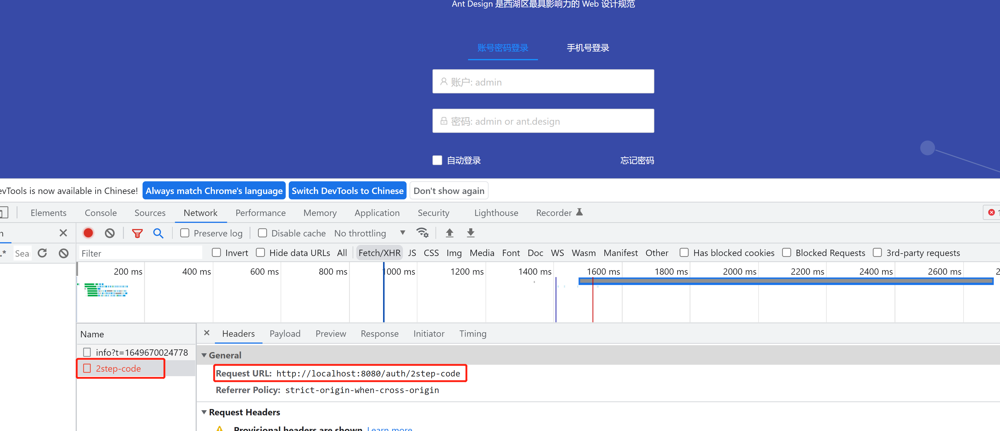

LoginController.java

```java
package com.bjmsb.controller;

import org.springframework.web.bind.annotation.CrossOrigin;
import org.springframework.web.bind.annotation.RequestMapping;
import org.springframework.web.bind.annotation.RestController;

@RestController
@CrossOrigin(origins = "*",allowCredentials="true",allowedHeaders = "*",methods = {})
public class LoginController {

    // 解决前端报错
    @RequestMapping("/auth/2step-code")
    public boolean step_code2(){
        System.out.println("此请求是前端框架带的默认请求，可以不做任何处理，也可以在前端将其删除");
        System.out.println("step_code2");
        return true;
    }

    @RequestMapping("/auth/login")
    public String login(){
        System.out.println("login");
        return "success";
    }
}
```

如果能请求成功，那么就意味着整个项目已经可以顺利进行通信，后续的话只需要完成对应业务的编写即可。

## 完成登录业务

首先我们现在需要知道的登录的时候账号和密码回作为参数传递到后端，那么我们需要看一下前端是如何完成发送的，这里我们就可以看一下Login.vue，在这个其中我们可以看到对应的登录是通过form表单完成的，那我们来看一下对应的方法

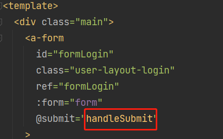

然后在下方我们可以看到对应有一个Login登录方法，传递了对应的参数，包括密码加密的方式

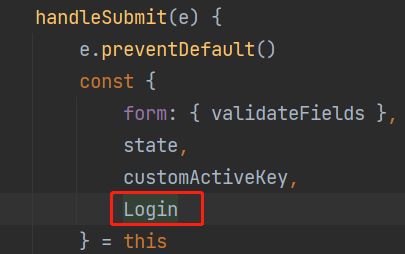

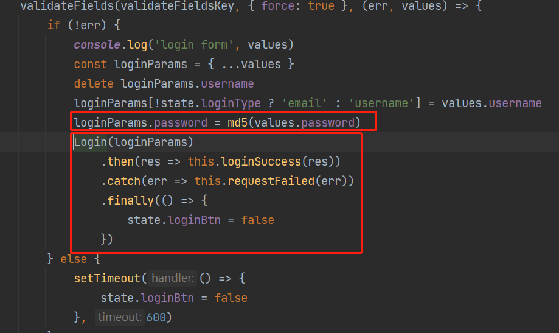

当前在这个login方法在上方定义，我们可以看一下


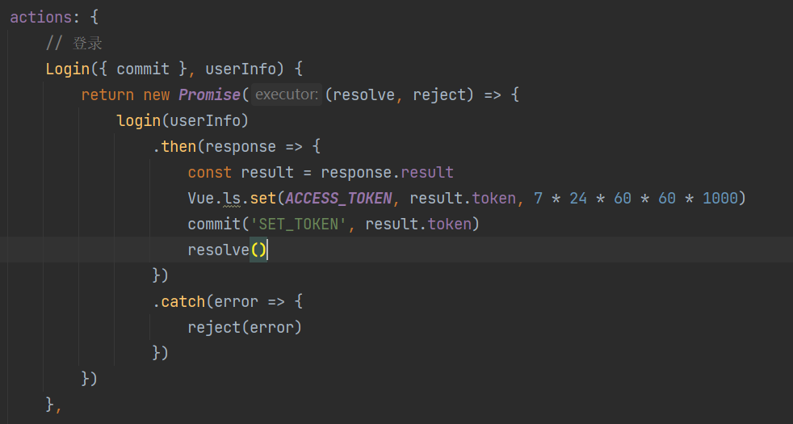

在进入其中的login方法，我们就能看见其中具体发送请求的接口地址

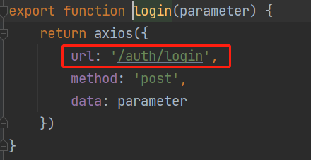

### 后端接收登录参数

在了解了这些以后，我们就可以在后端做一个对应的接口，在LoginController中添加

```java
// 登录接口
@RequestMapping("/auth/login")
public String login(String username,String password){
    System.out.println("login");
    System.out.println(username+":"+password);
    return "success";
}
```

此时我们就可以重启项目测试，前端访问，然后来看后端是否能够成功接收到对应的用户名和密码的参数

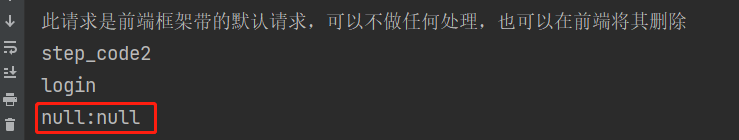

此时我们会发现，后端确实有反应，但是无法成功输出对应的参数内容，原因在于，此时的数据格式为json，我们可以从前端的控制台来看到

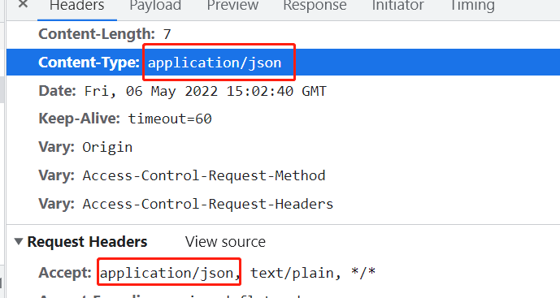

那么现在这种情况，我们要接收请求对应的参数的话其实可以使用两种方式

1. 使用@RequestBody接受参数

```java
@RequestMapping("/auth/login")
public String login(@RequestBody Map<String,Object> map){
    System.out.println("login");
    System.out.println(map);
    return "success";
}
```

2. 在前端传递参数的时候，进行数据的转换，把默认的json转换成key:value的形式便于后端接收参数（推荐）

在前端项目的根目录下运行

```java
npm install qs 安装对应组件，并且在登录的方法调用前添加如下代码
```

```java
const QS = require('qs')
const data = QS.stringify(loginParams)
```

这两行代码具体写入位置

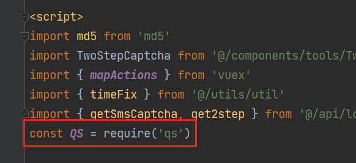

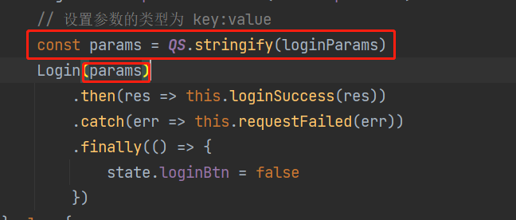

此时后端可以改为

```java
// 登录接口
@RequestMapping("/auth/login")
public String login(@RequestParam(value = "username") String username, @RequestParam(value = "password") String password){
    System.out.println("login");
    System.out.println(username+":"+password);
    return "success";
}
```

此时我们重启后端服务，测试前端发送的请求就可以接受到对应的参数了

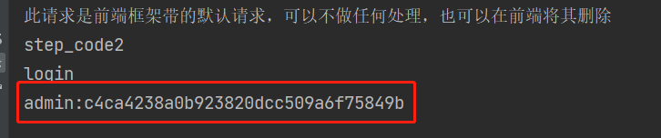

### 实现登录后续逻辑

正常项目开发流程是需要前后端配合，后端根据原型图，编写好对应业务和接口，同时提供给前端对应的接口文档，约定好对应的传参方式和对应参数类型，前端发送请求按照约定传递参数即可。而且一般后端项目一般开发的顺序是从后往前，也就是先开发持久层，再来业务层，最后Controller提供接口，当然也可以从前往后开发，因为我们目前已经存在前端项目了，所以我们的分析方式就是从前往后去进行分析，那么现在我们控制器已经能够成功接收到前端请求和对应参数，那我们就先来搞定业务层

首先我们在service包中把之前通过代码生成器生成的Server接口和实现类，分别建立base包，然后把这些都放进去，目前我们还用不多这些生成的代码，然后再来创建LoginService接口和对应实现类LoginServiceImpl

```java
public interface TblLoginLogService extends IService<TblLoginLog> {
    void login(String username,String password);
}

@Service
public class TblLoginLogServiceImpl extends ServiceImpl<TblLoginLogMapper, TblLoginLog> implements TblLoginLogService {
    @Override
    public void login(String username,String password) {

    }
}
```

写完这个基础的业务层以后，此时我们在控制器中就可以进行调用了

```java
@RestController
public class LoginController {

    @Autowired
    private LoginService loginService;

    // 解决前端报错
    @RequestMapping("/auth/2step-code")
    public boolean step_code2(){
        System.out.println("此请求是前端框架带的默认请求，可以不做任何处理，也可以在前端将其删除");
        System.out.println("step_code2");
        return true;
    }

    // 登录接口
    @RequestMapping("/auth/login")
    public String login(@RequestParam(value = "username") String username, @RequestParam(value = "password") String password){
        System.out.println("login");
        loginService.login(username,password);
        return "success";
    }
  
}
```

写到这里我们发现，现在想要完成登录就需要去数据库里面查出对应的用户数据，所以这个时候需要关注几个表

tbl_user_record 用户登记表

tbl_dept 部门表

tbl_role 角色表

tbl_company 公司表

tbl_user_role 用户角色关联表

tbl_user_dept 用户部门关联表

通过这几个表，当然还有其他很多，我们能够看出来这其中是存在一些关联关系的，这个希望大家能熟悉一下对应的表，然后当前业务我们要关注的是用户的信息，所以我们要是用的就是tbl_user_record这个表的数据，所以此时我们的业务层，就应该通过持久层的查询，查询到对应的用户信息以后返回对应数据，而类型就应该是TblUserRecord，同时要根据关联的表，查询出全部数据

这里要修改LoginService和对应实现类的Login方法的返回值类型为TblUserRecord，同时因为要查询对应数据，我们还需要引入TblUserRecordMapper

```java
@Service
public class LoginServiceImpl implements LoginService {

    @Resource
    private TblUserRecordMapper tblUserRecordMapper;

    @Override
    public TblUserRecord login(String username, String password) {
   
    }
}
```

此时我们可以直接使用tblUserRecordMapper去调用Mybatis提供的一些查询方法，但是现在有一个问题，就是我们当前有参数，而且比较特殊，所以我们需要自己定义对应的方法，那么我们打开TblUserRecordMapper类型接口，来添加方法

```java
public interface TblUserRecordMapper extends BaseMapper<TblUserRecord> {
    /**
     * 查询用户信息
     * @return 用户信息
     * 注意：当前有两个参数，所以需要加上@Param注解
     */
    TblUserRecord login(@Param("username") String username, @Param("password") String password);

}
```

搞定这个以后，我们需要写对应映射执行的SQL语句，打开TblUserRecordMapper.xml文件（建议先在Navicat中把SQL语句执行成功以后，直接粘贴到其中即可，可以保证语法没有问题）

```java
SELECT 
a.*,b.dept_privileges,c.role_privileges,d.company_simple_name
FROM tbl_user_record a
LEFT JOIN tbl_dept b ON a.user_dept = b.id
LEFT JOIN tbl_role c ON a.user_role = c.id
LEFT JOIN tbl_company d ON a.company = d.id
WHERE a.user_name = #{username} and a.user_password = #{passowrd}
```

这里我们要聊一下这块的表设计，按照常理来说，这个位置的表设计要按照RBAC的思想来设计，但是当前这个位置我们为了简介，所以我们现在的方式是 用户-》角色（在角色这里直接记录对应权限-模块）模块对应的表名为：tbl_function_model

搞定了查询语句以后，我们还要写好对应的映射关系

```java
<?xml version="1.0" encoding="UTF-8"?>
<!DOCTYPE mapper PUBLIC "-//mybatis.org//DTD Mapper 3.0//EN" "http://mybatis.org/dtd/mybatis-3-mapper.dtd">
<mapper namespace="com.mashibing.mapper.TblUserRecordMapper">

    <!-- 通用查询映射结果 -->
    <resultMap id="BaseResultMap" type="com.mashibing.bean.TblUserRecord">
        <id column="id" property="id" />
        <result column="user_name" property="userName" />
        <result column="user_password" property="userPassword" />
        <result column="user_type" property="userType" />
        <result column="user_role" property="userRole" />
        <result column="user_gender" property="userGender" />
        <result column="user_dept" property="userDept" />
        <result column="user_job" property="userJob" />
        <result column="user_status" property="userStatus" />
        <result column="office_phone" property="officePhone" />
        <result column="inner_phone" property="innerPhone" />
        <result column="move_phone" property="movePhone" />
        <result column="email" property="email" />
        <result column="is_send_msg" property="isSendMsg" />
        <result column="start_date" property="startDate" />
        <result column="stop_date" property="stopDate" />
        <result column="birthday" property="birthday" />
        <result column="ip_rule" property="ipRule" />
        <result column="user_hiredate" property="userHiredate" />
        <result column="is_send_wchat" property="isSendWchat" />
        <result column="remark" property="remark" />
        <result column="company" property="company" />
        <result column="is_dept_admin" property="isDeptAdmin" />
        <result column="last_login_date" property="lastLoginDate" />
        <result column="create_person" property="createPerson" />
        <result column="create_date" property="createDate" />
    </resultMap>

    <!-- 通用查询结果列 -->
    <sql id="Base_Column_List">
        id, user_name, user_password, user_type, user_role, user_gender, user_dept, user_job, user_status, office_phone, inner_phone, move_phone, email, is_send_msg, start_date, stop_date, birthday, ip_rule, user_hiredate, is_send_wchat, remark, company, is_dept_admin, last_login_date, create_person, create_date
    </sql>
    <select id="login" resultMap="loginResultMap">
        SELECT
            a.*,
            b.dept_privileges,
            c.role_privileges,
            d.company_simple_name
        FROM tbl_user_record a
                 LEFT JOIN tbl_dept b ON a.user_dept = b.id
                 LEFT JOIN tbl_role c ON a.user_role = c.id
                 LEFT JOIN tbl_company d ON a.company = d.id
        WHERE a.user_name = #{username} and a.user_password = #{password}
    </select>
    <resultMap id="loginResultMap" type="com.mashibing.bean.TblUserRecord">
        <id column="id" property="id" />
        <result column="user_name" property="userName" />
        <result column="user_password" property="userPassword" />
        <result column="user_type" property="userType" />
        <result column="user_gender" property="userGender" />
        <result column="user_job" property="userJob" />
        <result column="user_status" property="userStatus" />
        <result column="office_phone" property="officePhone" />
        <result column="inner_phone" property="innerPhone" />
        <result column="move_phone" property="movePhone" />
        <result column="email" property="email" />
        <result column="is_send_msg" property="isSendMsg" />
        <result column="start_date" property="startDate" />
        <result column="stop_date" property="stopDate" />
        <result column="birthday" property="birthday" />
        <result column="ip_rule" property="ipRule" />
        <result column="user_hiredate" property="userHiredate" />
        <result column="is_send_wchat" property="isSendWchat" />
        <result column="remark" property="remark" />
        <result column="is_dept_admin" property="isDeptAdmin" />
        <result column="last_login_date" property="lastLoginDate" />
        <result column="create_person" property="createPerson" />
        <result column="create_date" property="createDate" />
        <association property="tblRole" javaType="com.mashibing.bean.TblRole">
            <result property="rolePrivileges" column="role_privileges"></result>
        </association>
        <association property="tblDept" javaType="com.mashibing.bean.TblDept">
            <result property="deptPrivileges" column="dept_privileges"></result>
        </association>
        <association property="tblCompany" column="com.mashibing.bean.TblCompany">
            <result property="companySimpleName" column="company_simple_name"></result>
        </association>
    </resultMap>
</mapper>
```

这里要注意一下改完这些内容以后，我们对应的实体类也要进行更改，更改的内容就是对应映射的属性

private TblRole tblRole;

private TblDept tblDept;

private TblCompany tblCompany;

重新生成对应的set和get方法包括 toString

```java
package com.mashibing.bean;

import com.baomidou.mybatisplus.annotation.IdType;
import com.baomidou.mybatisplus.annotation.TableId;
import java.time.LocalDateTime;
import java.io.Serializable;

/**
 * <p>
 * 用户档案
 * </p>
 *
 * @author lian
 * @since 2022-04-11
 */
public class TblUserRecord implements Serializable {

    private static final long serialVersionUID=1L;

    /**
     * 用户编号
     */
    @TableId(value = "id", type = IdType.AUTO)
    private Integer id;

    /**
     * 用户姓名
     */
    private String userName;

    /**
     * 用户密码
     */
    private String userPassword;

    /**
     * 用户类型
     */
    private String userType;

    /**
     * 岗位角色
     */
    private TblRole tblRole;

    /**
     * 用户性别
     */
    private String userGender;

    /**
     * 所属部门
     */
    private TblDept tblDept;

    /**
     * 职位
     */
    private Integer userJob;

    /**
     * 用户状态
     */
    private String userStatus;

    /**
     * 办公电话
     */
    private String officePhone;

    /**
     * 内线电话
     */
    private String innerPhone;

    /**
     * 移动电话
     */
    private String movePhone;

    /**
     * 电子邮箱
     */
    private String email;

    /**
     * 允许发送手机短信
     */
    private String isSendMsg;

    /**
     * 有效开始日期
     */
    private LocalDateTime startDate;

    /**
     * 有效结束日期
     */
    private LocalDateTime stopDate;

    /**
     * 出生日期
     */
    private LocalDateTime birthday;

    /**
     * 登陆ip规则
     */
    private String ipRule;

    /**
     * 入职日期
     */
    private LocalDateTime userHiredate;

    /**
     * 允许发送微信
     */
    private String isSendWchat;

    /**
     * 备注
     */
    private String remark;

    /**
     * 所属公司
     */
    private TblCompany tblCompany;

    /**
     * 是否部门管理者
     */
    private String isDeptAdmin;

    /**
     * 最后登陆时间
     */
    private LocalDateTime lastLoginDate;

    /**
     * 创建人
     */
    private String createPerson;

    /**
     * 创建时间
     */
    private LocalDateTime createDate;


    public Integer getId() {
        return id;
    }

    public void setId(Integer id) {
        this.id = id;
    }

    public String getUserName() {
        return userName;
    }

    public void setUserName(String userName) {
        this.userName = userName;
    }

    public String getUserPassword() {
        return userPassword;
    }

    public void setUserPassword(String userPassword) {
        this.userPassword = userPassword;
    }

    public String getUserType() {
        return userType;
    }

    public void setUserType(String userType) {
        this.userType = userType;
    }

    public String getUserGender() {
        return userGender;
    }

    public void setUserGender(String userGender) {
        this.userGender = userGender;
    }

    public Integer getUserJob() {
        return userJob;
    }

    public void setUserJob(Integer userJob) {
        this.userJob = userJob;
    }

    public String getUserStatus() {
        return userStatus;
    }

    public void setUserStatus(String userStatus) {
        this.userStatus = userStatus;
    }

    public String getOfficePhone() {
        return officePhone;
    }

    public void setOfficePhone(String officePhone) {
        this.officePhone = officePhone;
    }

    public String getInnerPhone() {
        return innerPhone;
    }

    public void setInnerPhone(String innerPhone) {
        this.innerPhone = innerPhone;
    }

    public String getMovePhone() {
        return movePhone;
    }

    public void setMovePhone(String movePhone) {
        this.movePhone = movePhone;
    }

    public String getEmail() {
        return email;
    }

    public void setEmail(String email) {
        this.email = email;
    }

    public String getIsSendMsg() {
        return isSendMsg;
    }

    public void setIsSendMsg(String isSendMsg) {
        this.isSendMsg = isSendMsg;
    }

    public LocalDateTime getStartDate() {
        return startDate;
    }

    public void setStartDate(LocalDateTime startDate) {
        this.startDate = startDate;
    }

    public LocalDateTime getStopDate() {
        return stopDate;
    }

    public void setStopDate(LocalDateTime stopDate) {
        this.stopDate = stopDate;
    }

    public LocalDateTime getBirthday() {
        return birthday;
    }

    public void setBirthday(LocalDateTime birthday) {
        this.birthday = birthday;
    }

    public String getIpRule() {
        return ipRule;
    }

    public void setIpRule(String ipRule) {
        this.ipRule = ipRule;
    }

    public LocalDateTime getUserHiredate() {
        return userHiredate;
    }

    public void setUserHiredate(LocalDateTime userHiredate) {
        this.userHiredate = userHiredate;
    }

    public String getIsSendWchat() {
        return isSendWchat;
    }

    public void setIsSendWchat(String isSendWchat) {
        this.isSendWchat = isSendWchat;
    }

    public String getRemark() {
        return remark;
    }

    public void setRemark(String remark) {
        this.remark = remark;
    }

    public String getIsDeptAdmin() {
        return isDeptAdmin;
    }

    public void setIsDeptAdmin(String isDeptAdmin) {
        this.isDeptAdmin = isDeptAdmin;
    }

    public LocalDateTime getLastLoginDate() {
        return lastLoginDate;
    }

    public void setLastLoginDate(LocalDateTime lastLoginDate) {
        this.lastLoginDate = lastLoginDate;
    }

    public String getCreatePerson() {
        return createPerson;
    }

    public void setCreatePerson(String createPerson) {
        this.createPerson = createPerson;
    }

    public LocalDateTime getCreateDate() {
        return createDate;
    }

    public void setCreateDate(LocalDateTime createDate) {
        this.createDate = createDate;
    }


    public TblDept getTblDept() {
        return tblDept;
    }

    public void setTblDept(TblDept tblDept) {
        this.tblDept = tblDept;
    }

    public TblCompany getTblCompany() {
        return tblCompany;
    }

    public void setTblCompany(TblCompany tblCompany) {
        this.tblCompany = tblCompany;
    }

    public TblRole getTblRole() {
        return tblRole;
    }

    public void setTblRole(TblRole tblRole) {
        this.tblRole = tblRole;
    }

    @Override
    public String toString() {
        return "TblUserRecord{" +
                "id=" + id +
                ", userName='" + userName + '\'' +
                ", userPassword='" + userPassword + '\'' +
                ", userType='" + userType + '\'' +
                ", tblRole=" + tblRole +
                ", userGender='" + userGender + '\'' +
                ", tblDept=" + tblDept +
                ", userJob=" + userJob +
                ", userStatus='" + userStatus + '\'' +
                ", officePhone='" + officePhone + '\'' +
                ", innerPhone='" + innerPhone + '\'' +
                ", movePhone='" + movePhone + '\'' +
                ", email='" + email + '\'' +
                ", isSendMsg='" + isSendMsg + '\'' +
                ", startDate=" + startDate +
                ", stopDate=" + stopDate +
                ", birthday=" + birthday +
                ", ipRule='" + ipRule + '\'' +
                ", userHiredate=" + userHiredate +
                ", isSendWchat='" + isSendWchat + '\'' +
                ", remark='" + remark + '\'' +
                ", tblCompany=" + tblCompany +
                ", isDeptAdmin='" + isDeptAdmin + '\'' +
                ", lastLoginDate=" + lastLoginDate +
                ", createPerson='" + createPerson + '\'' +
                ", createDate=" + createDate +
                '}';
    }
}
```

注意：为了保证持久层和Service层没有问题，建议大家这里可以进行单元测试，保证持久层和业务层没有问题，在测试之前一定要在pom文件中加上对应的配置，因为当前Mapper映射文件和对应接口都在Java包中，所以正常情况Maven是无法识别映射的，加上以下配置Maven才可以识别

```java
<resources>
            <resource>
                <directory>src/main/java</directory>
                <includes>
                    <include>**/*.xml</include>
                </includes>
            </resource>
</resources>
```

```java
@SpringBootTest
class FamilyServicePlatformApplicationTests {

    @Autowired
    LoginService loginService;

    @Resource
    TblUserRecordMapper mapper;

    @Test
    void contextLoads() {
        //TblUserRecord  tblUserRecord = loginService.login("admin","c4ca4238a0b923820dcc509a6f75849b");
        TblUserRecord tblUserRecord = mapper.login("admin","c4ca4238a0b923820dcc509a6f75849b");
        System.out.println("输出数据："+tblUserRecord);
    }

}
```

修改业务层实现类

```java
package com.mashibing.service.impl;

import com.mashibing.bean.TblUserRecord;
import com.mashibing.mapper.TblUserRecordMapper;
import com.mashibing.service.LoginService;
import org.springframework.beans.factory.annotation.Autowired;
import org.springframework.stereotype.Service;

import javax.annotation.Resource;


@Service
public class LoginServiceImpl implements LoginService {

    @Resource
    private TblUserRecordMapper tblUserRecordMapper;

    @Override
    public TblUserRecord login(String username, String password) {
        TblUserRecord tblUserRecord = tblUserRecordMapper.login(username,password);

        return tblUserRecord;
    }
}
```

修改控制器

```java
// 登录接口
@RequestMapping("/auth/login")
public TblUserRecord login(@RequestParam(value = "username") String username, @RequestParam(value = "password") String password){
    System.out.println("login");
    TblUserRecord tblUserRecord = loginService.login(username,password);
    System.out.println(tblUserRecord);
    return tblUserRecord;
}
```

进行测试，前端发起请求，后端看控制台是否能够成功打印用户数据，如果能够得到此时就证明我们的后端业务逻辑已经基本完成

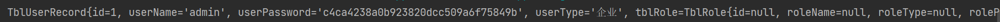

### 前端完成登录跳转

此时大家会发现前端页面还是会报错，并且无法成功跳转到登录成功页面，那么这个时候我们就需要保证前后端数据的统一，那么我们就需要看一下前端的业务逻辑，那我们需要找到前端项目的Login.vue文件，在handleSubmit方法中有对应的提交，其中有一个逻辑的判断，这里的逻辑可以理解为 成功走then，失败走catch，在失败中会有对应登录失败的提示

```java
 Login(params)
     .then(res => this.loginSuccess(res))
     .catch(err => this.requestFailed(err))
         .finally(() => {
             state.loginBtn = false
         })
```

然后我们再来看Login方法，在这里其实我们就能看到问题，就是当前这个位置会从响应内容中读取result这个属性，但是这个我们后端并没有提供，同时这里还有一个token属性属于result，token其实可以走到自动登录的功能，其实通过这里的ls（本地储存类似Cookie）就能看到，我们可以把对应的登录信息通过vue的方式进行本地存储，不适用Cookie，因为Cookie不安全。

```java
actions: {
        // 登录
        Login({ commit }, userInfo) {
            return new Promise((resolve, reject) => {
                login(userInfo)
                    .then(response => {
                        const result = response.result
                        Vue.ls.set(ACCESS_TOKEN, result.token, 7 * 24 * 60 * 60 * 1000)
                        commit('SET_TOKEN', result.token)
                        resolve()
                    })
                    .catch(error => {
                        reject(error)
                    })
            })
        },
```

所以从以上的内容中可以看出，我们后端业务需要返回一个result，并且这个result中还要包含token属性，同时除了这些以外，我们从前端的测试数据auth.js中data数据中还包message、code、headers属性，这些都需要提供，当然headers我们不需要改，所以由此得出，我们后端在给前端响应数据的时候，我们需要提供一个对象，来包含这些属性，这样前端也就能够解析了，当然如果在实际开发中，这些实际上就是前端和后端在开发前提前沟通好的，而且一般是后端定义，然后前端按照对应后端提供的文档进行接收解析参数即可。

那么这里分析清楚以后，现在来编写后端返回数据类型R，用户前端接收数据，其中定义的属性为：

code：状态码

message：消息

result：具体返回数据

```java
public class R {
    private Integer code = 200;
    private String message = "";
    private Object result;

    public R() {
    }

	public R(Object result) {
        this.result = result;
    }

    public R(Integer code, String message, Object result) {
        this.code = code;
        this.message = message;
        this.result = result;
    }

    public Integer getCode() {
        return code;
    }

    public void setCode(Integer code) {
        this.code = code;
    }

    public String getMessage() {
        return message;
    }

    public void setMessage(String message) {
        this.message = message;
    }

    public Object getResult() {
        return result;
    }

    public void setResult(Object result) {
        this.result = result;
    }

    @Override
    public String toString() {
        return "R{" +
                "code=" + code +
                ", message='" + message + '\'' +
                ", result=" + result +
                '}';
    }
}
```

这个类型完成之后，我们还需要修改控制器返回的对象类型

```java
// 登录接口
@RequestMapping("/auth/login")
public R login(@RequestParam(value = "username") String username, @RequestParam(value = "password") String password){
    System.out.println("login");
    TblUserRecord tblUserRecord = loginService.login(username,password);
    R r = new R(200,"登录成功",tblUserRecord);
    System.out.println(r);
    return r;
}
```

但是现在还有一个问题，就是前端还需要一个token属性，所以这个我们也要加上，那么这个的话我们就需要在TblUserRecord中来添加属性，同时添加一个set和get方法就可以了

```java
private String token;

public String getToken() {
    return token;
}
```

然后再来修改控制器，添加属性内容，这里简单来写，就传递一个用户名就可以了

```java
// 登录接口
@RequestMapping("/auth/login")
public R login(@RequestParam(value = "username") String username, @RequestParam(value = "password") String password){
    System.out.println("login");
    TblUserRecord tblUserRecord = loginService.login(username,password);
    tblUserRecord.setToken(tblUserRecord.getUserName());
    R r = new R(200,"登录成功",tblUserRecord);
    System.out.println(r);
    return r;
}
```

测试前端访问以后我们会发现，现在还是不能成功跳转，是因为我们在浏览器控制器中可以看到还需要发送一个user/info的请求，这个请求用来获取用户信息，所以我们还需要在后端编写这个接口

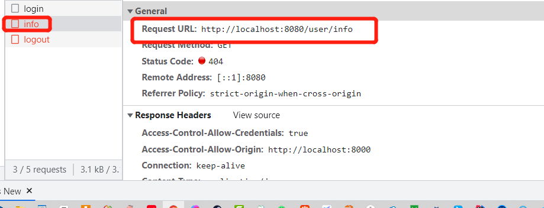

但是在编写这个接口的时候我们发现，在登录业务的时候，我们已经查询过一次用户的信息了，所以没有必要反复的查询，我们可以通过Session共享的方式把数据进行共享，所以需要在/auth/login接口中增加一个参数为HttpSession，然后在编写对应的/user/info接口时直接使用即可

```java
// 登录接口
@RequestMapping("/auth/login")
public R login(@RequestParam(value = "username") String username,
               @RequestParam(value = "password") String password,
               HttpSession session){
    System.out.println("login");
    TblUserRecord tblUserRecord = loginService.login(username,password);
    tblUserRecord.setToken(tblUserRecord.getUserName());
    // 将用户信息写入Session
    session.setAttribute("userRecord",tblUserRecord);
    R r = new R(200,"登录成功",tblUserRecord);
    System.out.println(r);
    return r;
}

//用户信息接口
@RequestMapping("/user/info")
public String getInfo(HttpSession session){
    System.out.println(session.getAttribute("userRecord"));
    return "";
}
```

但是此时我们测试会发现，此时用户信息接口中是拿不到对应的Session中保存的数据的，原因在于跨域Session数据同步失效了，本质其实就是Sessionid不是一个，也就表示用了两个不同的Session。我们可以做测试，在两个接口中分别输出SessionId就会发现不一样，但是这里大家会有疑问，之前我们不是在配置跨域的时候设置了使用同一个Session吗？确实如此，但是此时的问题不是出在后端，而是在前端，所以我们需要修改前端request.js文件，加上一个属性，保证使用的是同一个会话

```java
axios.defaults.withCredentials = true
```

然后我们再来进行测试，此时Sessionid一致了，同时数据也能取出来了，接下来我们继续完成/user/info接口，这个位置其实我们需要看一下前端要的内容，所以我们找到user.js中的GetInfo方法，在这里就是我们需要响应给前端的参数，在这其中我们可以看到除了result以外还有对应的role包括permissions，所以这里内容非常的多，这个是我们现在使用的这个前端框架的要求，它的权限控制粒度非常的细，细致到每个按钮了，所以太麻烦了，那我们其实没有必要写的这么麻烦，所以这里给大家简化一些，简单来说，就是我们当前登录用户就是admin，所以直接显示所有模块和功能

```java
{
  message: "ok",
  result: {
    name: "admin",
    avatar: "/avatar2.jpg",
    role: {
      permissions: [
        {
          permissionId: "901"
        },
        {
          permissionId: "221"
        },
        {
          permissionId: "223",
        },
        {
          permissionId: "226",
        },
      ],
    },
  },
  code: 200,
}
```

这就是我们要给前端返回的数据格式，所以我们就根据这样的数据格式来组织对象，在result包下

1. 我们需要定义实体类：Permission、Permissions、UserInfo，那么我们在写这些实体类的时候，我们也需要有一定的顺序，需要从内往外去写Permission、Permissions、UserInfo

```java
public class Permission {
    private String permissionId;

    public Permission() {
    }

    public Permission(String permissionId) {
        this.permissionId = permissionId;
    }

    public String getPermissionId() {
        return permissionId;
    }

    public void setPermissionId(String permissionId) {
        this.permissionId = permissionId;
    }

    @Override
    public String toString() {
        return "Permission{" +
                "permissionId='" + permissionId + '\'' +
                '}';
    }
}
```

```java
public class Permissions {
    private List<Permission> permissions;

    public List<Permission> getPermissions() {
        return permissions;
    }

    public void setPermissions(List<Permission> permissions) {
        this.permissions = permissions;
    }

    @Override
    public String toString() {
        return "Permissions{" +
                "permissions=" + permissions +
                '}';
    }
}
```

```java
public class UserInfo {
    private String name;
    private String avatar = "/avatar2.jpg"; //登录以后，显示在页面上的用户信息图片，默认值
    private Permissions role;

    public UserInfo() {
    }

    public UserInfo(String name, Permissions role) {
        this.name = name;
        this.role = role;
    }

    public String getName() {
        return name;
    }

    public void setName(String name) {
        this.name = name;
    }

    public String getAvatar() {
        return avatar;
    }

    public void setAvatar(String avatar) {
        this.avatar = avatar;
    }

    public Permissions getRole() {
        return role;
    }

    public void setRole(Permissions role) {
        this.role = role;
    }

    @Override
    public String toString() {
        return "UserInfo{" +
                "name='" + name + '\'' +
                ", avatar='" + avatar + '\'' +
                ", role=" + role +
                '}';
    }
}
```

2. 完成/user/info接口

```java
//用户信息接口
@RequestMapping("/user/info")
public R getInfo(HttpSession session){
    // 获取用户信息
    TblUserRecord userRecord = (TblUserRecord) session.getAttribute("userRecord");
    // 获取对应用户的功能模块
    String[] rolePrivileges = userRecord.getTblRole().getRolePrivileges().split("-");
    // 拼接需要返回的数据对象的格式
    Permissions permissions = new Permissions();
    List<Permission> permissionList = new ArrayList<>();
    for (String s : rolePrivileges) {
        permissionList.add(new Permission(s));
    }
    permissions.setPermissions(permissionList);
    UserInfo userInfo = new Us`erInfo(userRecord.getUserName(),permissions);
    return new R(userInfo);
}
```

完成这些以后，我们最终测试，直接访问前端 admin 1成功进入到主页面

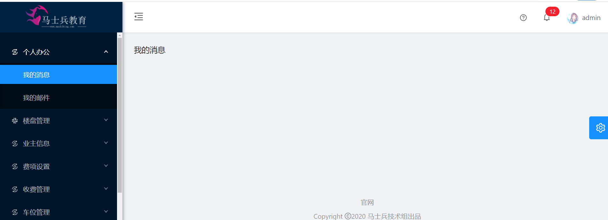

# 合家云-登出业务

之前那我们已经实现了登出，那对应的我们需要一个登出服务，现在我们来解决一下，首先在我们的主页面的右上角有一个头像按钮，我们点开以后会出现一个列表，其中就包含登出按钮

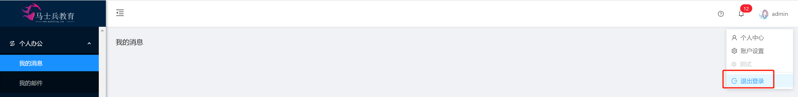

这个前端项目本身就包含这个登出功能，所以我们点击退出登录确实会有效果，但是有一个问题，就是我们退出登录以后，按理来说我们的后端也需要参与，来清除Session中的数据，所以现在我们就需要找到前端退出登录时发出的请求位置 compoments>tools>UserMunu.vue文件，这个文件就是对应用户菜单的，在这里我们找到Logout事件，对应发出的请求

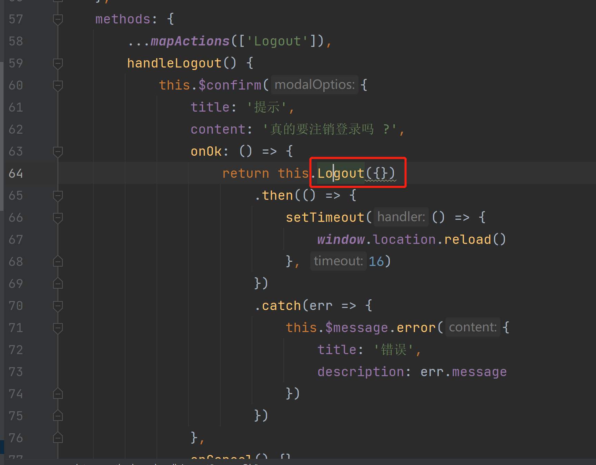

然后向下找到对应发出的请求地址，在login.js文件中

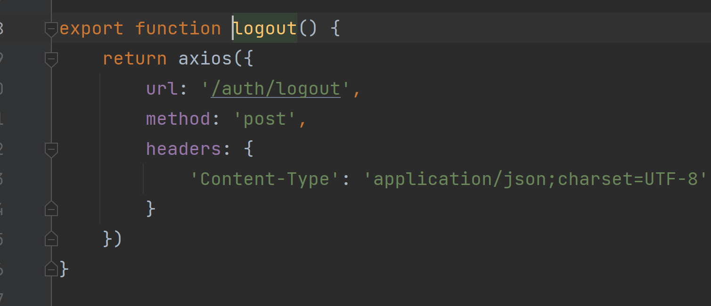

url就是我们发出登出的地址，那我们只需要在后端做一个接口就可以了

```java
//登出接口
@RequestMapping("/auth/logout")
public String LogOut(HttpSession session){
    System.out.println("logout");
    session.invalidate();//将Session设置为失效
    return "";
}
```
