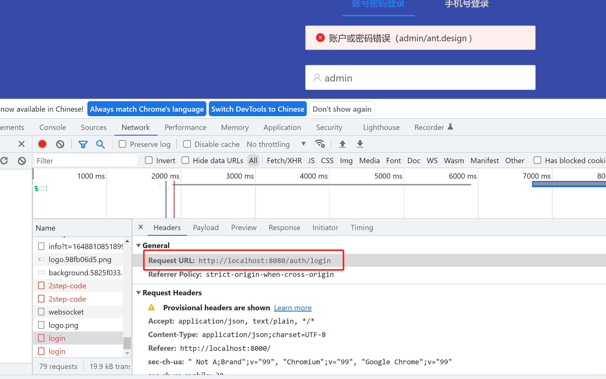

# 合家云项目前后端通讯

增加配置：

```java
#SQL语句日志打印
logging:
  level:
    com:
      mashibing:
        mapper: debug
```

因为现在大家在访问的时候用到的是两个独立的项目，所以必须要保证两个项目之间能够进行通信，此时对于前端和后端而言，我们都需要进行相关的配置，来保证两个项目可以进行正常的数据通信

## 前端查看

我们的请求都是从前端发起到后端进行处理的，所以在前端我们可以通过F12进行查看，会发现，现在发起的请求都是发送到8000端口的，但是为了完成前后端的交互，我们的请求需要发送到后端8080端口进行处理，这就是我们要做的第一件事。

前端项目在开发完成后，会有一些测试数据，这些数据都存在在mock中，比如我们在登录系统的时候使用的账号密码admin，这个数据就存在于mock>service>auth.js中


当然我们现在就是要抛弃这些测试数据，连接后端完成相应的请求。

此时我们可以查看一下前端项目，在前端项目中，我们找到src>api>login.js这个文件中的login方法，此方法就是请求参数和请求信息

```java
export function login(parameter) {
    return axios({
        url: '/auth/login',
        method: 'post',
        data: parameter
    })
}
```

此时我们再来看axios这个方法，在这个方法中

```java
// 创建 axios 实例
const service = axios.create({
    baseURL: process.env.VUE_APP_API_BASE_URL, // api base_url
    timeout: 6000 // 请求超时时间
})
```

走到这里我们可以看到其实这里第一步骤就是去调用了某个地址，然后我们再来看mock的index

```java
import { isIE } from '@/utils/util'

// 判断环境不是 prod 或者 preview 是 true 时，加载 mock 服务(判断是否走以下内容，我们现在需要不走以下内容)
if (process.env.NODE_ENV !== 'production' || process.env.VUE_APP_PREVIEW === 'true') {
  if (isIE()) {
    console.error('[antd-pro] ERROR: `mockjs` NOT SUPPORT `IE` PLEASE DO NOT USE IN `production` ENV.')
  }
  // 使用同步加载依赖
  // 防止 vuex 中的 GetInfo 早于 mock 运行，导致无法 mock 请求返回结果
  console.log('[antd-pro] mock mounting')
  const Mock = require('mockjs2')
  require('./services/auth')
  require('./services/user')
  require('./services/manage')
  require('./services/other')
  require('./services/tagCloud')
  require('./services/article')

  Mock.setup({
    timeout: 800 // setter delay time
  })
  console.log('[antd-pro] mock mounted')
}

```

此时我们要找到对应的配置文件进行修改，使其变成前后端通讯

### 1、修改前端项目配置，完成通信功能

```
1、修改.env.development文件
```

```tex
NODE_ENV=development
VUE_APP_PREVIEW=false //不是测试环境
VUE_APP_API_BASE_URL=http://localhost:8080/  //后端服务地址
```

```
2、删除main.js的mock数据挂载，在src目录下打开main.js文件，将import './mock'代码注释
```

```
3、当修改成功之后，重新运行服务，点击登录请求，查看发送的地址是什么地址，如果出现http://localhost:8080/auth/login，则表示前端项目的修改已经成功，只需要去修改后端项目的配置即可。
```



### 2、修改后端项目的配置，完成通信功能

```
1、在项目中新建一个config的包，添加跨域的配置类
```

```java
package com.mashibing.config;

import org.springframework.context.annotation.Bean;
import org.springframework.context.annotation.Configuration;
import org.springframework.web.cors.CorsConfiguration;
import org.springframework.web.cors.UrlBasedCorsConfigurationSource;
import org.springframework.web.filter.CorsFilter;

@Configuration
public class CorsConfig {
     private CorsConfiguration buildConfig() {
        CorsConfiguration corsConfiguration = new CorsConfiguration();
        // 设置属性
        // 允许跨域请求的地址，*表示所有
        corsConfiguration.addAllowedOrigin("*");
        //  跨域的请求头
        corsConfiguration.addAllowedHeader("*");
        //  跨域的请求方法
        corsConfiguration.addAllowe	dMethod("*");
        // 在跨域请求的时候使用同一个 Session
        corsConfiguration.setAllowCredentials(true);
        return corsConfiguration;
    }
    @Bean
    public CorsFilter corsFilter() {
        UrlBasedCorsConfigurationSource source = new UrlBasedCorsConfigurationSource();
        //配置 可以访问的地址
        source.registerCorsConfiguration("/**", buildConfig()); 
        return new CorsFilter(source);
    }
}
```

```
或者可以在controller类的上面添加注解
```

注意：这两种方式都可以，但是配置类的方式是一劳永逸的，注解就需要反复配置

```java
@CrossOrigin(origins = "*",allowCredentials="true",allowedHeaders = "*",methods = {})
```
